# MiniClaw Agent 层：源码级面试讲解

> 本文以当前 src/MiniClaw/agent 的真实实现为准，并说明它如何被 CodingAssistant 组装。面试时要区分 Agent 通用循环和产品层注入的能力，不要把 Memory、审批、WorkspaceGuard、Goal 都说成 AgentLoop 内部实现。

## Agent 流程图

```mermaid
flowchart TD
    A[用户任务进入 CodingAssistant]
    A --> B[创建或恢复 AgentLoop]
    B --> C[创建本轮 CancellationToken]
    C --> D{同一 Agent 是否正在运行?}
    D -- 是 --> ER1[返回 agent is already running]
    D -- 否 --> E[追加 user message]
    E --> F[刷新 system prompt / ContextJournal / Memory]
    F --> G[投影当前请求上下文]
    G --> H[获取本轮工具定义]
    H --> I[绑定 request tool names]
    I --> J[构造 ModelRequest]
    J --> K[ModelClient.stream]
    K --> L{收到哪类 ModelEvent?}
    L -- text_delta --> M[转发文本事件]
    M --> K
    L -- error --> ER2[记录模型错误事件]
    L -- completed --> N[取得 AssistantReply]
    N --> O{reply 是否 aborted?}
    O -- 是 --> P[保存 partial assistant<br/>run_finished aborted]
    O -- 否 --> Q{reply.error 是否存在?}
    Q -- 是 --> ER3[结束本次 Attempt]
    Q -- 否 --> R{是否有 final guard?}
    R -- 是 --> S[检查最终回复和验收状态]
    S --> T{检查阻塞?}
    T -- 是 --> U[追加 COMPLETION_CHECK 反馈]
    U --> F
    T -- 否 --> V[保存 assistant message]
    R -- 否 --> V
    V --> W{reply.tool_calls 是否为空?}
    W -- 是 --> X[自然停止]
    W -- 否 --> Y[按模型顺序处理 Tool Calls]
    Y --> Z{Token 是否已取消?}
    Z -- 是 --> CA[补齐当前及剩余 Tool Result<br/>cancelled / not_started]
    Z -- 否 --> AB{当前工具是否只读且可并行?}
    AB -- 是 --> AC[合并连续只读调用<br/>read grep search ls find]
    AB -- 否 --> AD[只取当前调用<br/>write edit bash memory goal]
    AC --> AE[asyncio.gather 执行批次]
    AD --> AE
    AE --> AF{ToolCancelledError?}
    AF -- 是 --> CA
    AF -- 否 --> AG[按原始调用顺序 zip 结果]
    AG --> AH[生成 role=tool<br/>保留 tool_call_id]
    AH --> AI[tool_finished + message_added]
    AI --> AJ{批次是否还有调用?}
    AJ -- 是 --> AB
    AJ -- 否 --> AK[turn_finished]
    AK --> AL[WorkingContext 持久化消息]
    AL --> AM[PhaseState / Memory GC / usage 统计]
    AM --> AN{累计输入达到压缩阈值?}
    AN -- 是 --> AO[artifact / archive / checkpoint]
    AN -- 否 --> AP[继续下一轮]
    AO --> AP
    AP --> AQ{达到 max_turns?}
    AQ -- 否 --> F
    AQ -- 是 --> AR[budget_exhausted<br/>paused / resumable]
    X --> AS[run_finished stop]
    P --> AT[统一收尾]
    CA --> AU[run_finished aborted]
    AR --> AV[统一收尾]
    ER1 --> AT
    ER2 --> AT
    ER3 --> AT
    AS --> AT
    AU --> AT
    AV --> AT
    AT --> AW[清除运行状态和 request tool names]
    AX[GoalSupervisor 在 AgentLoop 外部]
    AX --> AY[一次 AgentLoop = 一个 Attempt]
    AY --> AZ{Goal 仍 active / verifying?}
    AZ -- 是 --> BA[生成 continuation prompt]
    BA --> B
    AZ -- 否 --> BB[Goal 进入终态或等待用户]
    classDef main fill:#123047,stroke:#42c8df,color:#eef7ff;
    classDef decision fill:#3a2a16,stroke:#f3ac52,color:#fff0d0;
    classDef exec fill:#302248,stroke:#ae91ff,color:#f7f0ff;
    classDef error fill:#421f2b,stroke:#ff737d,color:#fff0f2;
    classDef result fill:#17352d,stroke:#70d6a2,color:#effff5;
    class A,B,C,E,F,G,H,I,J,K,N,V,Y,AH,AI,AK,AL,AM,AP,AT,AW,AX,AY,BA main;
    class D,L,O,Q,R,T,W,Z,AB,AF,AJ,AN,AQ,AZ decision;
    class AC,AD,AE,AG,AO,AR exec;
    class ER1,ER2,ER3,P,CA,AU error;
    class M,S,U,X,AS,AV,BB result;
```



## 1. 先背住这段总述

### 30 秒版本

> MiniClaw 的 Agent 层是一个通用的异步模型—工具循环。它维护统一消息历史，把上下文和工具定义封装成 ModelRequest，消费模型的流式事件；如果模型返回 Tool Call，就通过抽象的 AgentToolExecutor 执行，并把每个结果按原始 tool_call_id 写回 role=tool 消息，然后进入下一次模型调用。它还处理并发保护、回合上限、取消传播、未完成 Tool Call 的协议闭合和运行事件，但不直接实现具体工具、安全策略、Memory 压缩或 Goal 监督。

### 一句话边界

> AgentLoop 管“对话协议和循环控制”，ToolExecutor 管“一个工具调用怎样安全完成”，CodingAssistant 管“把项目能力组装成真正的编码助手”。

## 2. Agent 目录的实际结构

| 文件 | 真实职责 |
|---|---|
| [loop.py](../../../src/MiniClaw/agent/loop.py) | AgentLoop 主循环，请求模型、执行工具、回填结果、停止、取消和暂停 |
| [types.py](../../../src/MiniClaw/agent/types.py) | Agent 对工具执行宿主的最小结构化协议 |
| [events.py](../../../src/MiniClaw/agent/events.py) | 对 UI、CLI、Trace 和产品层暴露的 AgentEvent |
| [context.py](../../../src/MiniClaw/agent/context.py) | 增量上下文日志、稳定前缀诊断，以及高风险任务的阶段状态 |

AgentLoop 依赖 llm.ModelClient、AgentToolExecutor、CancellationToken、ContextJournal 和 PrefixDiagnostics，但不导入具体 read、write、bash、Memory、Goal、审批和 Runtime。Agent 层因此是可复用内核，而不是把所有 Coding Agent 能力塞进一个巨型类。

## 3. 三个最重要的抽象

### 3.1 ModelClient

AgentLoop 不关心厂商 SDK，只调用：

```python
async for model_event in self.model_client.stream(request):
    ...
```

只要对象实现 stream(ModelRequest) -> AsyncIterator[ModelEvent]，就可以替换真实模型、测试模型或 Trace 包装器。

### 3.2 AgentToolExecutor

AgentToolExecutor 只要求 definitions() 和 execute(call, cancellation_token)。返回对象只需要 content、is_error 和 details。这里使用 Python Protocol 的结构化类型，具体执行器不必继承基类，只要接口形状兼容即可。

### 3.3 AgentEvent

AgentLoop 不绑定某个前端，而是持续产出 run_started、turn_started、message_added、text_delta、tool_started、tool_finished、turn_finished、run_finished 和 error。上层可以消费同一事件流完成终端输出、飞书回复、会话持久化、Trace 和指标统计。

## 4. 一次 run 的真实执行流程

每次 run 开头检查 _running，防止同一个 AgentLoop 重入。随后创建新的 CancellationToken；prompt 不为 None 时追加 user message。网络边界恢复可以传 prompt=None，避免重复追加用户请求。

默认 max_turns=32。turn 是“一次模型请求及其随后整批工具执行”，不是一个 Tool Call：

```text
Turn 1：模型请求 → 3 个 Tool Call → 3 个 Tool Result
Turn 2：模型请求 → 最终文本
```

每个非恢复回合会刷新 context_updates_provider，由 ContextJournal 追加变化，调用 transform_context 投影历史，获取 system prompt 和本轮工具定义，再构造 ModelRequest。接近上限的最后三个回合会额外加入预算提示。

## 5. 请求消息和工具定义

请求消息实际排列为：

```text
system prompt
memory_context 参考消息
投影后的正式历史
其他上下文消息
```

Memory 作为可变参考数据放在 system 后面，既不伪装成系统授权，也尽量保持稳定前缀。

工具集合在 CodingAssistant 创建 ToolExecutor 时固定，但每轮可以过滤展示。没有 Goal 时隐藏 goal_complete；同时把本轮实际工具名绑定回 Executor。模型即使手写隐藏工具，也会收到 TOOL_UNAVAILABLE，而不是绕过执行策略。

## 6. 模型回复、Tool Call 和停止条件

AgentLoop 主要消费 text_delta、error 和 completed。流结束后没有 completed 会报 model stream ended without a completed reply；reply.error 非空时结束本轮，不执行不完整调用。

没有 Tool Call 时，保存 assistant 消息，发出 turn_finished 和 run_finished，结束本次 AgentLoop。这只能说明模型本次自然停止，不能证明复杂 Goal 已完成。

有 Tool Call 时，先保存 assistant 调用消息，再把每个执行结果写成对应的 role=tool 消息：

```text
assistant: tool_calls=[call_a, call_b]
tool:     tool_call_id=call_a
tool:     tool_call_id=call_b
```

每个结果必须保留原始 call_id。stop_reason=length 且没有 Tool Call 时，普通 AgentLoop 也会结束，不会自动无限续写。

## 7. 多工具并行和错误处理

当前实现是相邻只读调用分批并行。read、grep、search、ls、find 可以进入 asyncio.gather；write、edit、bash、Memory 写入、Goal 写入和未知扩展保持串行。

并行结果通过 zip(batch, results) 按模型原始顺序写回，因此完成顺序不同也不会打乱 Tool Result。每个调用仍经过同一个 ToolExecutor，不绕过校验、审批、取消和 Trace。

参数错误、未知工具、工具不可用、审批拒绝、命令失败等一般归一化为 ToolResult(is_error=True)，作为 tool message 回给模型，模型下一轮根据真实错误修正。ToolCancelledError 则代表整次运行取消，不是普通工具失败。

## 8. 取消、协议闭合和副作用

取消可能发生在模型请求、重试退避、审批等待、工具执行或工具批次之间。AgentLoop 会给当前活动调用和剩余未启动调用补齐取消结果，记录 cancelled、not_started 和 reason，并以 run_finished(stop_reason=aborted) 结束。

协议闭合不等于确认副作用不存在。已启动的有副作用工具可能记录 uncertain_side_effect；恢复时必须先检查真实工作区，不能直接重放。

## 9. 上下文、预算和恢复

ContextJournal 保存系统拥有的小型增量状态，使用 protocol=1、revision、set、remove 和 reset。工具批次尚未闭合时不插入更新，避免破坏 assistant Tool Call 与 tool result 的协议顺序。

达到 max_turns 时追加暂停消息，状态为 budget_exhausted、paused、resumable=True，不宣称成功。WorkingContext 的 artifact、archive 和 checkpoint 由 CodingAssistant 在 turn_finished 后触发，不属于 AgentLoop 内部的 Memory 策略。

CodingAssistant 从 WorkingContext 加载历史。崩溃留下未闭合 Tool Call 时会移除不完整轮次；网络失败恢复只复用 pending_request，不重复追加用户消息，也不重做已经成功的工具。

## 10. Goal 边界和面试回答

GoalSupervisor 位于 AgentLoop 外部。一次 AgentLoop 是一个 Attempt，Goal 可以跨多个 Attempt：

```text
Goal
  ├─ Attempt 1：一次 AgentLoop.run
  ├─ Attempt 2：一次 AgentLoop.run
  └─ ...直到 Goal 进入终态或预算结束
```

### 为什么不让 AgentLoop 直接认识具体工具？

> 循环层只需要工具定义和统一执行接口。具体工具、安全策略和运行环境变化更频繁，直接写进循环会增加耦合，也无法用假的 Executor 做单元测试。

### 为什么只并行只读工具？

> 并行前提是调用之间不通过共享状态相互影响。只读搜索可以安全重叠；写入、Shell、Memory 和 Goal 可能改变后续调用语义，所以保持串行能保证确定顺序和副作用边界。

### 为什么达到回合上限是暂停？

> 回合上限只表示当前执行预算耗尽，无法证明业务结果。保存状态并标记 resumable，可以从最后有效结果继续，避免把未完成任务误报为完成。

### 模型能直接执行工具吗？

> 不能。模型只生成结构化 ToolInvocation。调用必须经过 AgentLoop 交给 ToolExecutor，再进行可用性检查、参数准备、Schema 校验、项目指令 preflight、审批、执行、结果变换和输出限制。

## 11. 不要在面试中说错

- 不要说 AgentLoop 自己执行 Bash 或文件读写。
- 不要说 AgentLoop 自己做路径沙箱和审批。
- 不要说所有 Tool Call 都串行；当前相邻只读调用会并行。
- 不要说所有 Tool Call 都并行；写入和有状态调用保持串行。
- 不要说模型一停止就代表 Goal 完成。
- 不要说 max_turns 是工具调用次数；它是模型回合数。
- 不要把稳定前缀字节数说成 Provider 缓存 Token。
- 不要说网络恢复会重跑整条任务。
- 不要说取消一定意味着没有副作用。

## 12. 建议阅读顺序

1. [agent/types.py](../../../src/MiniClaw/agent/types.py)
2. [llm/types.py](../../../src/MiniClaw/llm/types.py)
3. [agent/events.py](../../../src/MiniClaw/agent/events.py)
4. [agent/loop.py](../../../src/MiniClaw/agent/loop.py)
5. [agent/context.py](../../../src/MiniClaw/agent/context.py)
6. [coding_agent/tools/executor.py](../../../src/MiniClaw/coding_agent/tools/executor.py)
7. [coding_agent/assistant/coding.py](../../../src/MiniClaw/coding_agent/assistant/coding.py)
8. [tests/test_agent_loop.py](../../../tests/test_agent_loop.py)
