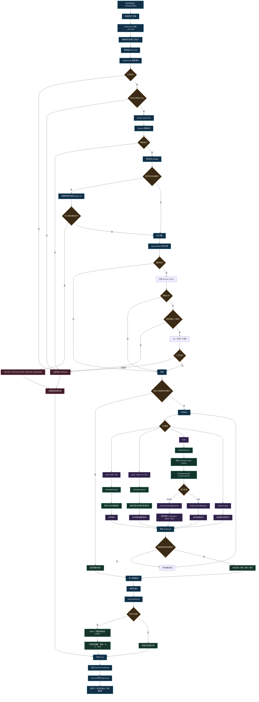
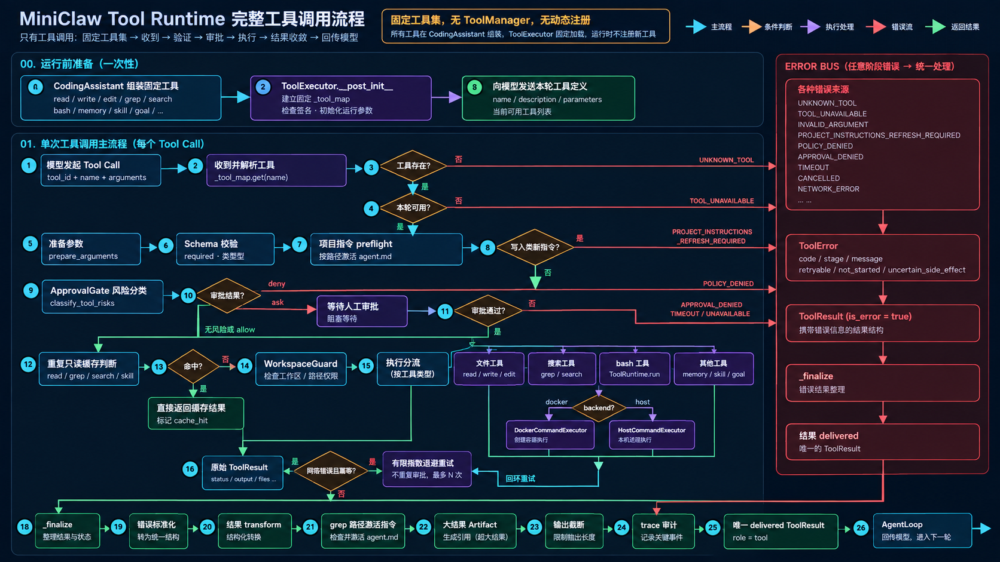

## 工具职责与边界

| 工具 | 作用 | 关键边界 |
|---|---|---|
| `read` | 读取文件内容，支持 `offset` / `limit` 分段 | 受 WorkspaceGuard 和 128KiB 模型可见上限约束；读取 artifact 不会二次落盘 |
| `bash` | 执行受控命令 | 经过 timeout、工作目录和执行后端检查；Docker/Host 由 Runtime 配置决定 |
| `write` / `edit` | 创建、覆盖或按唯一文本替换文件 | 写入路径受 WorkspaceGuard 保护，结果进入统一 ToolExecutor 生命周期 |
| `grep` | 搜索文件内容 | 只读搜索，支持正则、glob、大小写、上下文和结果上限 |
| `search` | 按 glob 查找工作区路径 | 自动排除受保护路径，可选择是否包含目录，最多返回 10,000 项 |
| `ls` | 列出单个目录的直接内容 | 只返回路径和目录标记，不读取文件；最多返回 500 项 |
| `find` | 按文件名模式递归查找路径 | 可限定 file/directory/any；只返回路径，不读取文件，最多返回 500 项 |
| `memory` | 检索或维护 semantic memory | 只允许用户明确确认的长期偏好/事实进入 semantic；episodic 由程序维护 |
| `goal` | 查看或更新明确 Goal 状态 | 只在存在长期 Goal 时使用，不承担普通任务验收 |

`ls` 与 `find` 都属于只读路径发现工具，和 `search` 的区别是：`ls` 只看当前目录，`find` 按文件名模式递归查找；三者都不会读取文件内容，后续需要内容时必须显式调用 `read`。

