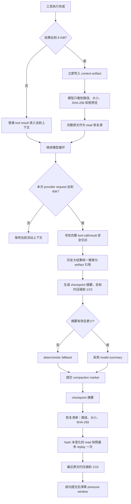

# MiniClaw 记忆压缩



## 1. 实时大工具落盘

大工具落盘不是硬压缩的子步骤，而是任何时刻都可能发生的实时保护路径。单个成功工具结果达到 `8 KiB` UTF-8 bytes，就立即保存到 `.aster/context-artifacts/<session>/`。模型只收到短引用、路径、字节数和 SHA-256；完整原文不直接长期占用活动上下文。

如果模型随后 `read` artifact，运行时标记 `artifact_read=true`，直接提供恢复内容，不再次生成 artifact，避免“落盘 → read → 再落盘”循环。`read` 支持 offset 分段，模型可见上限为 `128 KiB`；runtime 捕获上限和截断证据拒绝仍保留。

## 2. 硬压缩触发

当前只有硬压缩路径，默认阈值为一次 provider request 的 `40,000` input tokens。没有 soft compaction、闭合回合归档或旧工具批量归档。累计输入可以用于诊断，但不触发另一套算法；phase 切换不会清零，只有成功提交后才清零 pressure window。

## 3. 摘要与提交

安全切点不能拆开 assistant tool-call 与对应 tool result。checkpoint 至少保留：当前目标、约束、完成项、最新有效验证、失败/未完成项、下一步以及必要文件/artifact 路径。

压缩后的模型可见结构固定为：

```text
checkpoint 摘要（约压缩前 1/10）
恢复清单（关键文件/artifact 的路径、大小、SHA-256）
必要的 read 快照恢复内容
最近原文（约压缩前 1/10）
```

摘要失败、取消或无法证明变小，不删除原始 append-only session，也不伪造成功 marker。摘要和最近原文的两个 `1/10` 是目标比例，恢复清单是额外的极小索引。

## 4. read 复用

`ReadSnapshotCache` 为最近读过的小文件记录 SHA-256。硬压缩成功后，下一次请求最多 replay 5 个 hash 未变化的快照一次；文件改变、删除、过大或已经 replay 就跳过。模型因此不需要马上重复读取同一个未修改文件，但仍可主动 `read` 获取最新内容。

## 5. 恢复不变量

1. 原始 session 永远保留，压缩只改变模型可见活动视图。
2. 不完整 tool-call 批次不会被重放以执行副作用。
3. artifact 是恢复源，不是 semantic 或 episodic memory。
4. read 恢复不会生成第二份 artifact。

## 6. 主要代码

| 目标 | 文件 |
|---|---|
| 触发、切点、摘要、提交 | `src/MiniClaw/coding_agent/memory/working.py` |
| artifact 实时落盘与引用 | `src/MiniClaw/coding_agent/memory/artifacts.py`、`working.py` |
| hash 快照恢复 | `src/MiniClaw/coding_agent/memory/read_cache.py` |
| 阈值配置 | `src/MiniClaw/coding_agent/memory/config.py` |
