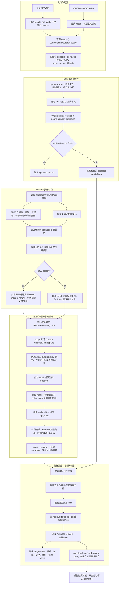

# MiniClaw 记忆召回

## 1. 记忆分层

| 层次 | 作用 | 是否进入这条查询召回链 |
|---|---|---|
| Working Context | 当前会话、checkpoint、最近原文 | 由上下文投影直接提供 |
| Episodic | 程序自动记录的历史会话、操作和结果 | 是，唯一的 memory recall 源 |
| Semantic | 用户明确确认的长期偏好和稳定事实 | 否，只由 memory 写入/修改工具管理 |
| Artifact | 大工具完整原文的恢复源 | 否，必须明确 `read` 才恢复 |

## 2. Episodic 召回流程（逐阶段）

`memory.search` 的 query 直接进入 episodic store，不再经过 semantic、archive 或多路融合接口。自动 recall 和显式 search 共用这条入口，但为了控制成本，显式 search 可以对有界候选池执行 cross-encoder rerank，自动 recall 使用轻量排序。

### 2.1 入口与 query 准备

- 自动 recall 从当前任务请求生成 bounded query；显式 `memory.search` 使用模型提供的 query；
- query 会折叠空白、规范化大小写并限制长度，避免把整段工作上下文重复送入检索；
- retrieval cache 的键包含 scope、规范化 query、自动/显式模式、active-context signature 和 memory version；
- cache 命中时直接返回候选，不重复读取和排序。

### 2.2 候选召回

- episodic store 读取会话摘要、状态、更新时间和检索字段；
- BM25 负责词项、文件路径、错误码、函数名等稀疏精确匹配；
- 向量召回负责语义相似但词面不同的历史；
- 两路候选在 episodic 入口合并，并保留各自 rank/score；
- 候选池只按请求 limit 的有界倍数扩展，避免全库扫描；
- 显式 search 对有界候选池执行 cross-encoder rerank；模型不可用时回退到确定性排序；自动 recall 不额外触发昂贵 rerank。

### 2.3 过滤、衰减与排序

- 先过滤 user、channel、workspace scope 不匹配的记录；
- 再处理 superseded、无效、冲突和不应覆盖新记录的状态；
- 自动 recall 排除当前 session，避免把当前工作重新召回；
- 自动 recall 还会排除已经出现在 active context 中的长重复内容；
- 根据 `updatedAt` 计算 `age_days`，使用 `exp(-age_days / 180)` 作为 recency multiplier；这里 180 天是时间常数，不是严格的半衰期；
- 将原始相关性分数乘以时间衰减后重新排序，同时保留来源、状态、rank 和诊断元数据。

### 2.4 去重、预算与注入

- 按规范化内容和稳定元数据去重，避免同一 episode 多次出现；
- 只保留最终 `limit` 条，并按 retrieval token budget 截断单条内容；
- 输出渲染为不可信 episodic evidence；
- evidence 只能进入 user-level context，不能修改 system policy，也不能覆盖当前用户请求；
- manager 记录候选数量、过滤原因、cache 命中、耗时和最终渲染 token，供诊断和 Eval 使用。

## 2.5 面试讲解：一条记录到底怎样变成最终 evidence

可以把一次召回拆成四个不同问题：

1. **找什么**：query rewrite 将当前请求变成有界检索文本，并保留文件名、错误码、函数名等高信号词。
2. **找到哪些**：BM25 找词面精确匹配，向量召回找语义相似匹配；两者只负责产生候选，不直接决定最终返回。
3. **哪些能用**：scope、状态、当前 session、当前上下文重复项会被过滤；随后用更新时间做指数衰减，让旧记录逐渐降低影响，但不会简单按日期删除。
4. **最终给多少**：候选按分数排序、去重、限制条数和 token budget，最后包装成不可信 evidence。

因此，“召回”不是一次搜索调用，而是“候选生成 → 过滤 → 时间修正 → 排序 → 去重 → 预算渲染”的完整流水线。

### 2.6 为什么需要 BM25 和向量两路候选

- 只有 BM25：`VersionResolver`、`min >= max`、`cli.py` 这类精确符号很强，但用户换一种说法时可能找不到。
- 只有向量：能理解“版本解析失败”和“依赖版本冲突”的语义相近关系，但可能把相似却不相关的历史混进来。
- 两者合并：先扩大候选覆盖面，再在过滤和排序阶段做确定性控制。这里是 episodic 内部的候选合并，不是 semantic 与 episodic 的多路融合。

### 2.7 为什么自动 recall 不总是做昂贵 rerank

自动 recall 可能发生在任务开头或一次受限的动态 refresh，并且结果会进入后续模型请求。如果每轮都调用 cross-encoder，会增加延迟、token/计算成本和缓存变化。显式 `memory.search` 是模型主动请求，通常更重视检索质量，因此可以对已经有界的候选池执行 rerank；rerank 不可用时仍有确定性排序回退。

### 2.8 时间衰减到底做什么

当前实现使用近似 `score_after_decay = relevance_score × exp(-age_days / 180)`。它不是硬删除：

- 新旧记录都可能保留；
- 越新的同等相关记录优先级越高；
- 很老但高度相关的记录仍可能入选；
- 记录的 `updatedAt` 缺失或无法解析时，不会因为解析异常直接崩溃。

面试中要特别区分“时间衰减”和“TTL”：TTL 到期删除记录，时间衰减只是降低排序分数，本项目采用后者。

### 2.9 过滤为什么必须在最终注入前完成

历史 episode 不是系统指令，也不是事实数据库的绝对真相。过滤可以避免：

- 把当前任务再次召回造成重复上下文；
- 让旧的 superseded 方案覆盖新的有效方案；
- 把其他 user/channel/workspace 的记录泄漏到当前任务；
- 把失败或未完成的历史误当成成功经验。

过滤之后仍会标记为“不可信 evidence”，模型必须结合当前文件、工具结果和用户要求判断，不能把召回文本当作新的 system prompt。

### 2.10 cache 命中与失效

缓存键不是只有 query，还包含 scope、自动/显式模式、active-context signature 和 memory version。这样可以避免把一个上下文中的结果错误复用到另一个上下文。

- semantic 或 episodic 数据发生修改时，memory version 增加并清空检索缓存；
- 当前活动上下文发生实质变化时，自动 recall 的 signature 变化；
- 显式 search 没有 active-context signature，仍受 query、scope 和 memory version 约束；
- cache 命中只复用已经完成的 episodic candidates，不跳过最终 evidence 的安全边界。

## 2.11 面试高频问题

**问：为什么 `memory.search` 不搜索 semantic？**

答：semantic 是用户明确确认的长期偏好/事实，写入和修改需要谨慎授权；当前查询召回只面向 episodic 历史任务，避免把长期偏好、临时操作历史和恢复 artifact 混成一条证据流。

**问：BM25、向量和 rerank 分别负责什么？**

答：BM25 和向量负责扩大候选覆盖；rerank 只在有界候选池内进一步判断相关性。前两者是召回，后者是排序，不应把三者混称为同一个步骤。

**问：为什么不直接把所有 episodic 记录都塞给模型？**

答：会造成上下文膨胀、旧结论干扰、跨 scope 泄漏和缓存前缀变化。召回必须有候选上限、过滤规则、去重和 token budget。

**问：旧 episode 会不会永远消失？**

答：不会因为时间衰减自动删除；它只是分数变低。只有状态过滤、去重或预算截断可能让它本轮不返回。

**问：召回内容能覆盖 system prompt 吗？**

答：不能。它被包装成 user-level 的不可信 evidence，system policy、当前用户请求和实时工具证据优先。

**问：artifact 为什么不加入 episodic？**

答：artifact 是大工具完整输出的恢复源，不是经过验证的任务经验。它必须由模型明确 `read`，否则模型不能声称看过完整内容；自动加入 memory 会把日志噪声变成长期检索结果。

**问：检索失败怎么办？**

答：向量模型或 rerank 不可用时回退到 BM25/确定性排序；缓存失效时重新检索；没有候选时返回空 evidence，不伪造记忆，也不阻塞当前工具执行。

**问：为什么要记录 diagnostics？**

答：为了区分“没有相关记忆”“被过滤”“被预算截断”“缓存命中”“检索耗时过高”等不同问题，Eval 才能判断是数据问题、排序问题还是上下文预算问题。

## 3. Semantic 的边界

Semantic 使用 `MEMORY.md` 短索引和 topic files 保存长期事实，但不参与当前查询召回。只有用户明确要求保存，或明确给出稳定、可复用的偏好/事实时，模型才谨慎调用 `remember`；`replace` 和 `forget` 只修改 semantic，并要求先确认目标记录和 revision。

普通工具输出、一次性验证、artifact、临时项目状态和模型猜测都不能自动写入 semantic。

## 4. Artifact 与召回的区别

Artifact 不属于 memory。它保存的是被实时落盘的大工具完整结果，模型只有拿到路径并主动 `read` 后才能使用完整内容。artifact、压缩 transcript 和旧 archive 都不参与 episodic 自动召回。

## 5. 主要代码

| 目标 | 文件 |
|---|---|
| episodic 入口、过滤、时间衰减、排序、去重 | `src/MiniClaw/coding_agent/memory/manager.py` |
| episodic 文件与检索 | `src/MiniClaw/coding_agent/memory/episodic.py` |
| semantic 索引与 topic files | `src/MiniClaw/coding_agent/memory/semantic.py` |
| memory 工具边界 | `src/MiniClaw/coding_agent/memory/tools.py` |
