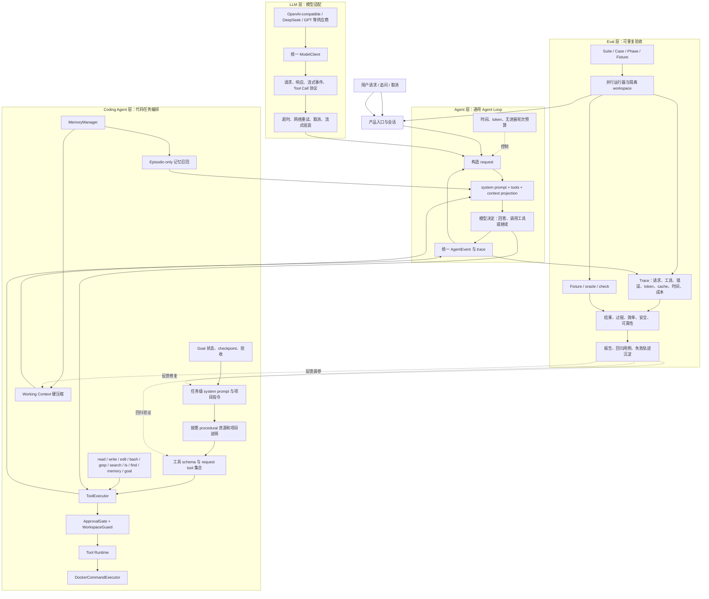

# MiniClaw 项目总览

## 总体架构图



## 一句话理解四层

- **LLM 层**解决“怎样稳定地和不同模型通信”。它不理解项目业务，也不直接执行文件操作。
- **Agent 层**解决“怎样反复请求模型、接收 Tool Call、回传 Tool Result，直到任务停止”。它是通用循环，不绑定 coding 规则。
- **Coding Agent 层**解决“代码任务需要哪些指令、记忆、工具、安全边界和验收状态”。它是产品编排层。
- **Eval 层**解决“这次运行到底是否正确、是否安全、是否浪费、能否回归复现”。它观察和验收运行，不代替 Agent 做决策。

## 1. LLM 层：只负责模型协议适配

LLM 层通过统一的 `ModelClient` 和类型协议屏蔽供应商差异。上层不需要知道 DeepSeek 或 GPT 的具体 HTTP/SSE 格式，只处理统一的：

- `ModelRequest`：模型 profile、messages、tool schema、metadata、取消令牌；
- `AssistantReply`：文本、tool calls、usage、错误和结束原因；
- 流式 `ModelEvent`：增量文本、增量 tool call、usage、完成和错误；
- `ToolInvocation`：工具名、call id、JSON arguments。

流式 Tool Call 不能直接把每个片段交给工具执行。LLM 适配层要先按 call id 组装完整名称和参数，完成 JSON 校验后，Agent 层才把它交给 ToolExecutor。网络重试只针对模型请求；已经产生副作用的工具不会因为模型网络错误而盲目重放。

## 2. Agent 层：通用模型—工具循环

AgentLoop 的核心循环是：

```text
构造 system prompt、历史消息和工具 schema
→ 请求模型
→ 得到文本或 Tool Call
→ ToolExecutor 执行并返回 Tool Result
→ 追加 assistant/tool 消息
→ 重新请求模型
→ 直到最终回答、goal 完成、预算耗尽、取消或失败
```

它还负责：

- 时间预算、token 预算、无进展轮次限制；
- context projection 和 context updates；
- 统一事件流，供 UI、trace 和 Eval 使用；
- final guard，防止模型在没有必要验收证据时虚报完成；
- 请求级 tool advertisement，保证模型看到的 schema 与实际可执行工具一致。

AgentLoop 本身不决定 `read` 如何解析路径，也不决定 bash 是否进入 Docker；这些属于 Coding Agent 的工具和 Runtime 层。

## 3. Coding Agent 层：面向代码任务的组合根

`CodingAssistant` 是 Coding Agent 的 composition root，负责把通用 AgentLoop 组合成代码工作流。

### 3.1 System prompt、项目指令和工具描述

一次模型请求的主要可见结构可以概括为：

```text
system prompt
→ 项目指令和行为约束
→ episodic recall evidence
→ 当前 working context
→ tool schema
→ 当前用户消息与历史 tool call/result
```

其中：

- system prompt 规定最高优先级的行为、安全和证据边界；
- 项目指令描述仓库约定，例如 `AGENTS.md`、项目说明和运行方式；
- tool schema 只描述模型可调用的工具能力和参数格式，不负责执行；
- phase prompt 或用户任务负责明确本次任务目标，不应该复制整套 system policy；
- memory evidence 是不可信数据，不能伪装成 system instruction。

### 3.2 MemoryManager、召回和压缩

MemoryManager 负责两条互不混淆的路径：

1. **Episodic recall**：当前只有 episodic 查询召回链，执行 query rewrite、BM25/向量候选召回、过滤、时间衰减、排序、去重和 token budget 渲染。
2. **Working compaction**：当前上下文超过硬阈值时，生成 checkpoint 摘要、恢复清单和最近原文；大工具 artifact 是实时路径，不等到硬压缩才落盘。

Semantic memory 仍然存在，但只由 `remember/replace/forget` 谨慎维护，不进入这条 episodic recall 查询链。Artifact 是工具结果恢复源，不是长期记忆。

压缩后模型可见结构为：

```text
checkpoint 摘要约压缩前 1/10
恢复清单和 hash
一次性 read 快照
最近原文约压缩前 1/10
```

### 3.3 Goal：把“做完”变成可验证状态

Goal 不是普通聊天文本，而是任务状态机和验收边界。它记录目标、checkpoint、验收标准、尝试状态和验证证据。

- `goal` 用于查看或更新明确的长期任务状态；
- `goal_complete` 只在存在明确 Goal 任务时暴露；
- 模型声明“完成”不等于系统接受完成；
- GoalSupervisor、GoalStore 和 judge 会检查证据、状态、预算和是否存在未恢复错误；
- Eval 仍可用 fixture/oracle 对最终工作区做独立验收。

### 3.4 Function Calling 与工具调用

模型不是直接执行 Python 函数，而是输出结构化 Tool Call：

```json
{
  "name": "read",
  "arguments": {"path": "src/app.py", "offset": 1, "limit": 200}
}
```

实际链路是：

```text
模型输出 Tool Call
→ 流式片段组装
→ schema 和 JSON 参数校验
→ 工具名 allowlist 校验
→ ApprovalGate 决定 allow / ask / deny
→ WorkspaceGuard 路径和操作检查
→ Tool Runtime 执行
→ 输出截断或 artifact 化
→ ToolResult 回传模型
→ trace 记录完整生命周期
```

工具 schema 是能力合同；ToolExecutor 是生命周期控制器；具体工具实现才是业务动作。三者不能混为一个“工具函数”。

### 3.5 ToolExecutor 与 Tool Runtime

ToolExecutor 统一处理每个工具调用的：

- 参数解析和 schema 约束；
- 工具是否注册、当前 request 是否允许；
- approval、超时、取消和有限重试；
- tool event、错误封装和结果转换；
- verification cache 和重复检查复用；
- artifact transform、输出上限和 trace。

Tool Runtime 决定“在哪里执行”和“执行环境有什么能力”：

- 文件工具通过 WorkspaceGuard 访问统一 workspace；
- bash 根据 RuntimeSettings 进入 host 或 Docker；
- Docker 模式固定工作目录、资源限制、网络策略、临时文件系统和容器清理；
- Runtime 结果仍要回到 ToolExecutor，不能绕过审批、trace 和输出边界。

### 3.6 WorkspaceGuard、ApprovalGate 和 Docker 的关系

这三者解决不同问题：

| 组件 | 解决的问题 | 典型职责 |
|---|---|---|
| ApprovalGate | 这次动作是否需要人工批准 | allow / ask / deny、审批超时、审批记录 |
| WorkspaceGuard | 路径是否在允许范围内 | 规范化路径、防目录逃逸、区分 read/write/search/execute |
| Docker Runtime | 命令在哪个进程环境运行 | 隔离命令、网络、CPU、内存、PID、tmpfs 和容器生命周期 |

Docker 不是 WorkspaceGuard 的替代品。即使命令在容器里执行，模型可见路径、宿主 workspace 映射、敏感目录和写入边界仍需要 Guard；反过来，Guard 也不能提供进程级隔离，所以 bash 还需要 Runtime 后端。

## 4. Eval 层：从运行轨迹得到可比较结论

Eval 不是“让另一个模型随便打分”，而是由 suite、case、phase、fixture、oracle、trace 和预算共同组成的验收系统。

### 4.1 运行阶段

```text
读取 suite 和 case
→ 准备 fixture 与隔离 workspace
→ 并行运行 Coding Agent
→ 保存完整 trace 和 workspace diff
→ 执行 oracle/check
→ 汇总质量、过程、效率、安全、可靠性
→ 生成报告与失败回归样例
```

### 4.2 主要观察指标

- **结果**：最终文件、测试、oracle 或 rubric 是否满足题目要求；
- **过程**：工具错误率、未恢复错误、是否完成必要验证；
- **效率**：input/output tokens、缓存命中、工具调用数、耗时和预算；
- **安全**：写入路径、命令边界、审批结果和越界尝试；
- **可靠性**：多次运行成功率、取消/重试恢复、最终状态是否可复现。

最终回复里说“完成”只是模型输出，不等于 outcome 通过；真正的工作区和 oracle 证据优先。

## 5. 一次完整请求的端到端轨迹

```text
用户：修复版本解析问题
→ CodingAssistant 读取 system prompt、项目指令、episodic evidence 和历史上下文
→ AgentLoop 发送 ModelRequest 与工具 schema
→ 模型选择 read
→ ToolExecutor 校验参数与工具权限
→ WorkspaceGuard 解析路径
→ read 工具返回文件内容
→ ToolExecutor 记录 trace 并把结果回传模型
→ 模型选择 edit
→ ApprovalGate / WorkspaceGuard 检查写入
→ edit 修改 workspace
→ 模型选择 bash
→ Runtime 将 bash 放入 Docker
→ 测试结果回传，必要时大输出实时落盘 artifact
→ 模型根据结果继续修复和验证
→ Goal / final guard 检查是否可以交付
→ Eval 用 fixture、oracle 和 trace 验收
```

## 6. 常见面试问答

### 问：为什么要分 LLM、Agent、Coding Agent 三层？

答：LLM 层处理供应商协议，Agent 层处理通用循环，Coding Agent 层处理代码任务的工具、记忆、目标和安全策略。这样更换模型不会重写 Agent Loop，更换工具策略也不会污染底层协议适配。

### 问：Tool schema 和 ToolExecutor 有什么区别？

答：schema 是给模型看的能力合同，描述名称、参数类型和约束；ToolExecutor 是给系统用的执行生命周期，负责校验、审批、超时、重试、结果转换、错误和 trace。模型输出合法 JSON 也不代表系统一定允许执行。

### 问：为什么需要 Tool Runtime，ToolExecutor 直接调用工具不行吗？

答：ToolExecutor 统一生命周期，Runtime 提供实际执行后端。尤其 bash 需要 host/Docker、网络、资源、cwd 和取消控制；把后端塞进每个工具会导致安全策略和执行逻辑分散。

### 问：WorkspaceGuard 和 Docker 哪个负责安全？

答：WorkspaceGuard 负责路径与操作授权，Docker 负责进程和资源隔离。两者是纵深防御，不能互相替代。

### 问：artifact 是 memory 吗？

答：不是。artifact 是大工具完整结果的恢复源，只有显式 read 才恢复；episodic 是程序记录的历史任务记忆，semantic 是用户确认的长期事实。三者生命周期和信任级别不同。

### 问：压缩会删除历史吗？

答：不会。原始 session append-only 保留，压缩只替换模型可见的 working projection。模型看到 checkpoint、恢复清单、一次性 read 快照和最近原文，需要细节时再 read artifact。

### 问：为什么 memory recall 不直接把所有历史放进 prompt？

答：会导致上下文膨胀、旧结论干扰、跨 scope 泄漏和缓存前缀变化。因此要经过 episodic 召回、过滤、时间衰减、排序、去重和 token budget。

### 问：Goal 和最终文本回答有什么区别？

答：文本回答是模型表达，Goal 是系统状态和验收证据。模型说“已完成”不能自动让 Goal 变成完成，系统还要检查验证、工作区和未恢复错误。

### 问：Eval 为什么要保存完整 trace？

答：只看最终答案无法解释工具错误、重复验证、压缩、缓存未命中和安全越界。完整 trace 让系统能定位问题、比较效率、生成回归用例，并区分模型错误和运行时错误。

### 问：模型调用失败和工具执行失败如何处理？

答：模型网络失败只重试受影响的模型请求；工具失败通常作为 Tool Result 返回模型，让它修正策略；写入类副作用不能因为网络重试而盲目重放。取消、超时和不可恢复错误会进入 trace 和最终状态。

### 问：这套架构最重要的设计原则是什么？

答：模型负责提出下一步行动，产品层负责上下文和记忆，ToolExecutor 负责调用生命周期，Runtime 负责执行环境，Guard 负责安全边界，Eval 负责独立验收。每层有清晰证据和失败边界，不能把模型一句话当成系统事实。

## 7. 代码入口速查

| 模块 | 主要入口 |
|---|---|
| LLM 适配 | `src/MiniClaw/llm/` |
| Agent Loop | `src/MiniClaw/agent/loop.py` |
| Coding Agent 组合根 | `src/MiniClaw/coding_agent/assistant/coding.py` |
| System prompt / 行为约束 | `src/MiniClaw/coding_agent/assistant/prompts.py` |
| Memory 与硬压缩 | `src/MiniClaw/coding_agent/memory/` |
| Goal 状态与验收 | `src/MiniClaw/coding_agent/goal/` |
| 工具实现与 schema | `src/MiniClaw/coding_agent/tools/` |
| ToolExecutor | `src/MiniClaw/coding_agent/tools/executor.py` |
| Runtime / Docker | `src/MiniClaw/coding_agent/runtime/` |
| WorkspaceGuard | `src/MiniClaw/coding_agent/runtime/workspace.py` |
| Eval runner / oracle | `src/MiniClaw/evaluation/` |
