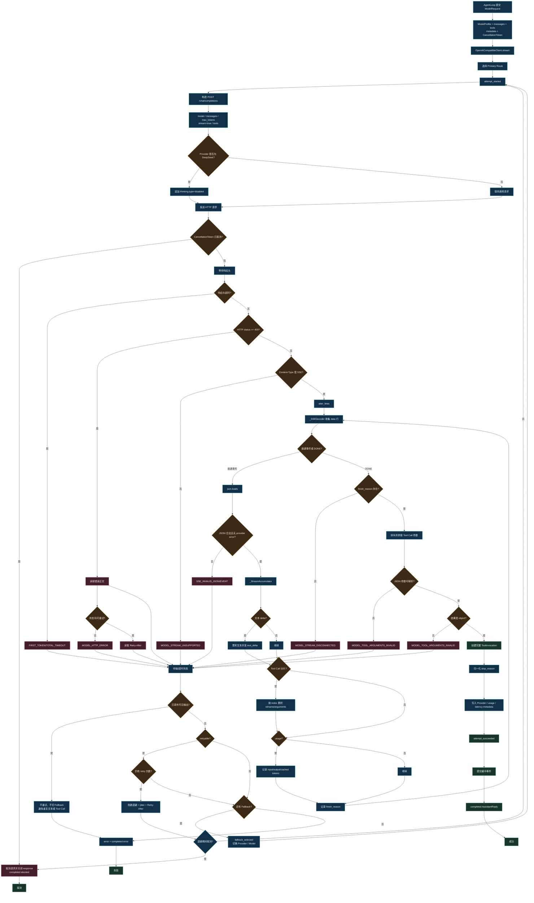

# MiniClaw LLM 层：源码级面试讲解

> 本文以当前 src/MiniClaw/llm 的真实实现为准。LLM 层不是简单封装 SDK，而是 Provider-neutral 类型、配置加载、原生 SSE 解析、Tool Call 重组、超时、取消、有限重试和 Fallback 的传输边界。

## LLM 流程图

## 1. 一句话结论

> MiniClaw 的 LLM 层只负责和模型稳定通信，不负责决定任务怎么做，也不负责执行工具。它把不同 Provider 的请求、消息、工具调用、流式事件、超时、重试、Fallback 和 Token usage 统一成 MiniClaw 自己的协议。

核心边界：

~~~text
Agent / CodingAssistant
        │
        ▼
ModelClient.stream(ModelRequest)
        │
        ▼
OpenAICompatibleClient
        │
        ▼
Provider HTTP / SSE
~~~

LLM 层不选择工具、不校验工具业务参数、不执行 Bash 或文件操作、不判断任务完成，也不做 Memory 召回和上下文压缩策略。

## 2. 目录与核心类型

| 文件 | 真实职责 |
|---|---|
| [types.py](../../../src/MiniClaw/llm/types.py) | ChatMessage、ToolInvocation、ModelRequest、AssistantReply、ModelEvent、TokenUsage、ModelProfile |
| [client.py](../../../src/MiniClaw/llm/client.py) | ModelClient Protocol |
| [openai_compatible.py](../../../src/MiniClaw/llm/openai_compatible.py) | HTTP/SSE、分片累积、超时、取消、重试、Fallback |
| [config.py](../../../src/MiniClaw/llm/config.py) | Provider、模型、超时、重试、价格和 Fallback 配置 |
| [factory.py](../../../src/MiniClaw/llm/factory.py) | 根据配置创建客户端和 ModelProfile |
| [env_file.py](../../../src/MiniClaw/llm/env_file.py) | .env 读取与环境合并 |
| [recovery.py](../../../src/MiniClaw/llm/recovery.py) | 保守识别网络错误，供上层定点恢复 |

## 3. Provider-neutral 协议

ChatMessage 统一 system、user、assistant、tool 四种角色。assistant 可以带 tool_calls，tool 必须带 tool_call_id。

ToolInvocation 的结构是 call_id、name、arguments。LLM 层只保证 arguments 能解析成 JSON object，具体字段类型、必填项和安全策略由 ToolExecutor 再校验。

ModelRequest 包含 profile、messages、tools、temperature、metadata 和 cancellation_token。metadata 是本地策略和 Trace 信息，不直接发送给 Provider，例如 Agent 请求会设置 buffer_network_retries=True。

AssistantReply 包含完整文本、完整 Tool Call、stop_reason、TokenUsage、error 和实际 Provider metadata。ModelEvent 包括 text_delta、tool_call、usage、transport、completed、error。

## 4. SSE 和 Tool Call 分片

SSEDecoder 收集连续 data 行，遇到空行才 flush，忽略冒号开头的心跳/注释，流关闭时还会 flush 未结束事件。非法 JSON 返回 MODEL_SSE_INVALID_JSON，非对象事件返回 MODEL_SSE_INVALID_EVENT。

文本 delta 可以立即发出，例如 Hel、lo。Tool Call 不能立即执行，因为 ID、函数名和参数都可能拆成多个 chunk：

~~~text
chunk 1：id="call_", name="wr", arguments='{"path":"a'
chunk 2：id="1",     name="ite", arguments='.txt","content":"OK"}'
~~~

StreamAccumulator 按 index 保存 ToolCallBuffer，分别累积 call_id、name 和 argument_parts。只有流结束后，才拼接参数、json.loads、验证结果是 object，并生成完整 ToolInvocation。半截 JSON 永远不会交给 Agent 执行。

## 5. 请求转 wire 格式

OpenAICompatibleClient 将统一请求转换为 POST /chat/completions：

~~~json
{
  "model": "...",
  "messages": [],
  "max_tokens": 8192,
  "stream": true,
  "stream_options": {"include_usage": true}
}
~~~

有工具时追加 function schema 和 tool_choice=auto；assistant 历史中的 arguments 重新编码为 JSON 字符串；tool 消息带回 tool_call_id。

当前 DeepSeek route 会追加 thinking.type=disabled，这是针对当前兼容接口的适配，不能泛化为所有 DeepSeek API 的永恒规则。

## 6. 四类超时

| 超时 | 含义 |
|---|---|
| Connect Timeout | 建立连接、连接池和写请求的底层网络时间 |
| First Token Timeout | 请求开始到第一个有意义输出的时间 |
| Idle Timeout | 已经有输出后，相邻流数据之间允许的最大空闲 |
| Total Timeout | 一次 attempt 从开始到结束的硬上限 |

文本、reasoning 内容或 Tool Call 分片都算有意义输出。响应头等待使用 first-token 与 total 的边界，不把整个模型启动时间错误归入 connect timeout。

## 7. 重试与 Fallback

每条 route 是 1 次初始请求加 max_retries 次重试。当前默认 `max_retries=5`，最多 6 次 attempt。退避从 1 秒开始，按二进制指数增长：

~~~text
min(retry_max_seconds, retry_base_seconds × 2^retry_index)
~~~

当前默认关闭 jitter，因此典型等待序列是 1、2、4、8、16 秒；如果 Provider 返回 Retry-After，则与本地退避取较大值，但仍受 retry_max_seconds 限制。

可重试状态码为 408、409、425、429 和 500-599。协议错误、大部分 4xx 和非法 Tool Call 参数不应盲目重试。

最关键的提交边界：

~~~text
尚未发布可见输出 → 可以 retry / fallback
已经发布 text_delta 或 tool_call → 不 retry、不切 fallback
~~~

Agent 请求设置 buffer_network_retries=True，客户端会暂存 text_delta、tool_call 和 usage，attempt 成功后才发布。失败时丢弃缓冲，避免重复文本和重复工具调用。这是传输层缓冲，不是数据库事务。

Fallback 顺序是 Primary 在本 route 内重试耗尽后，切换下一个 route；只有没有发布可见输出时才允许切换。成功回复 metadata 会记录实际 Provider 和 model。

## 8. 取消、错误与 usage

_await_cancelable 同时等待网络任务、CancellationToken 和 timeout。取消先到时取消异步操作、关闭 response、返回 completed(stop_reason=aborted)，不把用户取消伪装成普通模型错误；重试退避也可以被取消。

最终所有 route 都失败时，先发 error，再发 completed(stop_reason=error)，并保留 partial content、partial usage、attempts、error code、retryable 和 emitted_output。

Provider usage 映射为：

~~~text
prompt_tokens → input_tokens
completion_tokens → output_tokens
prompt_tokens_details.cached_tokens → cached_tokens
~~~

LLM 层提供 usage、价格和首 Token 延迟 metadata；跨请求费用、耗时和模型重试统计由 Trace 层汇总。usage 缺失时不能把零值解释成实际没有 Token 消耗。

## 9. 配置与网络恢复

Provider 别名：

~~~text
primary / openai / openai-compatible / zxcoding → primary
deepseek → deepseek
anthropic → anthropic（原生 Messages API）
~~~

主要配置包括 MINICLAW_PROVIDER、各 Provider 的 API Key/Base URL/Model、上下文/输出上限、四类超时、重试参数、MINICLAW_LLM_FALLBACKS 和三类价格。OpenAI 与 DeepSeek 走 `/chat/completions`；Anthropic 走原生 `/v1/messages`，并把 `tool_use/tool_result` 映射为 MiniClaw 的统一 Tool Call/Tool Result。

配置加载阶段会拒绝未知 Provider、缺少对应 Key、非正数超时、负数重试或价格、jitter 超出 0 到 1、retry base 大于 max、子超时超过 total、输出上限不小于上下文窗口，以及缺少 Provider Key 的 Fallback。

ConnectError、ReadError 和协议断开首先按传输问题处理。LLM 层有限重试；仍失败时上层只恢复 pending_request，保留历史、工具结果、Trace 和预算，不从头重跑，也不自动重放已经执行的工具副作用。

## 10. 高频面试回答

### 为什么不让 Agent 直接调用 SDK？

> Provider 差异、SSE 分片、超时、取消、Retry-After、Fallback 和 usage 会泄漏到 Agent，换模型时业务层会出现大量分支。因此用 ModelClient Protocol 把变化集中在 LLM 层。

### 为什么 Tool Call 要等完整？

> 函数名、ID 和 JSON 参数都可能分片。只有完整拼接并验证为 JSON object 后，才能交给 Agent，避免半截参数执行。

### 为什么部分输出后不重试？

> 重试会重复用户可见文本或 Tool Call。Agent 请求使用缓冲，把一次 attempt 的输出成功后再提交；已经发布输出就不自动重放。

### 一次 Agent turn 可能有几次 HTTP 请求？

> 正常是一条；发生临时网络错误时，同一 route 可能多次 attempt，也可能切 Fallback，但它们仍属于一个 ModelRequest 和一个 Agent turn。

### 如何判断缓存命中？

> 以 Provider 返回的 cached_tokens 为准。客户端稳定前缀诊断只能说明请求是否具备较好的命中条件，不能替代 Provider 实测。

## 11. 不要在面试中说错

- 不要说当前是整包 JSON；现在是原生 SSE 流解析。
- 不要说 Tool Call 到一半就执行；必须完整拼装和校验。
- 不要说所有异常都会重试；协议错误和大部分 4xx 不重试。
- 不要说 max_retries=5 代表总共五次；它是初始一次加五次重试。
- 不要说已有可见输出后还会切 Fallback。
- 不要把 LLM 重试和工具副作用重试混为一谈。
- 不要把稳定前缀字节数说成 Provider 缓存 Token。
- 不要说 LLM Client 自己完成所有跨请求成本汇总。

## 12. 建议阅读顺序

1. [types.py](../../../src/MiniClaw/llm/types.py)
2. [client.py](../../../src/MiniClaw/llm/client.py)
3. [openai_compatible.py](../../../src/MiniClaw/llm/openai_compatible.py)
4. [config.py](../../../src/MiniClaw/llm/config.py)
5. [factory.py](../../../src/MiniClaw/llm/factory.py)
6. [tests/test_llm_streaming.py](../../../tests/test_llm_streaming.py)
7. [tests/test_llm_config.py](../../../tests/test_llm_config.py)
