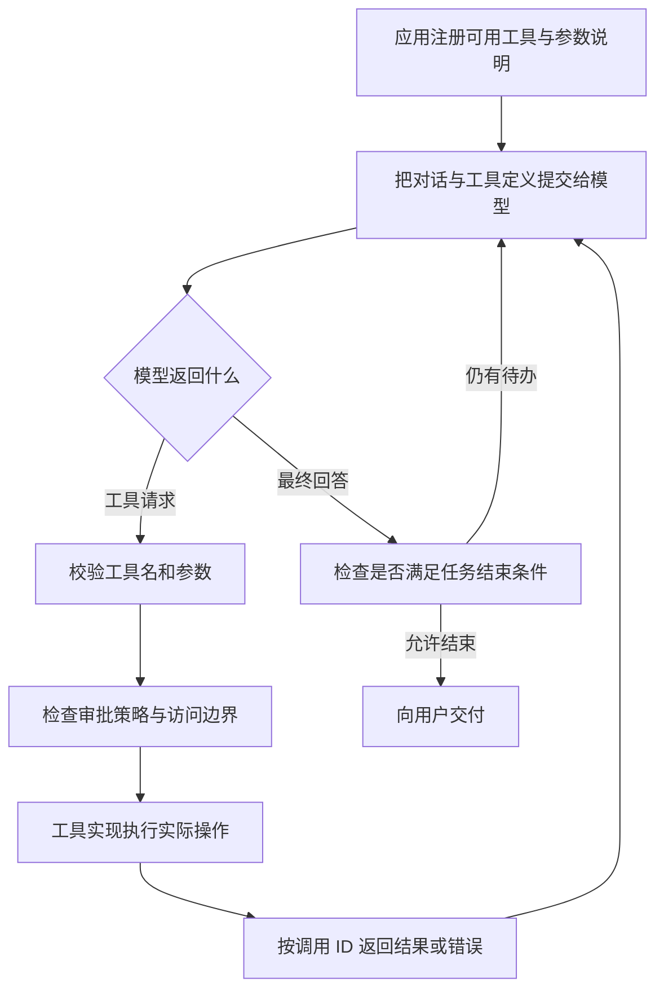
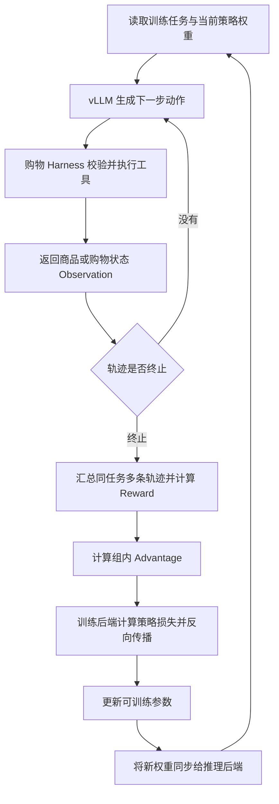

# 简历名词讲解：Tool Calling、Docker、veRL、vLLM

这份文档按“是什么 → 怎么工作 → 项目怎么用 → 面试怎么回答”组织。先讲清职责，再补原理，避免只背名词。

MiniClaw 的实现说明已对照当前源码；购物项目已对照当前 `grpo.yaml` 和 AgentLoop 适配代码。**当前配置不自动等于所有历史实验的实际配置**，回答某次训练的参数、性能和成绩时，应以该次运行保存的配置与日志为准。本次只整理概念，没有重新运行训练或评测。

## 先把四个名词放在正确位置

| 名词 | 一句话理解 | 在你的项目里负责什么 | 不负责什么 |
|---|---|---|---|
| Tool Calling | 模型按约定格式提出“调用哪个工具、传什么参数” | 连接模型决策与文件操作、命令执行、购物动作 | 不直接执行程序，也不保证动作正确或安全 |
| Docker | 用容器提供可配置的进程、文件系统和资源隔离 | MiniClaw 的命令执行后端之一 | 不理解用户授权，不验证业务结果 |
| veRL | 编排大模型强化学习的数据流和训练过程 | 组织轨迹采样、奖励、优势计算、策略更新及权重同步 | 不是模型，也不会自动定义购物任务的正确标准 |
| vLLM | 高效执行大模型推理的引擎 | 生成购物轨迹中的模型动作，也可提供推理服务 | 不负责 GRPO 梯度更新，也不直接执行购物工具 |

**两个项目分别理解：**MiniClaw 主要研究“模型怎样可靠地做事”；购物项目还进一步研究“怎样用轨迹和奖励更新模型参数”。

---

## 1. Tool Calling：模型提出动作，程序负责执行

### 1.1 它到底是什么

用户说“读取配置，修好错误，再运行测试”。模型只能生成输出，不能凭一段文字直接访问你的磁盘。

Tool Calling 给它一个明确的接口：程序提供工具名称、用途和参数结构，模型输出工具名与参数，应用程序执行，再把结果交给模型。

例如，提供一个简化的工具定义：

```json
{
  "name": "read",
  "description": "读取工作区内的文本文件",
  "parameters": {
    "type": "object",
    "properties": {
      "path": {"type": "string"}
    },
    "required": ["path"]
  }
}
```

模型可能返回：

```json
{
  "call_id": "call_01",
  "name": "read",
  "arguments": {"path": "config.json"}
}
```

以上是便于理解的中立表示，不是要求所有供应商采用相同外层字段。MiniClaw 内部用 `ToolInvocation(call_id, name, arguments)` 表达，再由适配层对接模型接口。

### 1.2 一次调用的完整流程



工具定义通常通过模型 API 的 `tools` 等字段传递，对话通过 `messages` 等字段传递。它们共同影响模型生成，但不能简单说“把 Python 函数源码全部拼进 system prompt”。

模型如何选择工具？依靠训练中学到的调用模式，并结合当前要求、工具说明及历史结果生成动作；执行代码仍由应用掌控。即使采用约束解码或严格参数格式，也只能减少格式错误，不能保证业务语义正确。

### 1.3 面试常问的几个小名词

| 名词 | 通俗解释 | 为什么需要 |
|---|---|---|
| Tool Schema | 工具的“使用说明书”：名称、描述、参数及类型 | 让模型知道怎么调用，也供程序做校验 |
| Arguments | 本次动作的实际参数，例如文件路径 | 决定这次具体做什么 |
| Call ID | 一次调用的编号 | 把返回结果和对应请求配对，多工具时尤其重要 |
| Tool Result / Observation | 程序执行后的结果或环境反馈 | 模型据此继续决策，而不是凭空假设执行成功 |
| Tool Registry | 工具注册表 | 将模型输出的工具名映射到真实实现 |
| Agent Loop | 反复“请求模型—执行工具—回传结果”的循环 | 让一次用户请求能完成多步任务 |

### 1.4 你的项目具体做了什么

**MiniClaw：**`ToolManager` 管理可用工具，`ToolExecutor` 统一处理参数校验、前置检查、异常和结果加工；具体文件工具使用 WorkspaceGuard，命令工具转入 Host 或 Docker 后端。`AgentLoop` 将调用与返回加入对话，再请求模型。

无 Goal 时隐藏 `goal_complete` 是一个具体例子：工具是否可用由程序状态决定，不只靠提示模型“不要乱用”。执行入口也需要检查，不能只把工具从展示列表隐藏。

**购物 Agent：**模型输出搜索、查看详情、选择规格等动作，Harness 执行动作并返回商品快照。当前适配代码对一轮多个调用只保留第一个，并记录被截掉的调用，使执行遵守单步单工具约定。这是项目执行策略，Tool Calling 本身并不要求只能调用一个工具。

### 1.5 高频追问与回答

**问：Function Calling 和 Tool Calling 有什么区别？**

答：Function Calling 通常指模型生成可执行函数的名称和参数；Tool Calling 是更广的说法，还可能涵盖平台提供的其他工具。具体 API 术语不同。在我的项目里，主要关注结构化调用协议、工具注册、实际执行与结果回传。

**问：和普通 API 调用有什么区别？**

答：普通业务代码通常预先写好调用哪个 API；这里由模型根据上下文提出调用建议。但两者最后都要由程序校验参数、执行请求并处理错误。Tool Calling 改变的是动作决策来源，没有取消后端校验。

**问：输出一个 JSON 就算实现 Tool Calling 吗？**

答：只完成了一部分。还需要解析与校验、注册表路由、权限检查、实际执行、调用配对、错误返回和循环控制。模型写“测试通过了”也不等于真的执行过测试。

**问：工具报错后直接重试吗？**

答：按错误分类。参数错要修参数，拒绝执行不能靠重试绕过，瞬时连接错误可以有限重试。涉及购买、扣款、写文件等副作用时，先确认上次是否已生效，不能因为没收到响应就重复执行。

**问：支持多个工具就意味着并行执行吗？**

答：不意味着。模型能返回多个调用，应用仍可串行执行。MiniClaw 当前循环逐个执行同轮调用；真正并行还要处理依赖、共享状态、取消和结果配对。

**问：工具输出里有“忽略用户要求”，怎么办？**

答：工具输出是外部数据，不应该变成高优先级指令。除了让模型区分来源，执行端仍要检查工具权限和路径；不能把安全完全寄托在模型听话上。

### 1.6 可以直接口述的版本

> Tool Calling 是让模型用结构化方式提出工具名和参数，再由应用执行并返回结果。我在 MiniClaw 里实现了工具注册、参数校验、审批、执行和错误回传，把它接进 Agent 循环。模型负责决策，Runtime 负责实际动作；是否完成还要检查工具证据和任务状态。

---

## 2. Docker：隔离执行环境，不替你判断动作是否应该做

### 2.1 镜像、容器、Dockerfile 分别是什么

可以用“环境模板”和“正在运行的实例”理解：

| 名词 | 是什么 | MiniClaw 中的例子 |
|---|---|---|
| Image，镜像 | 包含文件系统层、依赖和启动配置的只读模板 | 预先准备好 Python 和所需工具的运行镜像 |
| Container，容器 | 基于镜像启动、拥有独立运行状态的实例 | 为一次命令启动的执行环境 |
| Dockerfile | 描述如何构建镜像的文本文件 | 指定基础镜像、安装依赖等步骤 |
| Bind Mount，绑定挂载 | 把宿主目录映射到容器指定路径 | 宿主工作区映射到 `/workspace` |
| Registry，镜像仓库 | 存储与分发镜像的服务 | 下载或分发统一运行环境；不等于容器本身 |

删除容器不会自动撤销挂载目录中的修改。因为对 `/workspace` 的写入可能实际落在宿主项目目录。

### 2.2 它为什么能隔离

典型 Linux 容器主要依赖三类机制：

- **Namespaces：控制进程看见什么。**例如隔离进程编号、挂载点和网络视图。
- **cgroups：控制资源用多少。**例如限制 CPU、内存和进程数。
- **权限与系统调用限制：控制能做什么。**例如 Linux capabilities、seccomp 和 `no-new-privileges`。

Namespace 不负责理解用户授权，cgroup 也不检查文件路径。这些机制各管一部分，最终限制取决于实际启动配置。

**与虚拟机的区别：**典型 Linux 容器共享其运行宿主的内核，虚拟机通常有自己的客户机内核。因此容器更轻，但隔离边界和虚拟机不同。在 Windows 上运行 Linux 容器时，Docker Desktop 通常通过 WSL2 或 Linux 虚拟机提供 Linux 内核，并不是 Linux 容器直接共享 Windows 内核。

### 2.3 MiniClaw 中一条命令怎么进去

```text
模型提出 bash 调用
  → 工具参数与审批检查
  → ToolRuntime 选择命令后端
  → DockerCommandExecutor 组装启动参数
  → 将工作区挂载为 /workspace
  → 容器中执行 sh -c <command>
  → 收集输出、退出码、错误及取消状态
  → 清理容器，把结果返回 Agent
```

这里 `bash` 是工具名称，不保证底层永远运行 Bash：当前 Docker 后端调用的是 `sh -c`；Host 后端则要遵循实际宿主命令环境。之前 Windows 命令反复失败，就是工具名与真实 shell 混淆的典型问题。

### 2.4 你确实实现了哪些限制

当前 `DockerCommandExecutor.build_run_args()` 中可以核对以下配置：

| 配置 | 意义 | 要讲清的边界 |
|---|---|---|
| 网络模式默认 `none` | 默认关闭容器外部网络访问 | 不代表宿主模型请求也断网 |
| CPU、内存、PID 上限 | 限制命令消耗与进程数量 | 上限来自配置，不能说所有运行都固定使用某组值 |
| `--read-only` | 容器根文件系统只读 | `/workspace` 的可写绑定挂载仍可写 |
| `--cap-drop ALL` | 去掉 Linux 额外能力 | 不等于容器中进程自动变为非 root 用户 |
| `no-new-privileges` | 防止执行过程中获得新的额外权限 | 不等于对任意危险代码绝对安全 |
| 限额 `/tmp` 临时挂载 | 提供可控的临时写入空间 | `noexec` 不阻止所有经解释器读取脚本的方式 |
| 命令结束、超时或取消后清理 | 减少残留容器与继续执行 | 不能撤销已写入宿主挂载目录的内容 |

**最容易说过头的地方：MiniClaw 不是所有工具都放进 Docker。**文件工具仍在宿主执行，通过 WorkspaceGuard 检查访问边界。前端难题复测使用过 Host/direct，因此不能将那批测试描述为 Docker 沙箱实测。

### 2.5 Docker、WorkspaceGuard、审批分别防什么

| 层次 | 主要回答的问题 |
|---|---|
| 审批策略 | 这个动作是否允许执行，是否需要用户确认？ |
| WorkspaceGuard | 这个文件路径是否位于允许访问的范围？ |
| Docker | 命令在什么环境执行，能使用哪些资源与挂载？ |
| 结果验收 | 执行完以后，实际交付是否正确？ |

例如，写错工作区内的配置，可能既不越路径边界，也不触发容器限制，但业务结果仍然错误。安全隔离不能代替功能验收。

### 2.6 高频追问与回答

**问：用了 Docker 为什么还需要 WorkspaceGuard？**

答：工作区会挂载进容器，挂载目录仍需要保护；文件工具还在宿主执行。容器隔离运行环境，WorkspaceGuard 检查应用层路径，两者职责不同。

**问：根文件系统只读，怎么还能修改代码？**

答：根文件系统和挂载目录是不同的写入边界。镜像层保持只读，显式挂载的 `/workspace` 可以允许写入，便于交付代码。

**问：Docker 能完全防止逃逸、泄露和越权吗？**

答：不能。实际风险还取决于内核漏洞、特权模式、网络、挂载范围、Docker socket 是否暴露等配置。也不能让模型获得不该暴露的秘密后，再期待容器补救全部问题。

**问：为什么不直接在宿主执行？**

答：宿主执行方便，但环境依赖和权限范围更难统一。容器有利于固定依赖、限制资源和复现命令；代价是启动、镜像维护、挂载及平台差异。项目保留两种后端，根据场景选择并记录实际使用的后端。

### 2.7 可以直接口述的版本

> 我把 Docker 用作 MiniClaw 的命令执行后端，挂载工作区并配置网络、资源、只读根文件系统和权限限制。文件工具仍通过宿主 WorkspaceGuard 做路径防护，审批单独决定动作能否执行。这样既能约束命令环境，也不会把 Docker 误当作完整的授权和正确性保证。

---

## 3. veRL：组织强化学习训练的数据流

### 3.1 它是什么，为什么要用

veRL 是面向大语言模型的强化学习训练框架，支持把轨迹生成、奖励计算、优势估计和策略更新组织起来，并对接训练与推理后端。

普通 SFT 可以理解为“给定答案，训练模型模仿”；在线 RL 则要让当前模型先做题、得到反馈，再更新参数。长程 Agent 还要在生成过程中访问环境，处理多轮动作与返回，因此训练脚本不是简单地多加一个 Reward 函数。

veRL 的价值在于组织这条数据流、调度计算组件与资源。你的工作是在它上面接入购物环境、AgentLoop、Reward、轨迹处理和评测，而不是宣称独立实现了整套分布式训练框架。

### 3.2 一轮购物 Agent GRPO 怎么走



图中的整体训练流程由 veRL 及项目适配代码组织；vLLM 承担生成计算，Harness 执行购物动作，Reward 由任务规则计算。

### 3.3 Actor、Rollout、Reward、Advantage 分别是什么

| 名词 | 通俗解释 | 购物例子 |
|---|---|---|
| Actor / Policy | 要被优化的动作生成策略 | 决定搜索词、比较商品、选择规格与购买 |
| Rollout | 策略与环境交互得到的一段完整轨迹 | 从用户购物要求到买到商品或终止 |
| Reward | 对轨迹好坏的数值反馈 | 是否满足硬约束、软偏好，是否正确购买，有无无效循环 |
| Advantage | 本条轨迹相对参考基线好多少 | 同一任务几条轨迹里，哪条更值得增加生成概率 |
| Old policy / old log-prob | 采样时策略对动作的概率信息 | 约束更新不要偏离采样分布过远 |
| Reference model | 通常用于 KL 约束的参考策略 | 与 old policy 的用途不同，不应混为同一概念 |
| Critic | 估计状态价值的模型 | 典型 PPO 常用；GRPO 可用组内奖励构造基线，不必单独训练 Critic |

Reward 和 Advantage 不是同一个数。高 Reward 表示任务得分高；正 Advantage 表示比用于比较的基线更好。

### 3.4 结合你的 GRPO 配置理解

当前购物项目配置中可以核对：

- `adv_estimator: grpo`：使用 GRPO 优势估计。
- `rollout.name: vllm`：轨迹生成使用 vLLM。
- `rollout.n: 4`：每个输入采样四条轨迹，**不是使用四张 GPU**。
- `use_kl_loss: false`、`use_kl_in_reward: false`：这份配置没有启用这两处 KL 项。
- `norm_adv_by_std_in_grpo: false`：组内优势不除以标准差。
- LoRA rank 16、alpha 32：通过低秩适配参数做更新；不意味着所有训练开销都消失。
- 通过自定义 `ShoppingToolAgentLoop` 接入多轮工具交互，并启用动态采样筛选。

这些是当前文件的值，不应直接当作 GRPO100、GRPO230 全部历史运行的配置证明。

用一个简化例子理解“去标准差”：同一任务四条轨迹奖励为 `[0.2, 0.4, 0.8, 1.0]`，均值为 `0.6`。只做减均值时，优势为 `[-0.4, -0.2, 0.2, 0.4]`。标准化版本还会除以组内奖励标准差；你的这个配置关闭了这一除法。

**为什么会考虑关闭？**除标准差会改变不同任务组对更新的相对权重，可能放大低差异组中的微小奖励差。关闭后仍保留组内相对比较，但更新更直接受到原始奖励尺度影响，所以仍需控制 Reward 尺度并用实验验证。

**为什么需要动态重采样？**组内奖励全部相同，减均值后优势为零，几乎没有区分轨迹的信号。项目会筛选组内差异及购买成功条件，有限补采样，仍无合格组则跳过更新。代价是更多采样成本与训练分布变化，不能只报告留下来的好轨迹。

### 3.5 为什么还需要训练后端和权重同步

推理侧关心如何高效生成新动作；训练侧需要梯度、优化器状态、反向传播与参数更新。veRL 可以对接 FSDP、Megatron 等训练后端，并对接 vLLM 等生成后端。

更新后的 Actor 权重必须传给生成侧，后续采样才使用新策略。否则训练侧已经更新，推理侧仍在拿旧模型做题。

如果进一步追问 HybridFlow：可以回答，veRL 将高层训练数据流的编排和底层分布式模型计算结合起来，使采样、打分、训练等阶段能采用不同资源与并行布局。**这属于框架能力，不代表你的单机实验实际使用了全部分布式特性。**

### 3.6 高频追问与回答

**问：用了 veRL，你自己做了什么？**

答：我复用框架的训练和采样基础设施，自己接入购物环境与多轮 AgentLoop，定义轨迹终止、动作约束、Observation 投影、Reward 和数据筛选，并建立独立评测。贡献主要在任务适配和训练闭环，而不是重新写分布式反向传播。

**问：无 KL 是不是完全不限制策略更新？**

答：不是。KL 项和 PPO 风格概率比裁剪是两种机制；当前配置仍采用裁剪策略损失。无 KL 减少一种参考约束，也可能增加漂移风险，需要看奖励投机、独立成功率和行为变化。

**问：工具返回的商品信息也要参与策略梯度吗？**

答：Observation 会参与上下文计算，影响下一步动作；但它不是策略主动生成的动作，通常应通过 loss/response mask 排除直接策略损失。模型生成的动作 token 才是需要学习的对象。排除 Observation 的直接损失，不等于把它从上下文删掉。

**问：GRPO 为什么不必训练 Critic？**

答：它用同一输入下多条轨迹的奖励构造相对基线，从而计算优势。代价是需要组内多次采样；如果奖励没有差异，就缺少有效区分信号。

### 3.7 可以直接口述的版本

> veRL 是我购物 Agent 的强化学习训练框架，负责组织采样、奖励、优势和策略更新。我接入了购物环境及多轮工具轨迹，用 vLLM 生成动作，再根据任务约束计算 Reward，通过 GRPO 更新 LoRA 参数。框架提供训练基础设施，我重点实现任务适配、奖励与轨迹处理，并用独立评测判断改进。

---

## 4. vLLM：让模型生成得更高效

### 4.1 它是什么，和模型有什么区别

Qwen 的权重决定模型学到了什么；vLLM 是加载这些权重并执行推理的引擎。

相同模型可以由不同推理引擎运行。vLLM 的主要价值是显存管理、请求调度和推理吞吐，也可以提供兼容常见模型 API 的服务接口；它不是一个新的语言模型。

### 4.2 先懂 Prefill、Decode 和 KV Cache

生成回答通常有两个阶段：

1. **Prefill：处理输入。**读取用户要求和历史上下文，计算后续生成要用到的状态。长输入通常增加这部分成本。
2. **Decode：逐步生成。**自回归模型根据已有内容生成下一个 token，再继续生成。

在典型自注意力层中，KV Cache 保存已有 token 的 Key 和 Value，供后续 token 查询。它避免每生成一个 token 就重新计算历史 token 的全部 K/V 投影。

**它缓存的是中间计算状态，不是答案，也不是项目的长期语义记忆。**不同模型架构的缓存组成不同，不能把标准 Transformer 的估算公式原样当作某个混合架构模型的精确显存公式。

### 4.3 为什么 vLLM 通常吞吐更好

| 机制 | 原来的困难 | 它怎么改进 |
|---|---|---|
| PagedAttention / 分块 KV 管理 | 请求长短不同、持续增长，连续预留大块缓存容易浪费显存 | 将 KV 按块管理，逻辑连续的序列可映射到不连续的物理块，按需分配 |
| Continuous Batching，连续批处理 | 等一整批最慢请求完成，再开始下一批，会浪费空出来的容量 | 在生成调度过程中移除已完成请求、加入新请求，提高设备利用率 |
| Prefix Caching，前缀缓存 | 多个请求共享相同长前缀，重复做 Prefill | 在模型、配置及前缀满足复用条件时复用已有缓存 |
| Chunked Prefill，分块预填充 | 一次很长的输入处理可能挤占其他请求的执行机会 | 将 Prefill 拆分参与调度，平衡长输入与 Decode 的资源使用 |

以上是引擎能力，是否开启、效果多大，要看版本、配置和请求分布。

**PagedAttention 不是摘要压缩。**它主要改善 KV 内存布局与分配，不会自动删掉历史 token。MiniClaw 的上下文压缩改变发给模型的内容；vLLM 的缓存管理改善这些内容如何被计算与存储，两者可以互补。

前缀缓存也不是“意思差不多就能复用”：通常依赖精确的 token 前缀及相关计算身份。改了模型权重、LoRA 或前缀时，旧缓存不能被当作无条件可用。缓存命中可以减少计算，但不等于模型的输入长度变成零。

### 4.4 放到购物 Agent 中怎么理解

同一购物任务需要多条采样轨迹，每条轨迹又要反复“生成动作—等待工具—读取结果”。vLLM 处理生成请求；外部工具和环境交互由 AgentLoop/Harness 处理。

当前配置的 `rollout.mode: async`、`max_num_seqs` 和 Agent worker 数帮助组织生成与交互并发，但**异步生成不自动等于整个 GRPO 训练采用完全异步更新，也不意味着单条轨迹多个动作可随意并行**。

当任务数量较多、输出长短不一时，连续批处理可以提高生成设备的利用率；如果时间主要花在慢工具、网络或重复无效动作上，推理引擎本身无法解决全部瓶颈。

### 4.5 常见配置与指标

| 配置或指标 | 含义 | 面试要避免的误解 |
|---|---|---|
| `max_model_len` | 引擎允许的输入与生成序列长度上限 | 不是每个请求只处理这么多“新增” token |
| `max_num_seqs` | 调度中允许的序列数量上限 | 不等于必然同时有这么多活跃任务 |
| `max_num_batched_tokens` | 每轮调度可处理的 token 预算 | 不等于单个用户的上下文窗口 |
| `gpu_memory_utilization` | 引擎规划可使用显存的比例参数 | 不是 GPU 算力利用率，也不是越大越好 |
| Tensor Parallelism，张量并行 | 把模型的部分张量计算分到多设备 | 与同一问题采样几条轨迹是不同维度 |
| TTFT | 从提交请求到得到第一个输出 token 的时间 | 受排队、Prefill 等影响，不是整题耗时 |
| TPOT / ITL | 每个输出 token 的时间 / 相邻 token 间隔 | 要看具体统计定义，不与 TTFT 混算 |
| Throughput | 单位时间完成的 tokens 或请求数 | 吞吐提升不保证每条请求延迟都下降 |
| 端到端任务耗时 | 用户任务从开始到结束的总时间 | 包含多次模型生成、工具执行、等待与重试 |

### 4.6 高频追问与回答

**问：为什么不用普通 `model.generate()`？**

答：它适合简单推理和调试；当要同时处理多条长短不同的生成请求时，还需要处理缓存、批处理和调度。vLLM 把这些推理系统能力封装好，适合大量 rollout 和服务化场景。但具体收益要在同模型、同负载、同硬件下测试。

**问：PagedAttention 为什么省显存？会不会损失语义？**

答：它通过分块管理减少预留浪费与碎片，通常不是通过丢弃 token 或降低 KV 精度来省显存。低精度 KV、量化、上下文裁剪是其他机制，不能混为一谈。

**问：LoRA 参数很少，为什么训练仍会 OOM？**

答：LoRA 减少可训练参数及其优化器状态，但基础模型权重、前向激活、长上下文和生成 KV Cache 仍占显存。训练和生成同卡时还要考虑两侧同时驻留或切换的峰值。

**问：vLLM 能让购物正确率提高吗？**

答：它主要提高推理执行效率，不能单独保证策略变聪明。正确率主要取决于模型、训练、环境和决策流程；引擎和采样参数也可能影响实际输出，因此对比时要记录配置。简历中的步数下降来自 Harness 改动，不能没有对照就归功于 vLLM。

**问：为什么训练更新后要处理缓存和权重一致性？**

答：新策略必须在生成引擎中生效，而旧权重计算出的缓存不能随意用于新权重。否则采样轨迹及概率信息可能对应错误版本，影响训练正确性。

### 4.7 可以直接口述的版本

> vLLM 是推理引擎，主要通过分块 KV 管理、连续批处理等机制提升生成效率。我在购物 Agent 的 GRPO 流程中用它生成多轮动作，工具执行由 Harness 负责，梯度更新由训练后端负责。它解决生成效率，不自动解决错误购买或工具循环，所以我另外记录模型生成、工具执行和整题耗时。

---

## 5. 面试时用这一段串起四个词

> Tool Calling 解决模型怎样提出可执行动作；Docker 用于约束 MiniClaw 命令的运行环境。在购物强化学习项目里，vLLM 执行模型推理，生成工具动作，Harness 与环境执行动作并返回观察，veRL 再组织轨迹奖励、优势计算和策略更新。模型能力、工具执行安全、训练效果和系统效率分别需要对应证据，不能因为用了这些框架就默认全部得到保证。

## 6. 复习与证据入口

**建议复习顺序：**先熟练口述 1.6、2.7、3.7、4.7，再练习追问；被问到自己的工作时，说明实际实现、配置与证据，不把框架提供的功能全部说成自己开发。

### 本地实现

- MiniClaw [工具统一 Runtime 详解](工具统一Runtime模块详细讲解.md)。
- MiniClaw [调用类型](../../src/MiniClaw/llm/types.py)、[工具执行器](../../src/MiniClaw/coding_agent/tools/executor.py)、[Agent 循环](../../src/MiniClaw/agent/loop.py)。
- MiniClaw [命令后端与 Docker 参数](../../src/MiniClaw/coding_agent/runtime/execution.py)、[Runtime 配置](../../src/MiniClaw/coding_agent/runtime/config.py)。
- 购物项目 [GRPO 配置](</D:/shopping-grpo-longhorizon-main2-reward-v4/configs/grpo.yaml>)、[AgentLoop 配置](</D:/shopping-grpo-longhorizon-main2-reward-v4/configs/agent_loop.yaml>)、[多轮工具适配](</D:/shopping-grpo-longhorizon-main2-reward-v4/src/shopping_grpo/training/grpo/adapter/agent_loop.py>)。

### 官方资料

- [Docker Overview](https://docs.docker.com/get-started/docker-overview/)：镜像、容器与架构基础。
- [veRL 官方仓库](https://github.com/verl-project/verl)：训练框架、HybridFlow、训练与推理后端集成。
- [vLLM 官方文档](https://docs.vllm.ai/en/latest/)：推理引擎、PagedAttention、连续批处理与缓存等能力。

官方资料用于解释通用机制；本地源码和具体实验记录用于回答“你的项目实际做了什么”。
