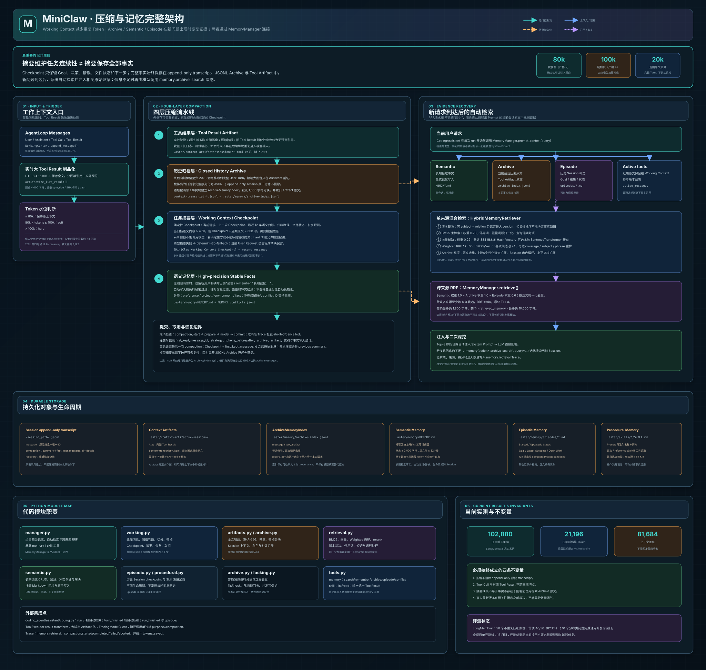

# MiniClaw 压缩与记忆完整讲解



> 对应架构图：[`frontend/architecture/miniclaw-memory-compaction.svg`](../../frontend/architecture/miniclaw-memory-compaction.svg)

## 先看重点：这个板块真正解决了什么

MiniClaw 的压缩与记忆系统不是“把聊天记录总结一下”这么简单，而是在同时解决两个相反的问题：

1. **模型输入不能无限增长**：长会话、测试日志和工具输出会让每一轮请求越来越贵，因此必须把当前工作上下文压小。
2. **压缩后又不能丢掉未来可能被问到的事实**：摘要模型不知道用户下一轮会问什么，不可能在 3k 或 30k 的摘要里提前保留所有潜在答案，因此完整原文必须被归档并可检索恢复。

当前设计的核心结论是：

```text
压缩：旧上下文 → Artifact + 完整 JSONL + Checkpoint + 近期原文

检索：新问题 → Semantic + Archive + Episode + Active facts
                 ↓
          BM25 + Vector + RRF + Rerank
                 ↓
             相关原始证据
```

必须把下面这句话记住：

> **Checkpoint 摘要只维护任务连续性，完整事实由原始 Transcript、JSONL Archive 和 Tool Artifact 保存，并在新问题到达后通过检索恢复。**

这也是为什么“只对当前工作区进行压缩”仍然需要 BM25 和 RRF。BM25/RRF **不参与把上下文压小**，它们负责从已经移出模型 Prompt、但仍属于当前会话的归档原文中找回与新问题相关的证据。Archive 虽然不是传统意义上的长期记忆，却同样是一个大规模候选集合，不能每轮全部重新塞回模型。

## 1. 当前生产配置

当前 `.env` 中使用以下配置：

| 参数 | 当前值 | 含义 |
|---|---:|---|
| 模型上下文窗口 | 128,000 Token | 一次模型请求允许的总上下文容量 |
| 最大模型输出 | 8,192 Token | 给回答、Tool Call 和模型摘要预留的最大输出 |
| Soft Trigger | 80,000 Token | 超过后尝试低成本确定性压缩 |
| Hard Trigger | 100,000 Token | 超过后必须压缩，必要时允许调用模型摘要 |
| Compaction Target | 30,000 Token | 压缩后希望回落到的目标，不是强制截断线 |
| Keep Recent | 20,000 Token | 尽量原样保留的近期对话预算 |
| Reserve | 12,800 Token | 不参与触发上限的安全余量，且必须覆盖模型最大输出 |
| Deterministic Semantic Budget | 4,500 Token | 判断确定性 Checkpoint 是否足够的语义内容阈值 |
| Artifact Threshold | 16 KiB | 实时 Tool Result 超过该大小就立即制品化 |
| Artifact Preview | 4,000 字符 | Artifact 引用中保留的头尾预览总预算 |
| Progressive Compaction | 开启 | 启用大输出制品化、旧结果引用化等渐进策略 |

触发判断使用严格的 `>`：

```text
tokens <= 80,000
    不压缩

80,000 < tokens <= 100,000
    soft compaction

tokens > 100,000
    hard compaction
```

因此，恰好 80,000 Token 不触发；恰好 100,000 Token 仍是 soft；只有超过 100,000 才进入 hard。

Token 数优先采用模型 Provider 返回的 `input_tokens`。如果这一轮没有可用的 Provider Usage，则使用当前消息字符数约除以 4 的方式估算。这个估算适合触发控制和离线测试，但不等于分词器精确值。

配置加载位于：

```text
src/MiniClaw/coding_agent/memory/config.py
```

它不只是读取环境变量，还会检查配置之间的约束：

- Reserve 必须覆盖最大输出。
- Reserve 必须小于上下文窗口。
- Hard Trigger 必须给 Reserve 留出空间。
- `target < soft < hard`。
- `keep_recent < target`。
- Artifact 阈值至少为 1 KiB。
- Artifact 预览必须小于 Artifact 阈值。

如果模型窗口小于参考的 128k，默认值会按窗口安全缩小。当前 `.env` 显式指定了 80k/100k/30k/20k，因此默认模型按完整评测档运行。

## 2. 整个板块的五种生命周期

从代码结构上看，MiniClaw 不只有一种“Memory”，而是五种不同生命周期的数据：

| 类型 | 保存什么 | 何时写入 | 何时读取 | 主要位置 |
|---|---|---|---|---|
| Working Context | 当前 Session 真正发给模型的消息 | 每条消息追加，超限时压缩 | 每轮模型请求 | Session JSONL + 内存 messages |
| Archive Memory | 被压缩移出的完整消息和工具原文 | 每次压缩准备阶段 | 新请求自动检索，或模型主动深挖 | `.aster/memory/archive-index.jsonl` |
| Semantic Memory | 跨会话稳定事实、偏好、项目和环境信息 | 显式 remember，或压缩时识别明确“记住”指令 | 新请求自动混合检索 | `.aster/memory/MEMORY.md` |
| Episodic Memory | 一个历史 Session 的 Goal、结果和状态 | 每次 run 结束 | 自动低权重召回或按需 read | `.aster/memory/episodes/*.md` |
| Procedural Memory | Skill 名称、简介、操作指南和 reference | 由项目文件维护 | 目录自动注入，正文按需读取 | `.aster/skills/*/SKILL.md` |

这些数据不能合成一个大 Memory 文件，因为它们的写入条件、过期方式和可信度完全不同：

- 工具日志适合短期 Working Context 或 Archive，不应该自动变成长期事实。
- “用户默认使用 Python”可能是稳定 Semantic Memory。
- “这次测试失败在第 46 行”更像当前任务状态或 Episode。
- “如何生成 PPT”属于 Procedural Memory，不属于聊天事实。

## 3. 自动压缩与 memory 工具不是一回事

项目中确实存在一个名为 `memory` 的模型工具，但自动压缩不依赖模型调用它。

```text
自动压缩
  CodingAssistant 在 turn_finished 后调用
  MemoryManager.maybe_compact()
  WorkingContext.maybe_compact()
  无需模型主动决定

memory 工具
  模型主动调用
  search / remember / replace / forget / archive_search / episode_*
  用于记忆管理和归档深挖
```

因此：

- 模型一次都不调用 `memory`，80k/100k 压缩仍然会发生。
- 模型调用 `memory(remember)`，只是保存长期事实，不会立刻压缩当前 messages。
- 自动检索发生在每次新 run 开始前，也不要求模型先调用工具。

## 4. 第一层：大型工具结果制品化

实现文件：

```text
src/MiniClaw/coding_agent/memory/artifacts.py
src/MiniClaw/coding_agent/memory/working.py
src/MiniClaw/coding_agent/assistant/coding.py
```

### 4.1 为什么首先处理 Tool Result

编码 Agent 的长上下文通常不只是聊天文本，大头往往来自：

- 测试完整输出；
- 构建日志；
- `grep` 大量命中；
- `read` 的大文件；
- `bash` 打印的依赖或错误堆栈；
- Docker 中的命令结果。

如果一个 50k 字符的测试日志留在 messages 中，后续每轮都会重复发送。即使它对下一步已经没有用，也会持续计费。

### 4.2 实时 Artifact 化

`ToolExecutor` 注册了 `WorkingContext.artifactize_live_result` 作为通用结果转换器。工具刚执行完、结果进入历史前，会检查 UTF-8 字节数：

```text
小于 16 KiB
    原样保留

大于等于 16 KiB
    全文写入 Artifact
    Tool Result 替换成：
      - Tool 名称
      - 完整结果相对路径
      - UTF-8 字节数
      - SHA-256
      - 头尾预览
```

Artifact 路径为：

```text
.aster/context-artifacts/<session-id>/
```

文件名包含经过清洗的 Tool 名、Tool Call ID 和随机后缀。保存时使用 SHA-256，既可以审计，也可以确认 Checkpoint 指向的内容没有变化。

预览不是只取开头，而是取头尾两部分，中间插入截断标记。这样既能看到命令起始信息，也有机会看到末尾的报错和总结。

### 4.3 压缩时的旧 Tool Result 引用化

有些工具结果产生时没有达到 16 KiB，但在会话变长后已经成为旧历史。正式压缩时，所有即将被归档的旧 Tool Result，只要还不是 Artifact 引用，都会保存为 `.txt` Artifact，并在**归档副本**中替换为不带预览的轻量引用。

这里有一个重要不变量：

> Session append-only transcript 中原先追加的 Tool Result 不会被原地改写；改变的是压缩时生成的归档副本和后续发给模型的有界上下文。

## 5. 第二层：完整历史 JSONL 归档

实现文件：

```text
src/MiniClaw/coding_agent/memory/working.py
src/MiniClaw/coding_agent/memory/archive.py
```

### 5.1 如何选择压缩切点

`WorkingContext._find_cut_point()` 从最新消息向前累计 Token，直到至少覆盖 `keep_recent_tokens=20k`。

找到近似切点后，它不会直接在任意消息之间切断，而是继续向后寻找一个完整的 `user` 消息，把切点放在新一轮 User Turn 开始前。

这样能够保证：

- 近期尽量保留完整原文；
- 一个 Assistant 发起的 Tool Call 和对应 Tool Result 不会被拆到压缩线两边；
- 用户请求、工具执行和助手结论尽量仍属于同一个完整回合。

如果单个回合自身就非常大，找不到合适的 User 边界，才允许在 Assistant 消息前切分，并让后续 Tool Result 留在保留侧。

### 5.2 Archive 与原始 Transcript 的区别

压缩发生后有两份相关数据：

1. **Session append-only transcript**：一直保存从 Session 开始以来追加的 message、compaction 和 recovery 事件。
2. **Compaction Archive Artifact**：把本次被移出的闭合旧消息重新序列化成独立 JSONL，专门用于恢复和检索。

Archive Artifact 典型路径：

```text
.aster/context-artifacts/<session-id>/context-transcript-<id>-<random>.jsonl
```

创建 Archive 时，会记录：

- 相对路径；
- 字节大小；
- SHA-256；
- 创建时间；
- 本轮归档的工具 Artifact 列表。

因此摘要失败、模型回答错误或程序重启都不会让完整历史消失。

### 5.3 ArchiveMemoryIndex

单纯把 JSONL 路径写进摘要还不够。过去的做法是让模型看到路径后，自己判断“摘要缺信息”，再主动 `grep/read` 归档。这个设计有两个问题：

- 模型可能没有意识到自己缺了信息，直接回答 `Unknown`。
- 即使意识到了，也不知道该搜哪个 Archive、用什么查询词。

现在每次压缩都会把归档消息加入独立索引：

```text
.aster/memory/archive-index.jsonl
```

每条 `ArchiveMemoryRecord` 保存：

- `record_id`；
- `session_id`；
- `source_kind`；
- `source_path`；
- `role`；
- `message_index`；
- `chunk_index`；
- `content`；
- `created_at`；
- 可选的 `subject / relation / value / version`；
- 可选的 Benchmark Session provenance。

默认普通文本按约 1,600 字符分块。超长单行会再切分；带 provenance header 的测试数据会在每个块前保留来源头，避免召回后失去 Session 和 Turn 信息。

Archive Index 还会解析 Artifact 引用中的 `Full result:` 路径，读取合法工作区内的工具全文，并以 `tool_artifact` 类型加入索引。路径必须能解析到当前 workspace 内部，防止索引器越界读取任意文件。

### 5.4 避免索引污染和重复占位

当前实现专门处理了两个 Benchmark 中出现过的工程问题。

第一，`memory.archive_search` 返回的是“对 Archive 的派生 JSON 视图”。如果再把这个 Tool Result 加入 Archive，下一次搜索会命中上一次搜索结果，形成：

```text
原始事实
  → 搜索结果 JSON
  → JSON 再被索引
  → 下一次得到更大的嵌套 JSON
```

现在 `message.role == tool && message.name == memory` 的内容会被排除，不再写回 Archive Index。

第二，多次渐进压缩可能归档重叠的旧历史。搜索前会按归一化正文去重，并保留最新副本，避免相同证据重复占据 Top-K。

## 6. 第三层：任务 Checkpoint

实现文件：

```text
src/MiniClaw/coding_agent/memory/working.py
```

Checkpoint 的职责不是重写一份“缩短后的完整聊天记录”，而是让 Agent 可以继续当前任务。

### 6.1 确定性 Checkpoint

确定性方案不调用 LLM，由程序按照固定模板生成，包含：

- `Current User Request`：从最新原始 User 消息精确提取；
- `Conversation Checkpoint`：说明旧历史已经归档；
- Exact Archive 路径和 SHA-256；
- `Previous Checkpoint`：上一轮压缩留下的任务状态；
- 最近最多 12 条 User/Assistant 语义台账；
- 每条台账最多 1,600 字符；
- `Recoverable Tool Results`：旧 Tool Artifact 路径；
- `File State`：通过 Tool Call 参数提取的 read/grep 文件和 write/edit 文件；
- `Recovery Rules`：近期原文优先、缺细节先读 Archive、没有读取不能声称已检查。

这个 Checkpoint 便宜、稳定、可重复测试，不受摘要模型表达波动影响。

### 6.2 什么时候需要模型摘要

计算完确定性 Checkpoint 后，满足任一条件就标记 `use_model=True`：

1. 被归档的非 Tool 语义消息超过 4,500 Token；
2. 确定性 Checkpoint 加近期原文仍超过 30,000 Token 目标。

然后根据 soft/hard 采取不同策略。

#### Soft：80k 到 100k

Soft 阶段只允许低成本的确定性压缩。

- 如果确定性 Checkpoint 足够小，提交 `deterministic-archive`。
- 如果需要模型摘要，则本轮不切换 active messages，等待后续达到 Hard Trigger。

当前实现中，Archive Artifact、Archive Index 和明确稳定事实提取发生在最终 soft 提交判断之前。因此 soft 被暂缓时，准备阶段可能已经产生可复用的归档和索引记录，但当前模型 messages 不会被替换成 Checkpoint。这是当前真实实现的行为。

#### Hard：超过 100k

Hard 阶段必须尽力回收上下文：

- 如果确定性方案已经足够，仍然可以使用 `deterministic-archive`。
- 如果 `use_model=True`，调用当前模型生成 `model-summary`。
- 如果模型返回空内容、错误或异常，使用 `deterministic-fallback`。

调用模型摘要时：

- `supports_tools=False`，避免摘要过程发起 Tool Call；
- metadata 标记 `purpose=compaction`，Trace 中与正常 Agent 请求区分；
- 摘要合并 previous summary；
- 当前用户请求仍由程序从原始 User 消息中精确插入，不交给摘要模型猜；
- 输出上限是模型最大输出与 `reserve × 0.8` 的较小值，当前实际仍是 8,192 Token。

### 6.3 为什么 30k 是目标，不是硬截断

代码会估算：

```text
estimated_after = recent_messages + checkpoint
```

30k 用来决定是否需要模型摘要，但模型摘要完成后不会把字符串机械截到 30k。因此它是工程目标，而不是“超过一字就切掉”的硬限制。

机械截断可能破坏路径、错误信息和下一步，当前设计选择可恢复性优先。

### 6.4 多次压缩

第二次压缩不会只总结“第二段历史”。`WorkingContext` 保存 `_previous_summary`，新的确定性或模型 Checkpoint 会合并上一轮结果。

同时，完整事实不依赖这个逐轮合并摘要：每次归档原文仍进入 Archive Index，查询时可以跨多个 Compaction Archive 找回。

## 7. 第四层：长期语义记忆

实现文件：

```text
src/MiniClaw/coding_agent/memory/semantic.py
src/MiniClaw/coding_agent/memory/archive.py  # StableFactIngestor
src/MiniClaw/coding_agent/memory/locking.py
```

### 7.1 保存范围

Semantic Memory 只有四类：

```text
preference
project
environment
fact
```

它适合保存：

- 用户长期偏好；
- 项目长期约束；
- 稳定环境信息；
- 明确、可复用的事实。

它不适合保存：

- API Key、Token、Password 等秘密；
- “本轮”“刚刚”“临时”等短期信息；
- 一次 Bash 的完整输出；
- 模型未经用户确认的猜测；
- 每个压缩块里的所有句子。

### 7.2 自动稳定事实提取为什么很保守

压缩时 `StableFactIngestor` 只扫描 User 消息，并只识别明确格式：

```text
记住: ...
长期记忆 [project]: ...
remember [preference]: ...
long-term memory: ...
```

没有明确指令的普通事实仍然保存在 Archive，但不会自动写进 Semantic Memory。

这是为了避免把讨论、假设和 Benchmark 噪声永久污染长期记忆。对未来未知问题的完整覆盖由 Archive 负责，不需要通过“把所有句子都提取成长期事实”来解决。

### 7.3 文件格式与人工内容保护

Semantic Memory 使用 Markdown 文件：

```text
.aster/memory/MEMORY.md
```

程序只管理一对 marker 中间的区块。Marker 外的人工笔记会保留，不会被程序重写掉。

限制包括：

- 单条最多 2,000 字符；
- 整个文件最多 32 KiB；
- 大小写不敏感去重；
- 写入使用临时文件再原子替换；
- 使用跨进程文件锁避免飞书多会话同时写入丢更新；
- 锁等待默认 3 秒，超过 30 秒的陈旧锁可以回收。

### 7.4 写入冲突

Semantic Store 会尝试从 `key: value`、中英文 `is/uses/prefers/使用/采用/偏好` 等句式识别 subject。

当新旧内容 subject 相同但值不同，默认 `reject` 不会静默覆盖，而是创建持久冲突：

```text
conflict_id
category
subject
existing
proposed
status
created_at
```

允许三种处理方式：

- `keep_existing`：保留旧值；
- `replace`：用新值替换；
- `keep_both`：两个值并存。

冲突创建与解决事件保存在 MEMORY 文件旁边的 JSONL 日志中。解决时仍会重新检查原值是否已被其他进程修改，避免基于过期状态覆盖。

## 8. Archive 与 Semantic 的混合检索

实现文件：

```text
src/MiniClaw/coding_agent/memory/retrieval.py
src/MiniClaw/coding_agent/memory/archive.py
src/MiniClaw/coding_agent/memory/manager.py
```

### 8.1 为什么 BM25 为主、向量为辅

编码 Agent 和记忆问答中，大量关键信息是精确字符串：

- 文件名和路径；
- 类名、函数名、错误码；
- 人名、地名和产品名；
- 版本号；
- 用户原话中的少见词。

BM25 对这种精确词面证据非常稳定，因此权重设为 `0.78`。向量检索权重为 `0.22`，用于补充词面不同但意思接近的召回。

当前默认 Vector Encoder 是本地、无依赖的 `LocalHashVectorEncoder`：

- 384 维；
- 使用 Token 和字符 3-gram；
- 使用 signed feature hashing；
- 不调用远程 Embedding API，不产生额外接口费用。

代码中也提供 `SentenceTransformerVectorEncoder`。它只会尝试加载本地 Hugging Face 缓存，找不到时退回 Hash Vector；当前 `MemoryManager` 默认没有启用 SentenceTransformer 实例。

所以这里的“向量检索”当前主要是轻量本地向量辅助，不等同于调用大型语义 Embedding 服务。

### 8.2 BM25 的工程处理

英文检索会：

- 删除常见停用词；
- 对 `-ed / -ing / -ness / -s / -dom` 做轻量词形扩展；
- 把查询词频封顶为 1，避免长选择题重复某个实体后淹没稀有决定词。

中文 Tokenizer 同时产生单字和相邻双字，兼顾无空格文本的召回。

### 8.3 Weighted RRF

BM25 分数和向量余弦分数不在同一个量纲，不能直接做简单加法。当前先分别排序，再使用 Weighted Reciprocal Rank Fusion：

```text
score = 0.78 / (60 + bm25_rank)
      + 0.22 / (60 + vector_rank)
```

参数：

- `bm25_weight = 0.78`
- `vector_weight = 0.22`
- `rrf_k = 60`
- 每路 `candidate_pool = 24`

RRF 的好处是对原始分数尺度不敏感：一个候选在 BM25 和 Vector 都排名靠前，会自然得到更高融合分；只在一条路上召回的候选仍有机会进入下一阶段。

### 8.4 第二阶段 rerank

RRF 后还会结合以下通用信号重新排序：

- 查询词覆盖率；
- subject 覆盖率；
- 完整查询字符串命中；
- preference 类别轻微加权；
- 有意义的多词精确短语命中。

多词短语信号用于解决类似 `high school` 与单独 `high` 的碰撞。`do you think`、`good idea` 等会话性词组会被排除，不作为主题短语强行加权。

### 8.5 结构化来源的冲突裁决必须在排序之前

`HybridMemoryRetriever` 支持调用方显式提供：

```text
version + subject + relation + value
```

如果多个结构化文档具有相同 `subject + relation`，Retriever 会先只保留最大 version，再进行 BM25、向量和 RRF。

这是非常重要的工程原则：

> 相关性只能回答“这条信息和问题是否相关”，不能回答“互相冲突的两条信息哪一条更新”。

如果先排序再选最新，旧事实可能因为字面更接近问题而排在新事实前面。当前实现会把被淘汰的旧记录 ID 放入 `superseded_record_ids`，方便 Trace 和调试。

生产 Archive 不再把普通编号行解释为版本，也不会把 Active Messages 再塞入候选池。需要版本语义的数据源必须在自己的适配器中显式构造结构化 `MemoryDocument`，不能改变真实会话的归档规则。

### 8.6 Archive 专项检索增强

Archive 查询还包含几类通用分布处理：

#### 当前状态/最新事实

当问题包含 `current/latest/now/当前/最新/现在` 等词时，会增加一条带有 `changed/switched/replaced/no longer/切换/替换/不再` 等状态变化词的扩展查询。

原因是旧句子可能字面写着“current”，而新句子只写“switched to”。如果只按词面，旧事实反而可能更靠前。

#### 个性化推荐

当问题是 `recommend/适合我/我的偏好` 一类，但没有明确提到用户兴趣主题时，会补充搜索用户兴趣、专业、研究方向和反复提到的主题。

#### 保留原始角色与来源

每个 Archive Record 保留原始 `role` 和 `source_path`。检索直接返回命中的原始块，不再根据评测标签合成 User/Assistant Session Context。

#### 重叠归档去重

渐进压缩可能多次归档重叠历史。搜索前按规范化正文精确去重，保留最新副本，防止同一证据重复占满 Top-K。

这些规则都是针对一类查询分布的修复，不包含某一道 Benchmark 的固定答案。

## 9. 跨来源 MemoryManager 检索

`HybridMemoryRetriever` 解决的是单个文档集合内部的 BM25/向量融合；`MemoryManager.retrieve()` 还要解决不同 Memory 来源之间的融合。

每次新用户请求到达，系统会并行形成三组排序结果：

```text
Semantic Memory   权重 1.0
Archive Memory    权重 1.0
Episode Memory    权重 0.6
```

其中 Archive 搜索内部已经会把当前未压缩的版本化 Active Facts 合入候选。

跨来源再次使用 RRF，`k=60`。这一级叫“来源融合”；每个来源内部的 BM25＋向量 RRF 则叫“算法融合”：

```text
source_score = source_weight / (60 + rank)
```

然后按归一化正文去重。相同内容如果同时出现在 Semantic 和 Archive，会合并分数并在 metadata 中记录多个来源，而不是重复注入。跨来源 RRF 完成后，系统还会针对用户查询和候选完整内容执行一次统一 final rerank；Archive 使用展开后的父节点内容，Episode 使用完整 Session 摘要。

默认行为：

- 最终最多保留 20 条跨来源候选；
- Archive 最多提供 5 个父节点；
- 整个 `<retrieved_memory>` 使用 15,000 Token 硬预算；
- 附带 Archive `source_path`；
- 明确告诉模型当前请求和系统规则优先；
- 证据不足时提示调用 `memory.archive_search`。

### 为什么当前会话也需要跨来源 RRF

压缩后，一个问题可能同时关联：

- 当前 Session 早期被归档的原话；
- 用户跨 Session 保存的稳定偏好；
- 之前某个 Episode 的任务结果。

三个来源的原始得分不兼容，而且不能把三个存储全部塞入 Prompt。跨来源 RRF 先解决不同来源排名不可直接比较的问题，final rerank 再根据完整候选内容决定最终顺序。

因此 RRF 不是“长期记忆专用”，而是一种**多排序列表融合方法**。只要当前 Session Archive、Semantic 和 Episode 同时参与候选，就有使用价值。

## 10. 自动注入与主动深挖

一次新请求的实际顺序是：

```text
用户 Prompt
  ↓
CodingAssistant._run_once()
  ↓
MemoryManager.prompt_context(prompt)
  ↓
自动检索并融合候选
  ↓
<retrieved_memory> 注入 System Prompt
  ↓
AgentLoop 调用 LLM
```

这意味着模型不需要先知道某个 Archive 文件路径，也不需要先自己意识到摘要漏了事实。

如果自动注入只找到了多跳问题的一部分，模型可以调用：

```text
memory(action="archive_search", query="更具体的第二跳查询")
```

`archive_search` 默认只搜索当前 Session，也可以显式传入 `sessionId`。近期 Active Messages 已经直接位于 Working Context，不会重复进入 Archive 检索。

## 11. Episodic Memory

实现文件：

```text
src/MiniClaw/coding_agent/memory/episodic.py
```

每次 `CodingAssistant.run` 结束，都会为当前 Session 更新一份 Markdown Episode：

```text
# Session <id>

- Started: ...
- Updated: ...
- Status: completed / failed / cancelled / active

## Goal
...

## Latest Outcome
...

## Open Work
...
```

当前默认 Episode 由最近 User 消息作为 Goal、最近 Assistant 消息作为 Outcome。也可以传入更完整的 summary。

Episode 提供：

- `list`：按修改时间列出最近 Session；
- `read`：读取完整 Episode；
- `search`：把每个 Episode 作为完整文档，使用 BM25＋本地向量＋Weighted RRF＋rerank 搜索。

Episode 在跨来源 RRF 中权重仍为 0.6。它主要负责定位相关历史经历，细粒度原始事实仍应优先来自 Archive；需要完整 Episode 时可以按 Session ID 直接读取。

## 12. Procedural Memory

实现文件：

```text
src/MiniClaw/coding_agent/memory/procedural.py
```

程序扫描：

```text
.aster/skills/*/SKILL.md
```

System Prompt 中只注入 Skill 名称和一句简介，不把所有 Skill 正文常驻上下文。模型确定需要某个流程后，通过 `skill` 工具读取：

- `SKILL.md` 正文；
- 同一 Skill 目录内的 reference 或资源文件。

安全和容量限制：

- 目标路径 `resolve()` 后必须仍位于 Skill 目录内；
- 禁止通过 `../` 读取目录外文件；
- 单个资源最大 64 KiB。

这是另一种渐进上下文策略：目录常驻、正文按需、附件再按需。

## 13. memory 与 skill 工具完整动作

实现文件：

```text
src/MiniClaw/coding_agent/memory/tools.py
```

### 13.1 memory 工具

| Action | 作用 | 关键参数 |
|---|---|---|
| `read` | 读取 Semantic Memory 托管区块 | 无 |
| `search` | 混合搜索 Semantic Memory | `query`, `limit` |
| `remember` | 写入稳定长期事实 | `category`, `content`, `conflictPolicy` |
| `replace` | 精确替换一条长期事实 | `category`, `oldContent`, `content` |
| `forget` | 精确删除一条长期事实 | `category`, `content` |
| `conflict_list` | 列出 pending/resolved/all 冲突 | `status` |
| `conflict_resolve` | 处理指定冲突 | `conflictId`, `resolution` |
| `archive_search` | 搜索压缩 Archive 原始消息和 Tool Artifact | `query`, `limit`, `sessionId` |
| `episode_list` | 列出近期 Episode | `limit` |
| `episode_search` | 搜索 Episode | `query`, `limit` |
| `episode_read` | 读取完整 Episode | `sessionId` |

Semantic 和 Archive 搜索结果会返回：

- record ID；
- 内容；
- 综合分；
- BM25/Vector/RRF 信息；
- 被版本裁决淘汰的旧记录 ID；
- Archive 的来源路径、类型和角色。

### 13.2 skill 工具

| Action | 作用 |
|---|---|
| `list` | 列出已发现 Skill 名称和简介 |
| `read` | 读取指定 Skill 正文或同目录资源 |

## 14. Session append-only、提交与重启恢复

`WorkingContext` 的 Session JSONL 包含三种事件：

```json
{"type":"message","id":"...","message":{}}
{"type":"compaction","id":"...","summary":"...","first_kept_message_id":"...","details":{}}
{"type":"recovery","compaction_id":"...","restored_messages":12}
```

重启时：

1. 读取所有合法 message；
2. 找到最后一个 compaction；
3. 取出其 summary，包装成 system Checkpoint；
4. 从 `first_kept_message_id` 对应原始消息开始恢复近期 messages；
5. 追加 recovery 事件。

损坏的单行 JSON、旧版本直接保存 `role` 的 transcript 记录会被容错处理。旧格式消息通过行号和原始内容 SHA-256 生成稳定 legacy ID。

`first_kept_message_id` 不允许指向合成的 Checkpoint。提交时如果切点位置是 synthetic system message，会继续寻找后面第一条真实消息 ID。

## 15. 取消、失败和 Trace

压缩支持端到端 Cancellation Token。检查点覆盖：

```text
compaction_start
compaction_prepare
compaction_model
compaction_commit
```

取消发生后不会继续执行提交阶段，Trace 使用取消状态而不是普通模型失败。

`CodingAssistant` 记录：

- `memory.retrieval`：查询、注入数量、来源和截断后的内容；
- `compaction.started`：触发前 Token 与软硬阈值；
- `compaction.completed`：策略、原因、前后 Token、差值和 details；
- `compaction.failed`：异常类型和信息；
- `compaction.aborted`：soft 暂缓或用户取消。

`compaction.completed.details` 还包括：

- 实际使用的 layers；
- Archive Artifact 元数据；
- Archive 新增索引块数；
- Tool Artifact 列表；
- 归档语义 Token；
- Stable Fact 写入统计；
- 模型摘要错误与 fallback 信息；
- `transcript_retained=true`。

模型摘要通过 `TracingModelClient` 发起，并标记 `purpose=compaction`。因此正常 Agent 模型调用和压缩模型调用可以分别统计成本，避免把摘要 Token 混入正常回答指标。

## 16. 关键模块逐个解释

### `config.py`

负责阈值、环境变量、模型窗口缩放和配置关系校验。它定义的是压缩政策，不处理消息内容。

### `working.py`

整个 Working Context 的状态机：追加消息、恢复 Session、实时 Artifact 化、检测水位、选择切点、归档、建立 Checkpoint、调用模型摘要、fallback 和提交 Compaction。

### `artifacts.py`

负责 Artifact 的命名、目录、UTF-8 保存、SHA-256、预览和引用格式。它不决定“什么时候压缩”。

### `archive.py`

负责把 Archive 消息、Tool Artifact、版本化事实和 Benchmark Session 上下文变成持久索引记录；查询时进行去重、查询扩展、Session 分组、角色偏好和上下文替换。

### `retrieval.py`

通用单来源检索器：Tokenize、BM25、本地向量、余弦相似度、Weighted RRF、rerank、版本裁决。Semantic、Archive 和 Episodic 都复用它。

### `semantic.py`

长期语义记忆的 CRUD、Secret/Transient 过滤、去重、冲突创建和解决、托管 Markdown 区块、原子写入。

### `episodic.py`

按 Session 保存任务经历，提供列表、直接读取和统一混合检索。

### `procedural.py`

发现 Skill，注入轻量目录，并安全读取 Skill 正文和资源。

### `manager.py`

整个板块的组合边界。它创建 Working、Semantic、Archive、Episode、Procedural Store；提供工具；在新请求时做跨来源 RRF 和统一 final rerank；压缩完成后同步 active messages。

### `tools.py`

把 Semantic、Archive、Episode 和 Procedural 能力暴露为模型可调用的 `memory` 和 `skill` 工具。

### `locking.py`

使用独占创建 `.lock` 文件提供跨进程写锁，包含超时和陈旧锁回收。

### `assistant/coding.py`

虽然不在 `memory/` 目录，它负责三个重要集成时机：

1. 新 run 开始前自动检索并组装 Prompt；
2. 每个 `turn_finished` 后检查是否压缩；
3. `run_finished` 后写 Episode，并把所有行为写入 Trace。

## 17. 完整时序示例

假设当前会话已经达到 102,880 Token。

### 压缩阶段

```text
1. turn_finished 得到 Provider input_tokens = 102,880
2. 102,880 > 100,000，reason = hard
3. 从尾部保留至少 20k，并移动到完整 User Turn
4. 旧 Tool Result 全文保存为 Artifact
5. 闭合旧历史完整保存为 context-transcript JSONL
6. 按消息/事实块写入 ArchiveMemoryIndex
7. 扫描明确“记住”指令，尝试写 Semantic Memory
8. 生成确定性 Checkpoint
9. 语义密度或压缩目标不满足，调用模型摘要
10. 成功则 strategy=model-summary；失败则 deterministic-fallback
11. active messages 替换为 Checkpoint + recent messages
12. Trace 写 compaction.completed
```

当前记录中的一个真实案例：

```text
压缩前：102,880 Token
压缩后：约 21,196 Token
上下文差值：81,684 Token
归档块：约 497
完整 JSONL：约 363 KB
策略：hard + model-summary
```

上下文差值表示后续 Prompt 少携带了多少历史，不等于净费用节省，因为压缩本身也可能调用一次模型，Provider 还有缓存计费和不同输入输出单价。

### 新问题恢复阶段

用户随后询问一个早期历史中的细节：

```text
1. MemoryManager 接收新问题
2. 搜索 Semantic、当前 Session Archive、历史 Episode
3. Archive 同时考虑近期未压缩的版本化事实
4. 单来源执行版本裁决、BM25、Vector、RRF、rerank
5. Archive 恢复最多 5 个父节点及相邻块
6. 跨来源再次 RRF
7. 对完整候选内容执行统一 final rerank
8. 在 15k Token 预算内注入 System Prompt
9. LLM 基于原始证据回答
10. 如果是多跳且证据不全，调用 archive_search 继续查
```

整个恢复过程不依赖摘要提前知道用户未来会问什么。

## 18. 当前测试与 Benchmark 证据

目前和压缩、记忆直接相关的验证包括：

- 大 Tool Result 实时 Artifact 化；
- append-only compaction；
- 重启恢复 Checkpoint＋近期消息；
- Tool Call/Result 不跨切点；
- 闭合历史完整 JSONL Archive；
- Archive 自动建索引和自动注入；
- 硬触发模型摘要；
- 模型摘要空响应时 deterministic fallback；
- 多次压缩合并 previous Checkpoint；
- Secret、临时信息和重复长期记忆拒绝；
- 长期记忆冲突创建和解决；
- Archive 去重与 memory 派生结果污染防护；
- Active 最新事实与 Archive 旧事实统一版本裁决；
- Episode 搜索；
- Skill 路径逃逸拒绝；
- Compaction Trace、Token 差值和摘要调用 purpose。

Benchmark 当前结果：

- LongMemEval 共运行 56 个不重复压缩案例，七类题型各 8 题；
- 首次运行 46/56，成功率 82.1%，保留了真实失败分布；
- 10 个初始失败按 Judge 等价性、时效更新、时间绑定、事实实际性、偏好召回、短语碰撞、角色召回和同 Session 覆盖等分布修复后回归通过；
- 8 组首次运行共执行 56 次压缩，压缩前后上下文差值约 4,426,734 Token；
- 当前全项目单元测试 155 passed，另有 2 个 subtests 通过。

这里应当同时报告首次成功率、错误分布和修复后的回归，而不是只给一个接近 100% 的最终数字。

## 19. 当前边界与如实说明

这套实现已经形成完整闭环，但仍要区分“已经实现”和“理论上更高级的方案”。

1. **Token 估算**：没有 Provider Usage 时使用字符数约除以 4，不是模型专用 tokenizer。
2. **Vector 默认实现**：当前默认是本地 Hash Vector，不是远程高质量 Embedding；SentenceTransformer 只是可选实现。
3. **Episode Search**：已使用和 Semantic、Archive 相同的混合检索，但 Episode 仍是任务概览，不能替代 Archive 原始证据。
4. **Compaction Target**：30k 是决策目标，不是提交后的强制上限。
5. **Soft Prepare Side Effect**：soft 最终暂缓时，准备阶段可能已经产生 Artifact 和索引记录，但不会切换 active messages。
6. **稳定事实自动写入**：只识别用户明确“记住”格式，不会从所有自然语言中主动抽取；这是高精度策略，不是遗漏。
7. **Archive Index**：当前为本地 JSONL 持久索引，搜索时读取记录并计算，不是独立向量数据库服务。
8. **Archive 生命周期**：当前代码强调追加和可恢复，没有实现自动 TTL 清理；长期运行时需要结合磁盘配额和保留策略管理。

## 20. 面试时最值得讲的五点

### 20.1 摘要无法解决未来未知问题

32k 实验曾出现“压缩 4 次、节省约 25k Token、无模型错误，但最终回答 Unknown”。这证明摘要在工程上成功，却在事实保持上失败。

修复不是继续要求摘要“更聪明”，而是把完整 transcript 归档、建立可检索索引，并在新问题到达后自动注入原始证据。

### 20.2 压缩和检索职责分离

压缩只决定哪些内容继续留在 Prompt，检索负责从离开 Prompt 的内容中找回证据。BM25/RRF 不属于“缩短算法”，属于“压缩后的可恢复性机制”。

### 20.3 版本正确性先于相关性

旧事实可能更像问题，但不能因此覆盖新事实。通过 `subject + relation + version` 在排序前裁决版本，避免把事实正确性交给相似度碰运气。

### 20.4 防止派生结果污染原始证据

搜索结果 JSON 不能再次进入搜索索引；重叠压缩产生的相同正文不能重复占满 Top-K。这两个问题曾让 Token 和搜索次数持续膨胀，修复后高成本案例 Token 从 162,988 降到 108,494，约下降 33%，答案仍保持正确。

### 20.5 可恢复性优先

先写完整 JSONL 和 Artifact，再做摘要；摘要失败时确定性 fallback；Session transcript append-only；Trace 记录每次压缩和恢复。这样模型能力波动不会直接造成不可逆信息丢失。

## 21. 一分钟口述版本

> MiniClaw 把上下文压缩和记忆检索拆成两个系统。上下文超过 80k 时尝试确定性压缩，超过 100k 时进入硬压缩，目标回落到 30k，同时保留最近 20k 原文。大工具输出先转 Artifact，旧历史完整写入 JSONL 并建立 Archive 索引，Checkpoint 只保存 Goal、决策、错误、文件状态和下一步。因为摘要不可能预测未来问题，所以新请求到达时会同时检索长期语义记忆、当前会话压缩归档和历史 Episode：三类来源内部统一执行 BM25 为主、轻量向量为辅、第一级 RRF 和单库 rerank，Archive 再恢复 Top-5 父节点；三路候选经过第二级跨来源 RRF 和统一 final rerank，在 15k Token 预算内注入模型。版本化事实在相关性排序前先裁决最新版本，长期记忆写入还有秘密过滤、冲突检测和跨进程锁。整个压缩、检索、取消、模型摘要和 Token 差值都会进入 Trace。

## 22. 相关文档和代码入口

文档：

- `3.记忆与压缩.md`：早期四类记忆与渐进压缩说明；
- `5.长期记忆检索.md`：长期语义记忆的混合检索；
- `7.Trace与Eval数据闭环.md`：压缩与检索如何进入 Trace/Eval；
- `14.面试修复重点.md`：Benchmark 和关键工程修复摘要。

核心代码：

```text
src/MiniClaw/coding_agent/memory/config.py
src/MiniClaw/coding_agent/memory/working.py
src/MiniClaw/coding_agent/memory/artifacts.py
src/MiniClaw/coding_agent/memory/archive.py
src/MiniClaw/coding_agent/memory/retrieval.py
src/MiniClaw/coding_agent/memory/semantic.py
src/MiniClaw/coding_agent/memory/episodic.py
src/MiniClaw/coding_agent/memory/procedural.py
src/MiniClaw/coding_agent/memory/manager.py
src/MiniClaw/coding_agent/memory/tools.py
src/MiniClaw/coding_agent/memory/locking.py
src/MiniClaw/coding_agent/assistant/coding.py
```

## 23. 最后再用一句话区分所有概念

```text
Artifact      = 把大正文移出 Prompt，但完整保存
Archive       = 把被压缩的旧原文保存并建立可搜索索引
Checkpoint    = 让当前任务可以继续，不负责保存所有事实
Semantic      = 用户明确要求长期记住的稳定事实
Episode       = 历史 Session 的任务经历概览
Procedural    = 可按需加载的操作流程
BM25/Vector   = 在某个来源内部找候选
RRF/Rerank    = 融合多个排序结果并选出有限证据
memory tool   = 模型主动管理或深挖记忆的接口
maybe_compact = 产品层自动执行的上下文控制机制
```
