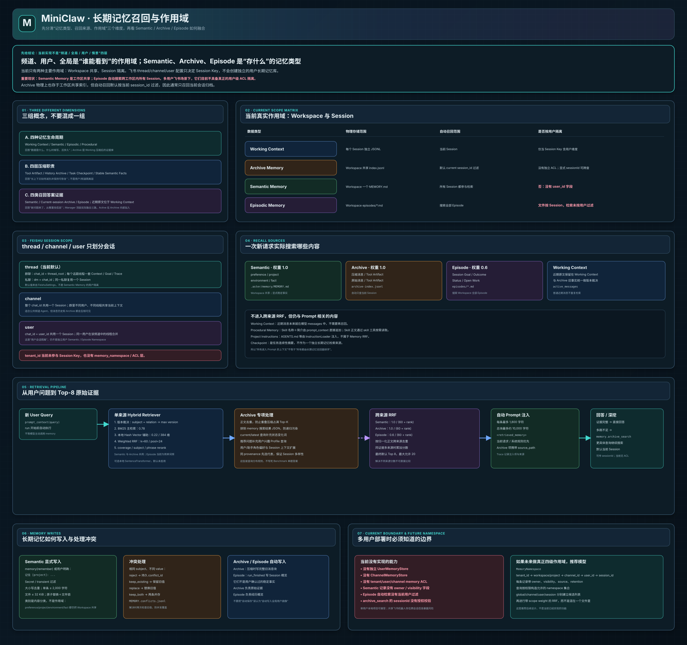

# MiniClaw 长期记忆召回完整讲解



> 对应架构图：[`frontend/architecture/miniclaw-long-term-recall.svg`](../../frontend/architecture/miniclaw-long-term-recall.svg)

## 先把最容易搞混的地方说清楚

当前 MiniClaw **不是**下面这种四层：

```text
全局记忆
频道记忆
用户记忆
情景记忆
```

原因是这里混合了两种完全不同的概念：

- **频道、用户、全局**描述的是记忆的**作用域**：谁可以看到这条记忆。
- **语义、情景、工作、流程**描述的是记忆的**类型和生命周期**：里面存什么、什么时候写、保存多久。

当前真实实现应该拆成两张表理解。

### 第一张表：当前有哪些记忆类型

| 记忆类型 | 英文名 | 保存什么 |
|---|---|---|
| 工作记忆 | Working Context | 当前 Session 正在进行的原始消息和任务状态 |
| 语义记忆 | Semantic Memory | 明确要求长期保存的偏好、项目、环境和事实 |
| 情景记忆 | Episodic Memory | 一个历史 Session 的 Goal、结果、状态和恢复概览 |
| 流程记忆 | Procedural Memory | Skill 名称、说明、操作流程和 reference |
| 压缩归档 | Archive Memory | 被上下文压缩移出的完整原始消息和 Tool Artifact |

其中代码注释中的“四种 Memory lifecycle”主要指：

```text
Working + Semantic + Episodic + Procedural
```

Archive 是后来为了解决“摘要丢失未来未知事实”增加的完整证据库，它依附于 Working Context 的压缩流程，但在召回时已经成为独立来源。

### 第二张表：当前有哪些作用域

当前核心只有两级：

```text
Workspace 级共享
Session 级隔离
```

没有完整实现以下独立存储：

```text
UserMemoryStore
ChannelMemoryStore
TenantMemoryStore
```

因此最重要的当前结论是：

> **飞书的 thread/channel/user 配置只决定 Session 如何划分，不会自动建立一套用户级长期语义记忆，也不会给 Semantic 和 Episode 增加用户权限隔离。**

## 1. 当前各类记忆的真实作用域

| 数据 | 物理存储位置 | 自动召回范围 | 当前是否用户隔离 |
|---|---|---|---|
| Working Context | 每个 Session 独立的 `context.jsonl` 或 `session.jsonl` | 当前 Session | 取决于 Session Key 如何构造 |
| Archive Memory | 工作区共享的 `archive-index.jsonl` | 默认只查当前 `session_id` | 逻辑按 Session 过滤，但没有独立 ACL |
| Semantic Memory | 工作区唯一的 `MEMORY.md` | 工作区所有 Session 都会搜索 | **没有**，记录中没有 `user_id` |
| Episodic Memory | 工作区共享目录下每 Session 一个 Markdown | 当前会搜索目录中的全部 Episode | 文件按 Session 分开，但搜索没有按用户过滤 |
| Procedural Memory | 工作区 `.aster/skills/` | 工作区内所有 Session 可见 | 没有用户区分，本来就是项目流程知识 |

这里的“全局”只能理解成：

> **当前 Workspace 内共享。**

它不是整个操作系统的机器级全局，也不是所有 MiniClaw 项目共享。另一个 Workspace 有自己的 `.aster/memory/`。

## 2. 一句话区分你提到的四个词

### 频道记忆

当前没有独立的 `ChannelMemoryStore`。

飞书配置为 `session_scope=channel` 时，整个飞书 Chat 共用同一个 Session，于是它的 Working Context 和默认 Archive 召回表现得像“频道记忆”。但 Semantic Memory 仍然是整个 Workspace 共用，不是只属于该频道。

### 用户记忆

当前没有带 `user_id` Namespace 的独立用户长期记忆。

Semantic Memory 中的 `preference` 类别容易让人误以为它是用户记忆，但 `preference` 只是**内容分类**，不是作用域。所有 Preference 最终仍写进同一个：

```text
.aster/memory/MEMORY.md
```

里面没有 owner、user_id 或 visibility 字段。

飞书配置为 `session_scope=user` 时，只是把 `chat_id + user_id` 拼成 Session Key，让该用户在该 Chat 中有独立 Working Context。它仍不会把 Semantic 和 Episode 变成真正用户私有。

### 全局记忆

当前最接近“全局记忆”的是 Workspace 级 Semantic Memory 和 Procedural Memory。

Episode 的目录也是 Workspace 共享，但每个文件仍对应一个 Session。Archive Index 文件物理上也是 Workspace 共享，不过自动 Archive 查询默认带当前 `session_id` 过滤。

### 情景记忆

情景记忆是 `EpisodicMemoryStore`，含义是“历史经历”，不是“频道范围”。

每个 Episode 表示一个 Session 曾经做过什么：

- Goal；
- Latest Outcome；
- Status；
- Open Work；
- Started/Updated 时间。

因此情景记忆是一种**数据类型**，与用户、频道、全局这些**访问范围**不是同一维度。

## 3. 为什么文档中会反复出现“四层”

当前项目里实际上有三套容易混淆的“四”。

### 3.1 四种记忆生命周期

```text
Working Context
Semantic Memory
Episodic Memory
Procedural Memory
```

这是在讨论 Agent 需要哪些不同用途的记忆。

### 3.2 四层上下文压缩

```text
Tool Result Artifact
完整 History Archive
任务 Checkpoint
明确 Stable Semantic Facts
```

这是在讨论长上下文超过阈值以后怎么减负和恢复。

### 3.3 四类可参与回答的证据

概念上可以写成：

```text
Semantic Memory
Current-session Archive
Historical Episode
Working Context 中的近期原文
```

但这里需要精确说明当前代码：

- `MemoryManager.retrieve()` 顶层融合的是 **Semantic、Archive、Episode 三路**。
- Working Context 中的近期原文已经直接发给模型，不需要再次检索注入。
- Archive 只索引普通历史消息和 Tool Artifact，不识别 Benchmark 标签或编号版本格式。

所以正常产品运行时，更准确的说法是：

```text
三路自动召回：Semantic + 当前 Session Archive + 跨 Session Episode
```

## 4. 飞书 thread、channel、user 到底控制什么

实现文件：

```text
src/MiniClaw/platforms/feishu/config.py
src/MiniClaw/platforms/feishu/models.py
src/MiniClaw/platforms/feishu/router.py
```

配置项：

```dotenv
MINICLAW_FEISHU_SESSION_SCOPE=thread
```

如果 `.env` 没有填写，默认值也是 `thread`。

### 4.1 thread：当前默认

对于群聊：

```text
session_key = chat_id + thread_root
```

其中 `thread_root` 优先取：

```text
root_id → thread_id → parent_id → message_id
```

结果是每个群聊话题线程都有独立的：

- CodingAssistant；
- Working Context；
- Goal；
- Trace；
- Runtime Session；
- 默认 Archive 检索范围。

对于私聊：

```text
session_key = dm + chat_id
```

同一私聊会持续复用一个 Session。

### 4.2 channel

```text
session_key = chat_id + channel
```

整个群或 Chat 共用一套 Session。不同用户、不同话题线程都会进入同一个 Working Context。

它适合公开频道共同维护一个任务，但意味着：

- 所有人会共享当前消息历史；
- 所有人会共享这个 Session 的 Archive；
- 一个用户的 Goal 可能影响后续用户；
- 同一 Session 串行队列会把所有消息排在一起。

### 4.3 user

```text
session_key = chat_id + user_id
```

同一用户在该 Chat 中的不同线程会合并为一个 Session，不同用户分开。

它实现的是：

> **用户会话隔离。**

它没有实现：

> **用户长期记忆隔离。**

因为 `MemoryManager` 创建 Semantic 和 Episode Store 时，没有传入 `user_id`，仍指向 Workspace 的公共路径。

### 4.4 tenant_id 当前的作用

飞书入站消息中保存了 `tenant_id`，但 `build_conversation()` 构造 Session Key 时没有使用它。

当前也不存在基于 tenant 的 Memory Namespace 和授权检查。

## 5. 飞书场景下的实际例子

假设一个 Workspace 中连接了同一个飞书机器人，有 Alice 和 Bob。

### 5.1 默认 thread 模式

Alice 在群聊线程 A 中提问，Bob 在线程 B 中提问：

```text
Alice Thread A
  → 独立 Working Context
  → 自动 Archive 只搜 Thread A

Bob Thread B
  → 独立 Working Context
  → 自动 Archive 只搜 Thread B
```

但两人仍然共享：

```text
.aster/memory/MEMORY.md
.aster/memory/episodes/
.aster/skills/
```

如果 Alice 明确让系统记住一条 Preference，它会进入公共 `MEMORY.md`。Bob 后续提出相关问题时，自动 Semantic 检索可能召回它。

Episode 自动搜索也会扫描所有 Session Markdown，因此有可能把 Alice Session 的 Episode Preview 召回 Bob 的请求。

### 5.2 user 模式

Alice 和 Bob 的 Working Context 会按用户分开，但 Semantic 和 Episode 共享问题仍然存在。

所以不能把 `session_scope=user` 当成完整的多用户隐私隔离。

### 5.3 channel 模式

Alice 和 Bob 连 Working Context 都共享。这是一种明确的公共频道行为，不适合处理私有用户信息。

## 6. 当前一次自动召回到底查什么

实现入口：

```text
CodingAssistant._run_once(prompt)
  → MemoryManager.prompt_context(prompt)
  → MemoryManager.retrieve(prompt, limit=8)
```

自动召回发生在模型开始回答之前，不要求模型先调用 `memory` 工具。

`MemoryManager.retrieve()` 依次获得三组排序结果。

### 6.1 Semantic Memory

```text
source = semantic
source weight = 1.0
```

内容来自：

```text
.aster/memory/MEMORY.md
```

类别包括：

```text
preference
project
environment
fact
```

Semantic 会搜索 Workspace 中所有托管条目，不带 session/user/channel 过滤。

### 6.2 Archive Memory

```text
source = archive
source weight = 1.0
```

内容来自：

```text
.aster/memory/archive-index.jsonl
```

但 `MemoryManager.search_archive()` 默认把：

```text
target_session = self.session_id
```

传给 Archive 搜索，所以正常自动召回只搜索当前 Session 的压缩归档。

可能包含：

- 被压缩的 User 消息；
- 被压缩的 User/Assistant/Tool 原始消息；
- 旧 Tool Result 的 Artifact 原文。

### 6.3 Episodic Memory

```text
source = episode
source weight = 0.6
```

`EpisodicMemoryStore.search()` 会扫描：

```text
.aster/memory/episodes/*.md
```

当前没有传 `session_id`、`user_id` 或 `channel_id` 过滤，因此它是 Workspace 范围搜索。

Episode 的完整摘要正文进入候选和 final rerank，约 300 字符 Preview 仅用于工具输出和调试。它仍不会自动注入历史 Session 的完整原始轨迹；原始细节由 Archive 提供。

### 6.4 Working Context 不进入 Archive 检索池

普通近期消息已经位于模型 Working Context。Archive Search 只搜索已经归档的原始证据，否则会重复注入当前问题、近期回答和 Memory Tool 的派生 JSON。

## 7. 哪些内容进入 Prompt，但不属于长期召回 RRF

### 7.1 Working Context

近期 User、Assistant 和 Tool 消息本来就在 `AgentLoop.messages` 中，不需要检索后再注入。

### 7.2 Compaction Checkpoint

Checkpoint 在压缩后作为一条 System Message 保留任务连续性。它不是 `MemoryManager.retrieve()` 中的一个 Source。

### 7.3 Procedural Memory

`MemoryManager.prompt_context()` 在 Retrieved Memory 后面直接追加 Skill Catalog：

```text
<available_skills>
- skill name: description
</available_skills>
```

它不与 Semantic/Archive/Episode 竞争召回名额。模型需要正文时调用 `skill` 工具读取。

### 7.4 Project Instructions

`AGENTS.md` 等由 `ProjectInstructionLoader` 解析并注入，与 MemoryManager 分开。

所以要区分：

```text
最终 System Prompt 的所有上下文
    ≠
长期记忆召回器排序出来的内容
```

## 8. Semantic Memory 的完整写入结构

实现文件：

```text
src/MiniClaw/coding_agent/memory/semantic.py
src/MiniClaw/coding_agent/memory/archive.py  # StableFactIngestor
src/MiniClaw/coding_agent/memory/locking.py
```

### 8.1 两种写入入口

第一种是模型主动调用：

```text
memory(action="remember", category="project", content="...")
```

第二种是压缩旧消息时，`StableFactIngestor` 识别 User 明确写出的：

```text
记住: ...
长期记忆 [preference]: ...
remember [environment]: ...
long-term memory: ...
```

普通聊天里的事实不会自动写入 Semantic。它们由 Archive 保存，需要时从原文召回。

### 8.2 preference 不是用户作用域

这是当前最容易误解的点：

```text
category="preference"
```

只表示这条内容属于“偏好”类别。记录并没有：

```text
owner_user_id
channel_id
tenant_id
visibility
```

所以在共享 Workspace 中，Preference 不是天然私有用户画像。

### 8.3 Secret 与临时信息过滤

写入前会拒绝 API Key、Token、Password 等 Secret-like 内容，也会拒绝明显的“本轮、临时、刚刚”等短期信息。

这避免把凭证或一次性状态持久化进长期 Memory。

### 8.4 容量与文件格式

- 单条最多 2,000 字符；
- 整个 Semantic 文件最多 32 KiB；
- 大小写不敏感去重；
- 程序只修改 Managed Marker 中间内容；
- Marker 外的人工笔记保留；
- 写入临时文件后执行原子替换。

### 8.5 写入锁

`MemoryFileLock` 使用独占创建 `.lock` 文件实现跨进程锁：

- 默认等待 3 秒；
- 每 50ms 重试；
- 超过 30 秒的陈旧锁会回收；
- 正常退出删除 lock。

这可以避免多个飞书 Session 同时修改同一个公共 `MEMORY.md` 时丢更新，但它只保证写入一致性，不提供用户权限隔离。

## 9. Semantic 冲突处理

Semantic Store 会尝试从以下表达识别 Subject：

```text
key: value
项目使用 Python
User prefers dark mode
Model defaults to gpt-...
```

如果同一 Category 中出现相同 Subject、不同内容，默认不会静默覆盖，而是创建：

```text
conflict_id
category
subject
existing
proposed
status
created_at
```

处理策略：

| 策略 | 含义 |
|---|---|
| `reject` | 创建 Pending Conflict，等待明确处理 |
| `keep_existing` | 保留旧值 |
| `replace` | 用新值替换 |
| `keep_both` | 新旧并存 |

冲突事件保存在 MEMORY 文件旁边的 JSONL 中。

解决冲突时会重新确认 Existing 值是否仍然存在，避免另一个 Session 已经修改后，当前操作仍基于过期状态覆盖。

## 10. Archive Memory 的完整结构

实现文件：

```text
src/MiniClaw/coding_agent/memory/archive.py
```

### 10.1 物理共享，逻辑按 Session 过滤

所有 Session 的 Archive Records 都追加在同一个：

```text
.aster/memory/archive-index.jsonl
```

每条记录都带 `session_id`。

自动搜索时：

```python
records = self.records(current_session_id)
```

因此默认只拿当前 Session 的记录。

这是一种逻辑隔离，不是物理文件隔离。也没有一个单独的授权层判断调用者是否有权搜索某个 Session。

### 10.2 Archive Record 字段

每条记录包含：

- `record_id`；
- `session_id`；
- `source_kind`；
- `source_path`；
- `role`；
- `message_index`；
- `chunk_index`；
- `content`；
- `created_at`；

Record ID 使用 Session、来源、路径、消息索引、块索引和正文共同计算 SHA-256，确保同一输入对应稳定身份。

### 10.3 Source Kind

常见来源：

```text
message
tool_artifact
```

### 10.4 分块

默认每块约 1,600 字符，最小配置不低于 400。

分块优先按行累积；单行超过限制会继续切分。任何 XML 风格标签都只被视为普通正文，不会触发特殊复制、聚合或排序。

### 10.5 Tool Artifact 原文

Archive Index 会从消息中的：

```text
Full result: <relative path>
```

提取 Artifact 路径，解析后确认仍位于 Workspace 内，再读取全文加入索引。

这使早期大型测试日志虽然已经从 Prompt 移出，仍然可以通过 Archive 搜索找回。

## 11. 单来源 HybridMemoryRetriever

实现文件：

```text
src/MiniClaw/coding_agent/memory/retrieval.py
```

Semantic 和 Archive 都复用这个 Retriever。

当前默认参数：

| 参数 | 数值 |
|---|---:|
| BM25 Weight | 0.78 |
| Vector Weight | 0.22 |
| RRF k | 60 |
| Candidate Pool | 24 |
| Vector Dimensions | 384 |
| BM25 k1 | 1.5 |
| BM25 b | 0.75 |

### 11.1 先进行版本裁决

如果文档同时具备：

```text
subject
relation
version
```

相同 `subject + relation` 的事实先只保留最大 Version，然后才计算相关性。

原因是：

> 相关性只能判断“像不像问题”，不能判断“哪条事实更新”。

被淘汰的旧 Record ID 会写入命中结果的 `superseded_record_ids`。

生产 Archive 不生成这些结构化字段。Benchmark 若需要版本语义，只能在 Benchmark 适配器中构造结构化文档，不能改变产品检索链路。

### 11.2 Tokenize

英文、数字、路径式 Token 使用正则提取。

中文连续文本会同时产生：

- 单字；
- 相邻双字。

这样无需外部分词库也能完成基础中文召回。

### 11.3 BM25

BM25 是当前主检索，适合：

- 文件路径；
- 类名和函数名；
- 人名和地名；
- 版本号；
- 错误文本；
- 用户原话中的稀有词。

工程处理包括：

- 英文停用词过滤；
- `-ed/-ing/-ness/-s/-dom` 轻量词形扩展；
- 查询词频封顶为 1；
- 防止长选择题重复实体淹没决定性稀有词。

### 11.4 默认向量检索

当前默认不是远程 Embedding 服务，而是：

```text
LocalHashVectorEncoder
```

它使用：

- Token Feature；
- 字符 3-gram；
- Blake2b Hash；
- Signed Feature Hashing；
- L2 归一化；
- 384 维向量。

优点：

- 无额外依赖；
- 不调用外部 API；
- 没有 Embedding 费用；
- 中英文和源码词都有基础模糊匹配能力。

缺点：

- 不具备真正预训练语义模型的理解能力；
- 更接近带字符特征的轻量 Dense Recall。

### 11.5 SentenceTransformer 是可选代码，不是当前默认路径

代码提供 `SentenceTransformerVectorEncoder`：

- 只尝试加载本地 Hugging Face Cache；
- 默认模型名为 `sentence-transformers/all-MiniLM-L6-v2`；
- 找不到本地 Cache 时回退 Hash Vector；
- 不主动联网下载。

但是 `MemoryManager` 当前默认创建的是普通 `HybridMemoryRetriever()`，它内部直接使用 `LocalHashVectorEncoder`。因此不要在面试中说“项目生产默认使用 MiniLM 向量模型”。

### 11.6 单来源 Weighted RRF

BM25 和 Vector 各自排序后，使用：

```text
0.78 / (60 + bm25_rank)
+
0.22 / (60 + vector_rank)
```

候选池取两路前 24 名的并集。

RRF 不直接使用 BM25 原始分数或余弦原始分数，因此不会因为两种分数尺度不同而失衡。

### 11.7 第二阶段 Rerank

融合后结合：

- Query Token Coverage；
- Subject Overlap；
- 完整 Query Phrase；
- Preference 类别微弱 Boost；
- 有意义的多词精确短语。

多词短语用于解决：

```text
high school
```

被只包含：

```text
high
```

的无关内容压过。

`do you think`、`good idea` 等会话性短语不作为主题短语。

## 12. Archive 的专项召回增强

Archive 不只是直接调用通用 Retriever，还增加了针对会话记忆的处理。

### 12.1 搜索结果不能反向污染索引

`memory.archive_search` 的 Tool Result 是对 Archive 的派生 JSON。如果把它再索引，会形成递归：

```text
原始证据
  → 搜索 JSON
  → JSON 再被索引
  → 下一次搜索命中旧搜索 JSON
```

当前会跳过：

```text
message.role == "tool" and message.name == "memory"
```

### 12.2 重叠压缩去重

多次渐进压缩可能把相同正文归档多次。搜索前按归一化正文去重，并保留最新 Record，避免相同事实占满多个 Top-K 位置。

### 12.3 当前问题去重

如果 Active Message 正文与当前 Query 完全一致，会排除，避免检索器把用户正在问的问题本身当成答案。

### 12.4 时效查询扩展

问题包含：

```text
current / latest / newest / now
目前 / 当前 / 最新 / 现在
```

会额外补充：

```text
updated / changed / switched / replaced / no longer
更新 / 改为 / 切换 / 替换 / 不再
```

这是为了让“刚改成 X”的新事实能与字面写着“current Y”的旧事实竞争。

### 12.5 个性化查询扩展

当用户问：

```text
给我推荐什么？
什么适合我？
按我的偏好建议
```

但 Query 中没有写具体兴趣时，会补充搜索用户兴趣、专业、领域、研究方向、喜欢和反复请求的话题。

这里要注意：它搜索的是当前 Session Archive 中的历史 Profile 信息，以及 Workspace Semantic 中可能存在的共享 Preference；当前并没有真正按用户 ID 限制这些 Profile。

### 12.6 Assistant 历史查询

当问题表达：

```text
你之前说了什么？
你当时推荐了什么？
提醒我我们讨论过什么
```

Archive 依靠原始 Assistant 消息块本身的词面、向量和角色元数据返回证据，不再合成或强制偏向特殊 Session Context。

### 12.7 重叠 Archive 去重

渐进压缩可能多次归档同一段闭合历史。Archive 搜索会按规范化正文精确去重，保留最新记录，避免重复片段占满 Top-K；它不会识别 Benchmark Provenance。

## 13. 跨来源 RRF

单来源 Retriever 输出：

```text
Semantic 排名
Archive 排名
Episode 排名
```

三种来源现在都使用统一 Hybrid Retriever，但内部 Score 仍不能直接比较：

- Semantic、Archive 和 Episode 分别在自己的文档集合中计算 BM25、向量、RRF 和 rerank；
- 文档长度和数据分布也不同。

因此 `MemoryManager` 再做一层跨来源 RRF：

```text
Semantic score = 1.0 / (60 + rank)
Archive score  = 1.0 / (60 + rank)
Episode score  = 0.6 / (60 + rank)
```

每个来源至少请求：

```text
max(final_limit, 8)
```

默认最多保留 20 条跨来源候选，其中 Archive 最多提供 5 个父节点。

跨来源 RRF 后还会执行统一 final rerank：

```text
用户查询
＋
Semantic完整事实 / Archive展开后的父节点 / Episode完整摘要
  ↓
覆盖率、Subject重合、完整短语等确定性特征精排
```

### 13.1 跨来源正文去重

正文通过：

```text
casefold + 空白归一化
```

作为 Key。

如果同一正文同时存在于 Semantic 和 Archive：

- 不重复注入；
- RRF 分数累加；
- Metadata 中 `sources` 记录两个来源。

当前 Item 的主 `source` 保持第一次遇到的来源，因此调试时应同时查看 Metadata Sources。

### 13.2 为什么 Episode 权重较低

Episode 是摘要式 Session 概览。虽然内部已经升级为统一混合检索，但它仍适合回答“以前做过什么任务”，不适合替代 Archive 的精确原文。

所以权重设置为 0.6，让相关的 Semantic 和 Archive 原始证据通常优先。

## 14. 自动注入格式和预算

最终候选渲染为：

```text
<retrieved_memory>
Automatically retrieved through cross-source RRF.
Current request and system rules take precedence.

- [semantic:record_id] ...
- [archive:record_id] path=... ...
- [episode:session_id] ...

If these excerpts do not contain every hop,
call memory(action='archive_search', query=...) before answering.
</retrieved_memory>
```

预算：

- 跨来源阶段最多保留 20 条候选；
- Archive 最多贡献 5 个父节点；
- 整个 Retrieved Memory 固定使用 15,000 Token 硬预算；
- 候选超过剩余预算时只截断最后一个候选，并保留明确截断标记；
- 中英文混合内容使用保守 Token 估算，避免中文按四字符一个 Token 被低估。

当前用户请求、System Rule 和 Project Instructions 的优先级高于 Retrieved Memory。记忆只是背景证据，不能覆盖本轮明确要求。

## 15. memory 工具与自动召回的区别

实现文件：

```text
src/MiniClaw/coding_agent/memory/tools.py
```

### 15.1 自动召回

```text
MemoryManager.prompt_context()
```

自动搜索：

```text
Semantic + Archive + Episode
```

### 15.2 memory(action="search")

这个 Action **只搜索 Semantic Memory**，不是全来源搜索。

### 15.3 memory(action="archive_search")

专门搜索 Archive。

默认：

```text
sessionId = current_session_id
```

也可以显式传入其他 `sessionId`。

当前没有授权层检查“当前飞书用户是否有权读取这个 Session”。模型如果通过 Episode List/Search 获得其他 Session ID，再显式调用 Archive Search，代码层没有 ACL 阻止。

### 15.4 Episode Actions

```text
episode_list
episode_search
episode_read
```

它们同样没有按当前用户或频道限制。

### 15.5 Semantic 写入 Actions

```text
remember
replace
forget
conflict_list
conflict_resolve
```

这些 Action 修改的是 Workspace 共享 Semantic Memory。

## 16. Episodic Memory 完整实现

实现文件：

```text
src/MiniClaw/coding_agent/memory/episodic.py
```

### 16.1 写入时机

每次 `CodingAssistant.run` 结束后调用：

```text
MemoryManager.checkpoint_episode()
```

Status 根据运行结果写为：

```text
completed
failed
cancelled
active
```

### 16.2 默认内容

如果没有传入自定义 Summary：

- 最近一条 User Content 作为 Goal；
- 最近一条 Assistant Content 作为 Latest Outcome；
- Open Work 写继续从 Working Context 恢复。

### 16.3 文件范围

每个 Session 对应：

```text
.aster/memory/episodes/<safe-session-id>.md
```

文件名按 Session 隔离，但目录是 Workspace 共享。

### 16.4 搜索算法

Episode Search 现在与 Semantic、Archive 复用同一个 HybridMemoryRetriever：

1. 从 Episode 的 `## Goal` 提取 Subject；
2. 将完整 Episode Markdown 作为 Content；
3. 分别执行 BM25 和本地向量检索；
4. 使用第一级 Weighted RRF 融合两份排名；
5. 执行单库 rerank；
6. 将完整摘要交给跨来源 RRF 和 final rerank。

它没有父子节点，也仍然没有 User Filter。

## 17. Procedural Memory 为什么不属于用户长期记忆

实现文件：

```text
src/MiniClaw/coding_agent/memory/procedural.py
```

Procedural Memory 保存的是项目操作流程：

```text
.aster/skills/*/SKILL.md
```

它回答：

- 遇到某类任务应该按什么流程执行；
- 需要读取哪些 Reference；
- 有哪些限制和验证步骤。

它不保存用户历史，也不参与 Semantic/Archive/Episode 的跨来源 RRF。

Prompt 只常驻 Skill 名称和简介，正文通过 `skill(read)` 按需读取。单资源最大 64 KiB，并进行目录逃逸检查。

## 18. Trace 中记录什么

新 Run 开始后，`CodingAssistant` 记录：

```text
memory.retrieval
```

内容包括：

- Query；
- 自动注入数量；
- 每个 Retrieved Item；
- Source；
- Record ID；
- Fused Score；
- Metadata；
- 截断到约 500 字符的 Content Preview。

Archive Metadata 可能包含：

- `source_path`；
- `source_kind`；
- `role`；
- 内部检索 Score；
- `superseded_record_ids`。

Trace 可以用于分析：

- 正确答案是否进入最终 15k Token 注入内容；
- 是召回失败还是模型使用证据失败；
- 哪个 Source 占据了位置；
- 旧版本是否被正确裁决；
- Episode 是否因公共搜索带来污染。

## 19. 当前长期召回的完整时序

```text
1. 飞书/CLI 生成当前 session_id
2. CodingAssistant 收到 User Prompt
3. MemoryManager 搜索 Workspace Semantic
4. MemoryManager 搜索 current_session_id Archive
5. MemoryManager 搜索 Workspace 全部 Episode
6. Semantic/Archive/Episode 内部统一执行 BM25、Vector、第一级 RRF 和单库 rerank
7. Archive 执行去重、查询扩展和 Top-5 父节点恢复
8. Manager 对三路排名执行 Cross-source RRF
9. 按正文去重，并基于完整候选内容执行统一 final rerank
10. 在 15k Token 总预算内注入
11. 与 Skill Catalog 一起注入 System Prompt
12. LLM 基于 Retrieved Memory 和 Working Context 回答
13. 多跳证据不足时调用 memory.archive_search
14. memory.retrieval 与 Tool Call 全部进入 Trace
```

## 20. 一个具体召回例子

假设当前 Workspace 中：

```text
Semantic:
  [preference] 用户喜欢简洁的 Python 项目

Current Session Archive:
  之前讨论过把检索 BM25 权重设为 0.78

Episode A:
  修复过历史归档重复占位问题

Episode B:
  完成过飞书 Runtime 接入
```

用户问：

```text
我们之前为什么让 BM25 占主要权重？
```

召回过程可能是：

1. Semantic 命中“简洁 Python”较弱相关；
2. 当前 Session Archive 精确命中“BM25 0.78”；
3. Episode A 命中“MemoryAgentBench”；
4. Cross-source RRF 后 Archive 排第一；
5. final rerank 后在 15k Token 中注入 Archive 原话和 Episode 背景；
6. 模型基于原始 Archive 回答，而不是只靠 Checkpoint 猜。

如果另一个飞书用户在不同 Session 问“我喜欢什么”，当前 Workspace Semantic 中那条 Preference 也可能被召回，因为它没有 User Owner。

## 21. 当前实现的安全边界

如果 MiniClaw 只在个人电脑、单用户 Workspace 中运行，Workspace 共享 Semantic 和 Episode 是合理且简单的设计。

如果作为多人共享飞书机器人使用，当前有以下风险：

1. Semantic Memory 可能跨用户召回 Preference 和 Fact。
2. Episode Search 可能把其他 Session 的 Goal/Outcome Preview 注入当前请求。
3. `episode_read` 可以读取指定其他 Session。
4. `archive_search(sessionId=...)` 没有调用者授权检查。
5. `session_scope=user` 只保护 Working Context，不保护共享 Semantic/Episode。
6. `tenant_id` 没有进入 Namespace。
7. Archive 是共享物理索引，虽然自动搜索默认按 Session 过滤，但不存在 ACL 层。

这不代表检索算法错误，而是 Memory Namespace 和权限模型尚未完成。

## 22. 如果以后真要做“全局/频道/用户/情景”应该怎么设计

这部分是推荐后续方案，不是当前已实现功能。

建议每条记忆都带：

```text
tenant_id
workspace_id / project_id
channel_id
user_id
session_id
scope
owner
visibility
source_kind
created_at / updated_at
retention
```

Scope 可以定义为：

```text
workspace_global
channel_shared
user_private
session_private
```

情景记忆仍然是 Type：

```text
memory_type = episodic
```

一条情景记忆也可以同时具有：

```text
scope = user_private
```

这就再次说明 Type 与 Scope 是两个维度。

### 推荐查询顺序

```text
当前 Session Archive
+ 当前 User Private Semantic/Episode
+ 当前 Channel Shared Memory
+ Workspace Global Project Memory
```

先根据 ACL 生成允许访问的 Namespace，再对每个 Scope 内部检索，最后使用带 Scope Weight 的 RRF 融合。

例如：

```text
session_private = 1.2
user_private    = 1.1
channel_shared  = 0.9
workspace_global = 0.8
```

但必须先做权限过滤，再做相关性排序，不能先把所有用户数据搜出来后再在 Prompt 层隐藏。

## 23. 面试时应该如何如实描述当前设计

推荐表述：

> MiniClaw 当前把记忆类型和作用域分开设计。类型上有 Working、Semantic、Episodic 和 Procedural，压缩后还有可检索 Archive。Semantic、Archive 和 Episodic 分别使用 BM25 主检索、轻量本地向量辅助、Weighted RRF 和单库 Rerank；Archive 额外恢复 Top-5 父节点。三路结果再经过跨来源 RRF 和统一 final rerank，在 15k Token 预算内注入。飞书的 thread/channel/user 配置目前只控制 Session Key 和 Working/Archive 的会话范围；Semantic 和 Episode 仍是 Workspace 共享，因此当前更适合单用户或可信项目成员场景，真正的 tenant/channel/user Memory Namespace 和 ACL 是后续需要补齐的能力。

不要说：

> 当前已经实现了完善的全局、频道、用户和情景四级隔离。

因为代码中没有 UserMemoryStore、ChannelMemoryStore、Owner 字段和 ACL。

## 24. 最值得讲的召回工程点

### 24.1 摘要不是完整记忆

完整事实保存在 Archive，Checkpoint 只维护任务状态。新问题先自动检索 Archive，而不是让模型看到路径后自行猜是否要搜索。

### 24.2 BM25 主、向量辅

编码 Agent 的关键证据通常包含精确路径、类名、错误和专有名词，因此 BM25 使用 0.78 主权重；本地 Hash Vector 用 0.22 补充模糊召回，不增加 API 成本。

### 24.3 两级 RRF

第一级融合 BM25 与 Vector；第二级融合 Semantic、Archive 和 Episode。这样解决不同检索方式和不同来源分数不可直接比较的问题。

### 24.4 结构化冲突裁决先于相关性

对于调用方显式提供版本字段的结构化文档，先保留最大 Version，再计算相似度。普通 Archive 文本不会被猜测为版本事实。

### 24.5 防止检索污染

排除 Memory Tool 的派生结果、对重叠 Archive 正文去重、普通 Active Messages 不重复进入候选，避免搜索结果越来越大并占满 Top-K。

### 24.6 作用域边界要如实说明

算法层已经较完整，但多用户 Namespace 与 ACL 未完成。能够明确指出这一点，比把 Preference 类别误称为“用户隔离记忆”更专业。

## 25. 当前测试与 Benchmark 证据

长期记忆召回相关验证覆盖：

- Semantic BM25＋Vector＋RRF；
- Archive 压缩原文自动建索引；
- Current Session 自动召回；
- Semantic/Archive/Episode Cross-source RRF；
- Archive 重复正文去重；
- Memory Tool 结果污染防护；
- 当前 Query 和普通 Active Message 防重复；
- 最新状态查询扩展；
- 个性化 Profile 查询扩展；
- 原始消息角色和来源保留；
- 重叠 Archive 正文去重；
- 结构化来源冲突先裁决后排序；
- Semantic Secret、Transient、Conflict 与 Lock；
- Memory Retrieval Trace。

当前评测记录包括：

- MemoryAgentBench 32k 多跳完整 10 题：官方标签 9/10，按数据最大编号最新规则 10/10；
- 32k 单跳 5/5；
- 64k 多跳 2/2；
- EventQA 65k 普通文本 2/2；
- LongMemEval 56 个不重复压缩召回案例，首次 46/56（82.1%）；
- 失败按时效、时间绑定、事实实际性、偏好召回、短语碰撞、角色召回和同 Session 覆盖等分布做通用修复；
- 当前全项目单元测试 155 passed，另有 2 个 subtests 通过。

## 26. 常见问题

### Q1：Semantic Memory 就是用户记忆吗？

不是。它是稳定事实类型，目前作用域是 Workspace 共享。`preference` 也只是 Category。

### Q2：Episodic Memory 是不是只属于当前频道？

不是。每个 Episode 属于一个 Session，但当前搜索扫描 Workspace 下全部 Episode，没有频道或用户过滤。

### Q3：Archive 是长期记忆吗？

它不是经过整理的稳定语义记忆，但它是可以长期保存并召回的原始证据库。功能上属于长期可恢复信息来源。

### Q4：设置 `MINICLAW_FEISHU_SESSION_SCOPE=user` 就安全了吗？

只能隔离 Working Context 和默认当前 Session Archive。Semantic 与 Episode 仍共享，因此不能视为完整用户数据隔离。

### Q5：为什么 Archive Index 是一个文件，却说按 Session 隔离？

它是物理共享文件，每条 Record 带 `session_id`，自动查询时逻辑过滤当前 Session。逻辑过滤不等于 ACL。

### Q6：自动召回会搜索所有 Archive 吗？

不会。默认只搜索当前 Session Archive。Semantic 和 Episode 的范围更大。

### Q7：`memory(search)` 会搜索 Archive 和 Episode 吗？

不会。它只搜 Semantic。Archive 使用 `archive_search`，Episode 使用 `episode_*`。只有 `MemoryManager.prompt_context()` 的自动路径会融合三类来源。

### Q8：当前向量检索会调用外部 Embedding API 吗？

默认不会。当前使用 384 维 Local Hash Vector。SentenceTransformer 只是可选本地实现，默认 Manager 没有启用。

### Q9：为什么还要 Episode，Archive 不是已经有原文了吗？

Archive 适合找细节，Episode 适合快速判断历史 Session 做过什么。Episode 是低成本导航，Archive 是原始证据。

### Q10：为什么 Procedural Memory 不进入 RRF？

Skill 是操作手册，不是用户历史事实。系统直接注入轻量 Catalog，确认需要后再按名称读取正文，比把它与事实竞争召回名额更合理。

## 27. 一分钟口述版本

> MiniClaw 当前没有实现全局、频道、用户、情景四个并列记忆层。频道、用户、全局属于作用域，语义、情景、工作、流程属于记忆类型。类型上有 Working、Semantic、Episodic、Procedural，压缩后还有 Archive 原始证据库；作用域上当前主要只有 Workspace 共享和 Session 隔离。飞书 thread/channel/user 只决定 Session Key，所以会影响 Working Context 和默认 Archive 范围，但 Semantic Memory 仍是 Workspace 一个 MEMORY.md，Episode 搜索也会扫描全部 Session。召回时 Semantic、Archive、Episode 内部分别进行 BM25 0.78＋本地向量 0.22＋第一级 RRF＋单库 rerank，Archive 再恢复 Top-5 父节点；三路结果经过第二级跨来源 RRF 和统一 final rerank，在 15k Token 内注入。当前适合单用户或可信 Workspace，多用户飞书场景还需要补 tenant/channel/user Namespace 和 ACL。

## 28. 最后用一张文字图收尾

```text
                         “存什么”——记忆类型
              ┌───────────────────────────────────┐
              │ Working：当前会话                 │
              │ Archive：压缩后的完整原始证据     │
              │ Semantic：稳定长期事实            │
              │ Episodic：历史 Session 经历       │
              │ Procedural：Skill 操作流程         │
              └───────────────────────────────────┘

                         “谁能看到”——当前作用域
              ┌───────────────────────────────────┐
              │ Session：Working、默认 Archive    │
              │ Workspace：Semantic、Episode、Skill│
              └───────────────────────────────────┘

飞书 thread/channel/user
              ↓
只负责生成不同的 session_id
              ↓
不会自动生成 User Semantic Memory 或 Channel Memory ACL
```

## 29. 相关代码入口

```text
src/MiniClaw/coding_agent/memory/manager.py
src/MiniClaw/coding_agent/memory/retrieval.py
src/MiniClaw/coding_agent/memory/archive.py
src/MiniClaw/coding_agent/memory/semantic.py
src/MiniClaw/coding_agent/memory/episodic.py
src/MiniClaw/coding_agent/memory/procedural.py
src/MiniClaw/coding_agent/memory/tools.py
src/MiniClaw/coding_agent/memory/locking.py
src/MiniClaw/coding_agent/assistant/coding.py
src/MiniClaw/platforms/feishu/config.py
src/MiniClaw/platforms/feishu/models.py
src/MiniClaw/platforms/feishu/router.py
```
