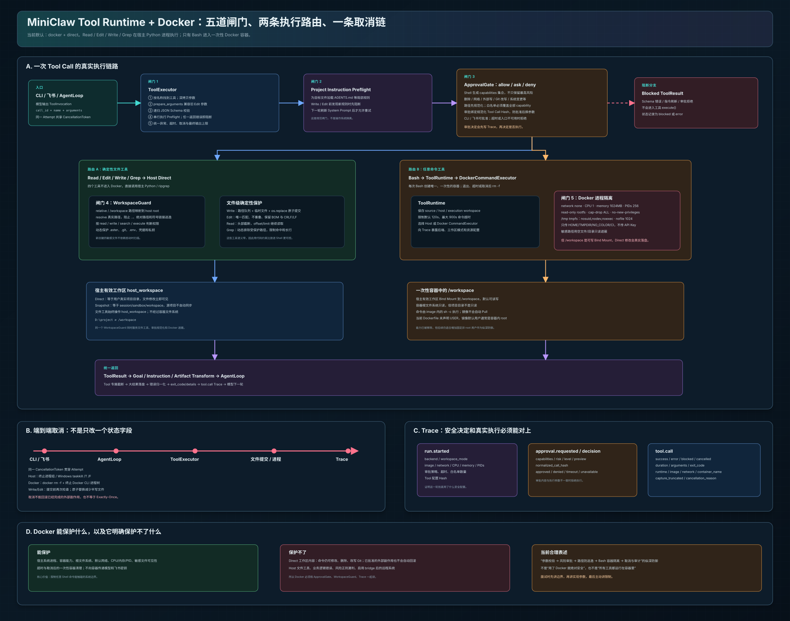

# MiniClaw Tool Runtime 与 Docker 完整讲解



> 对应架构图：[`frontend/architecture/miniclaw-tool-runtime-docker.svg`](../../frontend/architecture/miniclaw-tool-runtime-docker.svg)

## 先把最重要的结论说清楚

MiniClaw 当前采用的是：

```text
Docker + Direct
```

但这不等于“所有工具都在 Docker 里执行”。真实结构是：

```text
Read / Edit / Write / Grep
        ↓
宿主 Python 进程直接操作有效工作区

Bash
        ↓
ToolRuntime
        ↓
一次性 Docker 容器
```

两条路共享：

```text
ToolExecutor
ApprovalGate
WorkspaceGuard
CancellationToken
Trace
```

因此最适合面试时使用的一句话是：

> MiniClaw 构建了“参数校验 → 项目规则预检 → 风险审批 → 路径防逃逸 → Bash 容器隔离 → 取消与审计”的纵深安全执行链；文件工具保持确定性宿主实现，只有具备任意代码执行能力的 Bash 进入受限 Docker。

还必须主动说明一个边界：

> Docker 的根文件系统虽然只读，但 Direct 模式下 `/workspace` 是可写 Bind Mount，所以 Bash 对项目文件的修改会真实落到宿主工作区。Docker 主要隔离宿主系统、进程、网络和资源，不负责自动回滚项目文件。

## 1. Tool、ToolExecutor、Runtime、Docker 分别是什么

这四个概念非常容易混在一起。

| 概念 | 负责什么 | 不负责什么 |
|---|---|---|
| Tool | 定义一个具体操作的参数和语义，例如 Read、Write、Bash | 不决定整套审批策略和 Agent 循环 |
| ToolExecutor | 统一调度 Tool Call，做参数校验、Preflight、取消、异常归一化和结果转换 | 不直接决定 Bash 在宿主还是 Docker 中运行 |
| ToolRuntime | 保存有效工作区、路径映射、命令后端、资源限制和运行元数据 | 不替代 ToolExecutor，也不负责模型 Tool Calling |
| DockerCommandExecutor | 将一条 Bash 命令放入临时容器并负责捕获、超时和清理 | 不保护宿主进程中的 Read/Edit/Write/Grep |
| WorkspaceGuard | 把模型路径映射到工作区真实路径，并按操作类型限制访问 | 不解析 Bash 内部每一个 Shell 路径表达式 |
| ApprovalGate | 判断 Tool Call 是否允许、需要询问或直接拒绝 | 不提供文件系统或容器级隔离 |

对应实现：

```text
src/MiniClaw/coding_agent/tools/executor.py
src/MiniClaw/coding_agent/runtime/core.py
src/MiniClaw/coding_agent/runtime/execution.py
src/MiniClaw/coding_agent/runtime/workspace.py
src/MiniClaw/coding_agent/approval/gate.py
src/MiniClaw/coding_agent/approval/risk.py
```

## 2. 一次 Tool Call 的完整真实流程

模型生成：

```text
ToolInvocation(
    call_id,
    name,
    arguments
)
```

然后进入 `ToolExecutor.execute()`。

完整执行顺序是：

```text
1. 查找 Tool
2. 深拷贝 arguments
3. prepare_arguments
4. 递归 JSON Schema 校验
5. Project Instruction Preflight
6. ApprovalGate Preflight
7. Tool.execute()
8. Result Transforms
9. ToolExecutor 最终输出上限
10. Tool Call 写入 Trace
11. ToolResult 返回 AgentLoop
```

任何一个 Preflight 返回错误 `ToolResult`，后面的工具执行都会被跳过。

这里的编号是为了帮助理解责任边界，并不表示路径只检查一次。对 Read/Write/Edit/Grep，Project Instruction Preflight 会先通过 WorkspaceGuard 解析目标；Approval 的白名单和 Call Hash 也会再次规范化路径；真正进入 Tool.execute() 后还会做最终、权威的访问检查。

### 2.1 为什么先复制参数

Executor 使用深拷贝，避免参数预处理直接修改模型原始 Tool Call 对象。

这很重要，因为：

- Trace 需要知道模型最初提交了什么；
- 参数规范化不能产生跨模块共享可变状态；
- 审批和执行应该针对同一份准备后的参数。

### 2.2 prepare_arguments 做什么

目前主要由 `EditTool` 使用。

它兼容：

```json
{
  "path": "a.py",
  "oldText": "old",
  "newText": "new"
}
```

以及字符串化的 `edits` JSON，最终统一成：

```json
{
  "path": "a.py",
  "edits": [
    {"oldText": "old", "newText": "new"}
  ]
}
```

准备后才进行 Schema 校验和审批，防止“审批看到一种参数，工具实际执行另一种参数”。

### 2.3 递归 Schema 校验

当前校验不是只检查第一层字段，而是递归检查：

- string、integer、number、boolean；
- object、array；
- required；
- enum；
- minimum；
- minItems；
- additionalProperties；
- 数组内部对象的必填字段。

例如 Edit 中某一项缺少 `newText`，会在执行和审批之前被拒绝。

### 2.4 Project Instruction Preflight

如果 Tool Call 指向一个此前尚未激活的目录，MiniClaw 会发现目标文件附近新的 `AGENTS.md` 等规则。

对于 Write/Edit，如果新规则尚未进入本轮 System Prompt，会返回：

```text
PROJECT_INSTRUCTIONS_REFRESH_REQUIRED
```

本次不修改文件，下一轮刷新指令后再重试。

它解决的是“是否遵守仓库局部规范”，不是操作系统安全。

### 2.5 ApprovalGate Preflight

只有前面参数与项目规则检查通过，才进行风险分类和审批。

无风险操作直接继续；存在风险时根据 `allow / ask / deny` 决定。

### 2.6 Tool 执行和 Result Transform

执行结束后，CodingAssistant 依次应用：

```text
Goal Result Transform
Instruction Result Transform
Working Context Artifact Transform
```

例如：

- Write/Edit 成功会使旧 Goal 验证失效；
- 标记为 `goal_verification=true` 的 Bash 会更新 Goal 验证证据；
- Grep 命中的新路径会激活附近项目指令；
- 大 Tool Result 会被制品化，避免直接塞满模型上下文。

## 3. 当前五个 Coding Tool 的执行位置

`create_coding_tools()` 注册顺序为：

```text
read
bash
edit
write
grep
```

真实执行位置：

| Tool | 默认执行位置 | 是否通过 WorkspaceGuard | 是否通过 ApprovalGate | 主要限制 |
|---|---|---:|---:|---|
| read | 宿主 Python | 是，read | 是，但普通读取通常无风险 Finding | 文件、偏移、头部截断 |
| edit | 宿主 Python | 是，write | 是 | 唯一匹配、不重叠、原子提交 |
| write | 宿主 Python | 是，write | 是 | 覆盖已有文件时为风险操作 |
| grep | 宿主 ripgrep 子进程 | 是，search | 是，但普通搜索通常无风险 Finding | 受保护路径排除、命中限制 |
| bash | DockerCommandExecutor | 通过共享 Guard 确定工作区和遮蔽路径 | 是 | 容器、网络、资源、超时、进程清理 |

Memory、Goal、Skill 等工具同样由 ToolExecutor 统一调度，但不属于 `create_coding_tools()` 的五个文件/命令工具。

## 4. 为什么只有 Bash 进入 Docker

文件工具的能力是窄化的：

```text
Read  = 读一个明确文件
Write = 写一个明确路径
Edit  = 替换明确文本块
Grep  = 搜索明确范围
```

它们可以直接用 Python 实现严格、确定性的语义。

Bash 不同：

```text
bash(command="任意 Shell 字符串")
```

它可能：

- 启动任意程序；
- 产生子进程树；
- 访问网络；
- 修改大量文件；
- 调用 Git、包管理器和数据库客户端；
- 消耗大量 CPU、内存、PID 和输出。

因此 Bash 需要额外的进程、网络和资源隔离。

这种设计的优势是：

- 文件工具实现简单，行为容易测试；
- 不需要为每次 Read/Edit 启动容器；
- Windows 宿主的文件编码、换行和原子替换由 Python 直接处理；
- 最危险的任意执行能力被放进 Docker。

代价是：

> Docker 不是所有工具的统一安全边界。宿主文件工具的安全依赖 WorkspaceGuard、ApprovalGate、原子写入和 ToolExecutor。

## 5. ApprovalGate：不是简单的“危险/不危险”布尔值

### 5.1 三种策略

```text
allow  风险操作自动允许
ask    请求用户审批
deny   风险操作自动拒绝
```

默认策略是：

```text
ask
```

默认审批超时：

```text
300 秒
```

超时、没有可用审批入口或审批处理异常时都会失败关闭，不会默认放行。

### 5.2 Bash 风险是能力集合

一条命令可以同时具备多个能力：

```text
network-access
external-write
destructive-filesystem
destructive-git
database-destruction
sensitive-file
system-change
filesystem-overwrite
```

例如：

```bash
curl -X POST --data @result.json https://example.com && rm result.json
```

可能同时得到：

```text
external-write
network-access
destructive-filesystem
```

审批请求会记录全部 `capabilities`，而不是只保留一个最高风险名称。

最高等级只用于决定主要展示的：

```text
risk
level
preview
```

### 5.3 文件工具风险

Write/Edit 主要分类：

```text
approval-policy-change
sensitive-file
file-overwrite
```

修改 `.miniclaw/approval.json` 属于 Critical，因为模型不应该静默重写自己的审批策略。

Write 完整替换一个已存在文件时属于 Medium 的 `file-overwrite`。

是否存在由宿主 `WorkspaceGuard.normalize()` 后的真实路径判断，不使用 Docker 中的 `/workspace` 去查询宿主文件。

### 5.4 长期记忆写入不经过人工审批

以下 Memory Action 会直接交给 Memory Store：

```text
remember
replace
forget
conflict_resolve
```

它们不会产生 Approval Request。安全边界由 Memory Store 自身提供：拒绝 Secret 和临时结果、去重、检测冲突，并要求通过 `conflict_resolve` 显式选择保留旧值、替换或两者共存。这样 Goal 自动续跑不会因内部记忆维护频繁停下来等待用户。

### 5.5 Preview 脱敏

审批预览会尝试隐藏：

- `sk-...` Token；
- Slack 风格 Token；
- Bearer Token；
- 名称含 API_KEY、TOKEN、PASSWORD、SECRET 的环境变量赋值。

Preview 最多约 2,000 字符，Write 内容预览更短。

脱敏只用于审批展示和 Trace，不能被理解成真正的秘密扫描器。

## 6. 项目白名单如何防绕过

白名单支持：

```json
{
  "tool": "write",
  "risk": "file-overwrite",
  "path_glob": "docs/**"
}
```

以及命令规则：

```json
{
  "tool": "bash",
  "risk": "network-access",
  "command_glob": "git fetch origin *"
}
```

当前做了四层约束。

### 6.1 路径匹配前规范化

模型输入：

```text
docs/../src/app.py
```

不会直接拿原始字符串匹配 `docs/**`。

规则首先拒绝 `..`，然后通过 WorkspaceGuard 解析成工作区相对规范路径。

### 6.2 命令结构必须一致

除了 Glob 字符串匹配，还比较 Shell 结构符号：

```text
&&
||
;
|
>
>>
<
换行
反引号
$()
```

因此 `git fetch origin *` 不能自然覆盖额外拼接的 `&& rm -rf ...`。

这不是完整 Shell AST，但能阻挡最直接的宽泛 Glob 拼接绕过。

### 6.3 必须覆盖全部 Capability

如果命令同时具有：

```text
network-access + external-write + destructive-filesystem
```

白名单必须分别覆盖全部 Finding，缺少任何一个都不能自动放行。

### 6.4 审批绑定 Tool Call Hash

审批请求保存：

```text
normalized_call_hash
```

Hash 包含：

```text
call_id
tool name
规范化 arguments
```

用户批准后，执行前再次计算。如果内容变化，结果为：

```text
call-mismatch
```

并拒绝执行。

## 7. CLI 与飞书审批

### 7.1 CLI

CLI 显示：

```text
审批 ID
工具名
风险等级
能力集合
原因
脱敏预览
```

用户必须输入完整 ID：

```text
批准 A1B2C3
拒绝 A1B2C3
```

### 7.2 飞书

飞书使用 `ApprovalInbox` 保存等待中的审批。

审批绑定：

```text
approval_id
session_key
user_id
```

其他会话或其他用户不能批准这条请求。

审批和 `/cancel` 能绕过普通会话队列，否则 Agent 正在等待审批时，用户批准消息自己也会被队列堵住。

### 7.3 超时失败关闭

`ApprovalGate` 使用 `asyncio.wait_for()`。

结果可能是：

```text
approved
denied
timeout
unavailable
call-mismatch
```

除明确允许类结果外，其他结果全部返回错误 ToolResult，不执行工具。

## 8. WorkspaceGuard 的真实职责

WorkspaceGuard 同时保存：

```text
root             宿主有效工作区
execution_root   模型和 Docker 看到的根路径
protected_paths  调用方显式补充的静态保护路径（通常为空）
```

真正的 `.aster`、`.git`、`.env`、凭据目录和密钥后缀规则统一定义在 `runtime/workspace.py`：文件工具每次访问按操作类型动态判断，Docker 每次命令启动前遍历当前工作区生成遮蔽列表，因此不依赖启动时的一次性扫描。

Docker 模式下通常是：

```text
root             D:\project
execution_root   /workspace
```

所以下面两个输入会映射到同一个文件：

```text
src/app.py
/workspace/src/app.py
```

### 8.1 路径规范化

`normalize()` 会：

1. 拒绝空路径和 NUL；
2. 把 `/workspace/...` 映射为宿主工作区路径；
3. 解析真实路径；
4. 确保最终路径位于工作区内部；
5. 对尚未存在的新文件，向上找到最近存在的父目录；
6. 解析该父目录真实路径，再次检查是否仍在工作区。

第五、六步用于阻止：

```text
workspace/link → workspace 外部目录
write link/new-file.txt
```

### 8.2 按操作类型授权

路径接口为：

```python
resolve(path, access="read" | "write" | "search" | "execute")
```

因此同一个文件可以：

```text
允许 Read
拒绝 Write
拒绝 Grep Search
```

### 8.3 `.aster` 规则

`.aster/**` 默认只允许 MiniClaw 内部组件访问。

模型文件工具只允许 Read：

```text
.aster/tool-output/**
.aster/context-artifacts/**
```

这样模型可以恢复自己之前产生的大输出，但不能修改：

```text
goal.json
trace.jsonl
session.jsonl
memory index
```

### 8.4 `.git` 规则

当前规则是：

- Write/Edit `.git/**`：拒绝；
- Grep 搜索 `.git/**`：拒绝；
- Read `.git/HEAD` 等普通元数据：允许；
- Read `.git/config` 和 credentials：拒绝；
- Git 修改操作应走 Bash，由危险 Git 风险策略审批。

因此模型不能用 Write 直接改 `.git/HEAD`，但可以在 Bash 中执行合法 Git 命令。

### 8.5 动态敏感路径

以下内容每次访问动态判断：

```text
.env / .env.*
.ssh / .aws / .azure / .kube / .gnupg / .docker
credentials / secrets / auth.json
.npmrc / .pypirc / .netrc
*.pem / *.key / *.p12 / *.pfx
```

所以 Runtime 初始化后新建 `.env`，仍会立即被文件工具阻止，并在下一次 Docker Bash 启动时被遮蔽。

### 8.6 internal_path

MiniClaw 自己需要写入：

```text
.aster/tool-output
.aster/context-artifacts
```

内部组件使用 `internal_path()` 获取路径，不通过模型 Tool ACL。

这叫内部能力分离：模型不能因为知道路径，就拥有和 Runtime 相同的权限。

## 9. 四个文件工具的具体安全行为

### 9.1 Read

流程：

```text
WorkspaceGuard(read)
→ 必须是普通文件
→ 宿主读取 Bytes
→ UTF-8 replace 解码
→ 最多返回前 2,000 行或 50 KiB
```

支持 `offset` 和 `limit` 继续读取。

如果第一行本身超过 50 KiB，不返回半截内容，而是建议用 Bash 检查有界字节范围。

### 9.2 Write

流程：

```text
Approval：已有文件可能触发 file-overwrite
WorkspaceGuard(write)
同路径 Mutation Queue
写同目录临时文件
取消检查
os.replace 原子替换
清理临时文件
```

同一个进程中，对同一路径的 Write/Edit 会串行化，防止两个并发操作互相覆盖中间状态。

原子替换能避免文件只写了一半，但不能回滚已经成功提交的完整新版本。

### 9.3 Edit

Edit 先读取原文件，再在内存中计算全部替换。

要求：

- 每个 `oldText` 在原文件中唯一；
- 多个 Edit 都基于同一份原始文件；
- Edit 之间不能重叠；
- 保留 UTF-8 BOM；
- 保留 CRLF 或 LF；
- 返回 Diff 和首个变化行。

只有全部验证通过才原子提交。

### 9.4 Grep

Grep 使用宿主 `rg --json`，不是容器内 grep。

支持：

```text
regex / literal
ignoreCase
glob
context
limit
```

运行前 WorkspaceGuard 会生成受保护路径的排除 Glob；每条匹配结果返回前还会再次检查是否受保护。

因此是两次过滤：

```text
rg 扫描前排除
匹配结果返回前复查
```

## 10. ToolRuntime 在启动时如何组装

`CodingAssistant` 创建时调用：

```python
create_tool_runtime(
    source_workspace,
    session_dir,
    task_id,
    settings,
)
```

ToolRuntime 保存：

```text
source_workspace
host_workspace
execution_workspace
session_dir
task_id
WorkspaceGuard
HostCommandExecutor / DockerCommandExecutor
SnapshotManifest
```

三个 Workspace 名称含义不同：

| 名称 | Direct | Snapshot |
|---|---|---|
| source_workspace | 用户真实项目 | 用户真实项目 |
| host_workspace | 用户真实项目 | Session 内安全副本 |
| execution_workspace | Docker 时 `/workspace` | Docker 时仍为 `/workspace` |

文件工具始终操作 `host_workspace`。

Docker 绑定挂载的也是 `host_workspace`。

## 11. Direct 与 Snapshot

### 11.1 Direct

```text
source_workspace == host_workspace
```

特点：

- 文件工具直接修改真实项目；
- Docker Bash 把真实项目挂载到 `/workspace`；
- 宿主和容器修改立即互相可见；
- 不需要额外同步；
- 最适合当前个人本地 Coding Agent；
- 没有自动回滚。

### 11.2 Snapshot

```text
source_workspace
    ↓ 安全复制
session/sandbox/workspace
```

复制时排除：

- `.aster`；
- 凭据和私钥；
- `.venv`、node_modules、构建产物和缓存；
- 符号链接；
- 超出文件数或体积上限的工作区。

Snapshot 使用 Manifest 记录：

```text
task_id
source workspace
task workspace
copied files
copied bytes
excluded entries
runtime backend
```

相同任务重新打开时复用已有 Snapshot，不会重新复制并覆盖 Agent 已完成的修改。

当前没有自动将 Snapshot 变更合并回源工作区的机制。

## 12. Docker 每次 Bash 的完整生命周期

### 12.1 启动前验证

CodingAssistant 默认创建 Runtime 时会验证：

```text
docker version
docker image inspect <image>
```

镜像不存在会启动失败。

运行命令使用：

```text
--pull never
```

因此 Agent 不会在任务执行中偷偷联网拉镜像。

### 12.2 每次一只新容器

每条 Bash 都生成唯一容器名：

```text
miniclaw-<task-hash>-<random>
```

然后执行：

```text
docker run --rm ... image sh -c <command>
```

这意味着：

- 容器根文件系统状态不跨 Bash 保存；
- `/tmp` 不跨 Bash 保存；
- `/workspace` 的修改会保存，因为它来自宿主 Bind Mount；
- 每条 Bash 都有容器启动开销。

### 12.3 当前 Docker 安全参数

| 参数 | 当前默认 | 作用 |
|---|---:|---|
| network | none | 默认不允许容器联网 |
| CPUs | 1 | 限制 CPU 使用 |
| memory | 1024 MB | 限制内存 |
| memory-swap | 1024 MB | 不提供额外 Swap 空间 |
| PIDs | 256 | 限制进程数量 |
| root filesystem | read-only | 阻止修改镜像根文件系统 |
| capabilities | drop ALL | 移除 Linux Capabilities |
| no-new-privileges | 开启 | 阻止执行过程中提权 |
| `/tmp` | 128 MB tmpfs | 临时可写空间 |
| tmpfs flags | nosuid,nodev,noexec | 限制临时目录执行能力 |
| nofile | 1024 | 限制打开文件描述符 |
| log driver | none | 不保留 Docker 日志副本 |
| workdir | `/workspace` | 固定命令工作目录 |

### 12.4 只传固定环境变量

容器只收到：

```text
HOME=/tmp
TMPDIR=/tmp
NO_COLOR=1
CI=1
```

不会自动传入：

```text
LLM API Key
DeepSeek Key
飞书 App Secret
宿主完整环境变量
```

### 12.5 敏感路径遮蔽

每次构建 Docker 参数时，Runtime 都会重新计算 execute 权限下的受保护路径。

对文件使用空文件只读 Bind Mount；对目录使用空目录只读 Bind Mount。

例如：

```text
宿主 D:\project\.env
        ↓
容器 /workspace/.env 被空文件遮蔽
```

这样工作区整体仍可挂载，但容器看不到秘密正文。

### 12.6 为什么 read-only 仍能改项目

`--read-only` 只控制容器镜像自身的根文件系统。

下面的 Bind Mount 没有设置 readonly：

```text
type=bind,source=<host_workspace>,target=/workspace
```

所以：

```bash
echo new > /workspace/a.txt
rm /workspace/a.txt
git reset --hard
```

仍可能真实修改项目。

这不是实现错误，而是 `docker + direct` 的明确取舍：

- Bash 需要执行测试和修改构建产物；
- 修改需要被宿主文件工具立即看到；
- 项目副作用由 ApprovalGate、版本控制和 Trace 管理；
- 操作系统副作用由 Docker 限制。

## 13. Docker 镜像里有什么

当前镜像基于：

```text
python:3.11-slim-bookworm
```

预装：

```text
bash
build-essential
ca-certificates
curl
git
ripgrep
lark-oapi
pytest
```

工作目录：

```text
/workspace
```

当前 Dockerfile 没有声明 `USER`，因此如果基础镜像未改变默认用户，容器内通常以 root 身份运行。

因为已经：

- drop ALL capabilities；
- no-new-privileges；
- read-only rootfs；
- 不挂载 Docker Socket；
- 不传宿主密钥；

风险已经明显降低，但增加固定非 root 用户仍是合理的后续纵深防御。

## 14. 超时与取消

### 14.1 两类超时

ToolExecutor 本身支持统一工具超时，但 CodingAssistant 当前创建它时没有配置全局 `timeout_seconds`。

当前 Bash 主要使用 Runtime 命令超时：

```text
默认 120 秒
最大 900 秒
```

模型可以为 Bash 指定更短 timeout，但不能超过 Runtime 最大值。

### 14.2 取消信号链路

```text
CLI / 飞书 /cancel
    ↓
CodingAssistant.cancel()
    ↓
AgentLoop CancellationToken
    ↓
ToolExecutor
    ↓
Tool / ToolRuntime
    ↓
文件提交点或 Host/Docker 进程
```

### 14.3 Host Bash 清理

HostCommandExecutor：

- Windows 创建新进程组；
- 取消或超时时调用 `taskkill /PID ... /T /F`；
- Unix 使用独立 Process Group，并向整个进程组发送 Kill；
- 最后再次等待和兜底 kill。

### 14.4 Docker Bash 清理

取消或超时时：

```text
docker rm -f <container>
终止 docker CLI 进程树
finally 再执行一次容器清理兜底
```

取消错误会附加：

```text
runtime=docker
container_name
container_removed=true
```

### 14.5 文件工具取消

Write/Edit 在准备提交和正式提交前检查 Token。

原子写入流程：

```text
写临时文件
检查取消
os.replace
```

因此取消发生在提交前时，目标文件保持原状。

Read 使用线程执行文件读取。取消可以使 Agent 不再等待结果，但底层已经开始的短暂同步读取不一定能在操作系统层瞬间停止。

Grep 收到 Task Cancelled 时会 kill `rg` 子进程。

### 14.6 取消不等于事务回滚

如果命令已经：

- 删除文件；
- 完成 Git Push；
- 向外部服务发送请求；
- 原子替换目标文件；

取消不能自动撤销这些副作用。

所以当前语义是：

```text
尽快停止后续工作 + 清理运行资源
```

不是：

```text
回滚已经完成的一切
```

## 15. 输出为什么有多层限制

### 15.1 Docker Capture Limit

DockerCommandExecutor 捕获上限默认：

```text
10 MB
```

超过后保留尾部，并设置：

```text
capture_truncated=true
```

它保护的是宿主 Runtime 内存。

### 15.2 Bash Tool Limit

BashTool 最多返回：

```text
最后 2,000 行
或 50 KiB
```

如果发生截断，会把 Runtime 当前捕获到的完整 Bytes 写入：

```text
.aster/tool-output/bash-<uuid>.log
```

注意：如果 Docker Capture 已经超过 10 MB，那么这里保存的是 Runtime 保留下来的尾部，而不是被 10 MB Capture Limit 丢弃的更早内容。

### 15.3 ToolExecutor Limit

ToolExecutor 还有最终：

```text
100,000 字符
```

防止某个工具绕过自己的输出策略。

### 15.4 Working Context Artifact

结果转换阶段还会把超过上下文制品化阈值的 Tool Result 写为 Context Artifact，只给模型保留引用和预览。

所以这些限制分别保护：

```text
Runtime 内存
单个 ToolResult
ToolExecutor 最终兜底
模型 Working Context
```

## 16. 错误如何统一

工具内部可以抛出：

```text
ValueError
PermissionError
TimeoutError
FileNotFoundError
UnicodeDecodeError
```

ToolExecutor 会转成：

```text
ToolResult(
    content="ExceptionType: message",
    is_error=True
)
```

但取消错误不会普通化成失败文本，而是继续向上抛出 `ToolCancelledError`，让 AgentLoop 和 Trace 能把状态记录为：

```text
cancelled
```

而不是普通 `error`。

## 17. Trace 记录了什么

### 17.1 run.started

包含：

```text
runtime backend
workspace mode
source / host / execution workspace
命令超时
Docker image / network / CPU / memory / PID / tmpfs
Approval policy / timeout / allowlist count
Tool definitions hash
```

这使得同一条轨迹可以回答：

> 当时到底是在 Host 还是 Docker、Direct 还是 Snapshot、网络是否开启、审批是什么策略？

### 17.2 Approval Trace

```text
approval.requested
approval.decision
```

记录：

```text
approval_id
tool_call_id
risk / level
capabilities
reason / preview
normalized_call_hash
decision
```

### 17.3 Tool Call Trace

状态包括：

```text
success
error
blocked
cancelled
```

Docker Bash Details 还包含：

```text
runtime
image
network
container_name
capture_truncated
exit_code
```

## 18. 五个典型调用实例

### 18.1 Read 普通源码

```text
read(path="src/app.py")
```

流程：

```text
Schema
→ 无审批 Finding
→ WorkspaceGuard(read)
→ 宿主读取
→ 头部截断
→ Trace success
```

### 18.2 Write 覆盖已有文档

```text
write(path="docs/design.md", content="...")
```

流程：

```text
Schema
→ classify file-overwrite
→ ask / allowlist / deny
→ WorkspaceGuard(write)
→ 同路径队列
→ 临时文件
→ os.replace
→ Trace
```

### 18.3 Bash 跑测试

```text
bash(command="pytest -q", goal_verification=true)
```

普通测试命令通常不产生危险 Finding：

```text
ApprovalGate 直接通过
→ Docker 临时容器
→ /workspace 中运行
→ exit code
→ Goal Verification Transform
→ Trace
```

### 18.4 Bash 下载并删除

```text
curl https://example.com/a -o a && rm a
```

可能得到：

```text
network-access
destructive-filesystem
```

所有能力必须被允许。

即使用户批准，默认 `network=none` 下下载仍然会因为容器没有网络而失败。

这体现了纵深防御：

```text
审批通过 ≠ 自动突破 Runtime 网络策略
```

### 18.5 Bash 读取 `.env`

Docker 默认会把 `/workspace/.env` 遮蔽为空文件，因此普通 `cat .env` 读不到真实 Secret。

但 Host Backend 的 Bash 是宿主 Shell，WorkspaceGuard 无法检查 Shell 内部所有路径访问；单独 `cat .env` 当前也不一定触发风险分类。

所以：

> 对不可信任务应保持 Docker Backend。Host Bash 应被视为明确的可信本地执行模式。

## 19. Docker 真正保护了什么

Docker 当前主要保护：

- 不让 Bash 直接启动和控制任意宿主进程；
- 不给命令完整宿主根文件系统；
- 默认断网；
- 限制 CPU、内存、PID、文件描述符和临时空间；
- 不传模型和飞书密钥；
- 遮蔽工作区中的敏感文件；
- 超时和取消后删除临时容器；
- 不允许命令修改容器镜像根文件系统；
- 不挂载 Docker Socket。

## 20. Docker 保护不了什么

Docker 当前不能自动保护：

- Direct 模式下的项目文件；
- 被命令删除或覆盖的 Git 工作树；
- 已批准并已完成的外部副作用；
- Host Read/Edit/Write/Grep；
- 风险正则未覆盖的新命令写法；
- 模型在业务逻辑上的错误决定；
- bridge 网络下的所有远端系统；
- Exactly-Once 和事务回滚；
- Linux 容器无法完成的 Windows/macOS 原生兼容性验证。

## 21. 当前仍值得加强的地方

这些不是单 Case 补丁，而是系统性改进方向。

### 优先级 1：非 Root 容器用户

在镜像中创建固定用户，并在 Docker 参数或 Dockerfile 中声明 `USER`。

它不能替代 Cap Drop，但可以增加一层纵深防御。

### 优先级 2：Shell 语法树级风险分析

当前风险分类和白名单 Shell Structure 主要使用正则。

正则适合快速覆盖常见分布，但无法完整理解：

- 变量展开；
- Alias；
- Here Document；
- 嵌套 PowerShell；
- 编码或间接执行；
- 脚本文件内部的副作用。

后续可在 Bash 和 PowerShell 分别引入语法解析，再映射为能力集合。

### 优先级 3：Host Bash 的敏感读取策略

Host Backend 当前是可信执行模式。

如果未来要让 Host Bash 面向不可信任务，需要额外的：

- 命令级 Secret Read 检测；
- 系统调用级 Sandbox；
- 或直接强制敏感工作区只能使用 Docker。

### 优先级 4：Workspace 事务或可恢复快照

Direct 修改没有自动回滚。

可以增加：

- 执行前 Git/文件快照；
- 变更 Manifest；
- 失败时可选恢复；
- Tool Call 幂等键；
- 外部副作用去重记录。

### 优先级 5：容器复用与隔离强度的平衡

当前每条 Bash 新建容器，隔离清晰但有启动成本。

如果以后使用长生命周期容器，需要重新处理：

- 跨命令残留进程；
- `/tmp` 状态；
- 用户安装依赖；
- 取消后的容器健康状态；
- 多会话隔离。

## 22. 面试时推荐的三层回答法

### 第一层：一句话

> 我没有把 Docker 当成万能沙箱，而是把工具安全拆成 ToolExecutor、ApprovalGate、WorkspaceGuard 和 Runtime 四层；文件工具走宿主确定性实现，只有 Bash 进入受限容器。

### 第二层：流程

```text
参数 Schema
→ 项目指令 Preflight
→ 多能力风险审批
→ 真实路径与操作权限检查
→ 文件工具 Host / Bash Docker
→ 取消、输出控制与 Trace
```

### 第三层：主动讲边界

> 当前默认是 Docker + Direct，因此容器的 `/workspace` 可写，项目修改会真实落盘；Docker 保护的是宿主系统和运行资源，项目副作用仍要靠审批、WorkspaceGuard、原子写入、Git 和审计控制。

# 面试题与参考回答

## 23. 基础题

### Q1：Runtime 和 Docker 有什么区别？

Runtime 是命令执行抽象，负责有效工作区、执行路径、超时、后端选择和 Trace 元数据；Docker 只是 Runtime 的一种 Bash CommandExecutor。Runtime 还可以选择 Host，并支持 Direct 或 Snapshot 工作区。

### Q2：为什么不把所有工具都放进 Docker？

Read/Edit/Write/Grep 的能力窄，可以用 Python 做更严格、可测试的路径和文件语义；每次文件操作启动容器会增加延迟和编码差异。Bash 可以执行任意程序，才需要进程、网络和资源隔离。

### Q3：当前到底哪些工具在 Docker？

只有 Bash。Read、Edit、Write 和 Grep 在宿主进程执行，但都经过 ToolExecutor、ApprovalGate 和 WorkspaceGuard。

### Q4：Docker + Direct 是什么意思？

Docker 表示 Bash 在容器中运行；Direct 表示有效工作区就是用户真实项目。真实项目被 Bind Mount 到 `/workspace`，因此容器修改项目文件会立即落到宿主。

### Q5：ToolExecutor 的核心职责是什么？

根据名称查找工具、准备参数、递归 Schema 校验、执行 Preflight、处理取消和可选超时、把异常归一成 ToolResult、执行结果转换器并限制最终输出。

### Q6：WorkspaceGuard 解决什么问题？

它把模型路径映射到一个固定工作区，解析真实路径和已有父目录，防止 `..`、工作区外绝对路径和符号链接逃逸，并根据 read/write/search/execute 动态保护内部状态和敏感文件。

### Q7：ApprovalGate 和 WorkspaceGuard 为什么不能只留一个？

ApprovalGate 解决“这个有副作用的操作是否获得授权”；WorkspaceGuard 解决“即使获得授权，路径是否仍在允许边界内”。一个是策略授权，一个是资源边界。

### Q8：Docker 已经隔离了，为什么还需要审批？

因为 `/workspace` 可写，命令仍能删除项目文件、改写 Git；启用网络后也可能对远端系统产生副作用。Docker 限制能力范围，审批决定用户是否同意使用这些能力。

## 24. 审批系统题

### Q9：为什么风险分类返回 capabilities 集合？

一条 Shell 命令可能同时包含网络、上传和删除。如果只保留最高风险类别，白名单覆盖一个类别就可能连带放过其他能力。当前要求白名单覆盖每一个 Finding。

### Q10：allow、ask、deny 分别是什么？

allow 自动允许已识别风险；ask 等待 CLI 或飞书用户明确批准；deny 自动拒绝。ask 超时、没有审批入口或处理异常时失败关闭。

### Q11：项目白名单如何防止 `docs/../src/app.py` 绕过？

先拒绝路径中的父目录引用，再通过 WorkspaceGuard 规范化为真实工作区相对路径，最后才做 Glob 匹配。

### Q12：命令白名单如何防止 `git fetch ... && rm ...`？

除了 Glob 匹配，还比较命令和规则中的 Shell 结构符号；额外出现 `&&`、管道、重定向、换行、命令替换等结构就不会匹配。

### Q13：审批后模型修改参数怎么办？

审批请求绑定规范化 Tool Call Hash。执行前重新计算，Hash 不一致返回 `call-mismatch` 并拒绝。

### Q14：飞书中其他人能批准我的危险操作吗？

不能。ApprovalInbox 除审批 ID 外还校验 session_key 和 user_id，错误用户会得到 wrong-user 或 not-found。

## 25. WorkspaceGuard 题

### Q15：如何阻止符号链接逃逸？

不仅解析最终目标；对尚不存在的新文件，还向上找到最近存在的父目录，解析该父目录真实路径并确认仍在工作区内。

### Q16：为什么要区分 read、write、search、execute？

因为权限并不相同。例如可以允许模型读取 `.git/HEAD`，但禁止直接 Write/Edit `.git`；Artifact 可以 Read，但不能 Write；Grep 需要排除整个敏感目录。

### Q17：保护路径为什么不能只在启动时扫描？

长任务运行中会新建 `.env`、Goal、Trace 等文件。当前每次文件访问都按相对路径规则动态判断，Docker 每次启动前也重新生成敏感路径遮蔽。

### Q18：Bash 是否真正经过 WorkspaceGuard 的每个路径检查？

不是。WorkspaceGuard 确定 Bash 的有效工作区和 Docker 遮蔽挂载，但不会解析任意 Shell 命令中的每一个路径。因此 Bash 还需要 Docker 和 ApprovalGate；Host Bash 应视为可信后端。

## 26. Docker 题

### Q19：`--read-only` 为什么仍能修改代码？

它只让容器根文件系统只读；`/workspace` 是单独的可写 Bind Mount，所以项目文件仍能修改。

### Q20：Docker 使用了哪些主要隔离参数？

默认 network none、CPU 1、内存 1024 MB、PIDs 256、read-only rootfs、cap-drop ALL、no-new-privileges、受限 `/tmp` tmpfs、nofile 1024、log-driver none，并且不传宿主密钥。

### Q21：为什么每条 Bash 都新建容器？

避免前一条命令留下后台进程、临时文件和被污染的容器状态；取消和超时后可以直接删除整个容器。代价是每条命令都有启动开销。

### Q22：镜像为什么使用 `--pull never`？

避免 Agent 任务执行期间发生隐式网络下载、版本漂移和不可控启动延迟。镜像必须由用户提前构建或准备。

### Q23：当前容器是不是非 Root？

Dockerfile 没有声明 USER，基础镜像默认通常为容器内 root。当前通过 Drop Capabilities、No New Privileges、只读根文件系统和不挂 Docker Socket 降低风险，但增加固定非 Root 用户仍是合理改进。

### Q24：默认 network none 后，批准 curl 有意义吗？

审批表示用户允许这个能力，不代表 Runtime 必须开放网络。默认网络策略仍会让命令失败。只有管理员把 Runtime 配为 bridge 后，批准的网络操作才可能成功。

## 27. 取消、文件一致性和 Trace 题

### Q25：用户取消后如何终止正在运行的 Bash？

共享 CancellationToken 唤醒 ToolExecutor 和 Runtime。Docker 路径执行 `docker rm -f` 并终止 Docker CLI 进程树；Host 路径终止整个进程组。

### Q26：Write 如何避免取消时产生半个文件？

先写目标旁边的临时文件，提交前再次检查 CancellationToken，然后用 `os.replace` 原子替换。取消发生在提交前时会删除临时文件，原文件不变。

### Q27：为什么取消不能保证回滚？

取消只能阻止后续步骤并清理仍在运行的资源。如果外部请求、删除、Push 或原子替换已经完成，就需要额外的事务、补偿操作或幂等机制才能恢复。

### Q28：为什么 Tool Call 需要记录 blocked 和 cancelled，而不是都写 error？

blocked 表示安全或项目规则在执行前主动阻断；cancelled 表示用户或上层控制信号终止；error 表示工具实际执行失败。三者根因和改进方式不同，混为一类会污染 Eval 和故障分析。

### Q29：Trace 如何证明审批内容和真实执行一致？

Approval Trace 和 Tool Trace 共享 tool_call_id，审批中保存 normalized_call_hash、capabilities 和 decision；Tool Trace 保存最终 arguments、状态和 Runtime Details，可以离线核对。

### Q30：如果让你继续加强这套系统，优先做什么？

第一，固定非 Root 容器用户；第二，把风险正则升级为 Shell AST/能力分析；第三，加强 Host Bash 的敏感读取边界；第四，为 Direct 工作区增加可恢复快照或事务 Manifest；第五，再评估是否复用长生命周期容器降低启动开销。

## 28. 一道综合面试题

### Q31：请完整描述 `bash("git reset --hard && curl -d @result.json https://x")` 会经历什么。

参考回答：

1. 模型产生 Bash ToolInvocation。
2. ToolExecutor 深拷贝参数并进行 Schema 校验。
3. 项目指令 Preflight 不涉及文件目标写入，通常直接通过。
4. ApprovalGate 识别至少 `destructive-git`、`external-write` 和 `network-access`。
5. 审批请求展示最高风险和完整 Capabilities，并写入 Trace。
6. deny 直接阻断；ask 等用户审批；白名单必须覆盖全部能力。
7. 用户批准后重新校验 Tool Call Hash。
8. BashTool 调用 ToolRuntime。
9. DockerCommandExecutor 创建一次性容器，挂载有效工作区到 `/workspace`。
10. 默认 network none，因此即使 Git Reset 已执行，curl 仍可能因为无网络失败。
11. Git Reset 对 Direct 工作区的修改会真实落盘，Docker 不会回滚。
12. 命令退出码、容器名称、Runtime、审批和 Tool 状态写入 Trace。
13. 如果中途取消，Runtime 删除容器并终止 Docker CLI，但已经完成的 Git Reset 不会自动撤销。

这道题最重要的点是：

> 审批、Docker 和取消分别解决授权、隔离和停止问题，三者都不等价于事务回滚。

## 29. 最后总结

MiniClaw 当前 Tool Runtime 的核心不是“加了一个 Docker”，而是把任意 Tool Call 拆成多个可验证边界：

```text
模型输入是否符合协议
        ↓
是否加载了正确项目规则
        ↓
副作用是否获得授权
        ↓
文件路径是否在允许边界
        ↓
任意命令是否被系统和资源隔离
        ↓
取消能否终止正在运行的资源
        ↓
审批和真实执行能否在 Trace 中对齐
```

当前最准确的工程评价是：

> 它已经形成一条完整的纵深防御链，并明确区分宿主文件工具与 Docker Bash；但 Direct 工作区仍然是真实可写项目，风险分类仍以规则为主，容器还可以进一步改为非 Root，因此不能把它描述成绝对安全或完整事务沙箱。

## 30. 相关实现入口

```text
src/MiniClaw/coding_agent/assistant/coding.py
src/MiniClaw/coding_agent/tools/executor.py
src/MiniClaw/coding_agent/tools/factory.py
src/MiniClaw/coding_agent/tools/read.py
src/MiniClaw/coding_agent/tools/write.py
src/MiniClaw/coding_agent/tools/edit.py
src/MiniClaw/coding_agent/tools/grep.py
src/MiniClaw/coding_agent/tools/bash.py
src/MiniClaw/coding_agent/tools/atomic.py
src/MiniClaw/coding_agent/tools/mutation_queue.py
src/MiniClaw/coding_agent/runtime/config.py
src/MiniClaw/coding_agent/runtime/core.py
src/MiniClaw/coding_agent/runtime/execution.py
src/MiniClaw/coding_agent/runtime/workspace.py
src/MiniClaw/coding_agent/runtime/snapshot.py
src/MiniClaw/coding_agent/approval/config.py
src/MiniClaw/coding_agent/approval/risk.py
src/MiniClaw/coding_agent/approval/gate.py
src/MiniClaw/coding_agent/approval/interaction.py
src/MiniClaw/cancellation.py
docker/runtime/Dockerfile
tests/test_tools.py
tests/test_runtime.py
tests/test_approval.py
```
